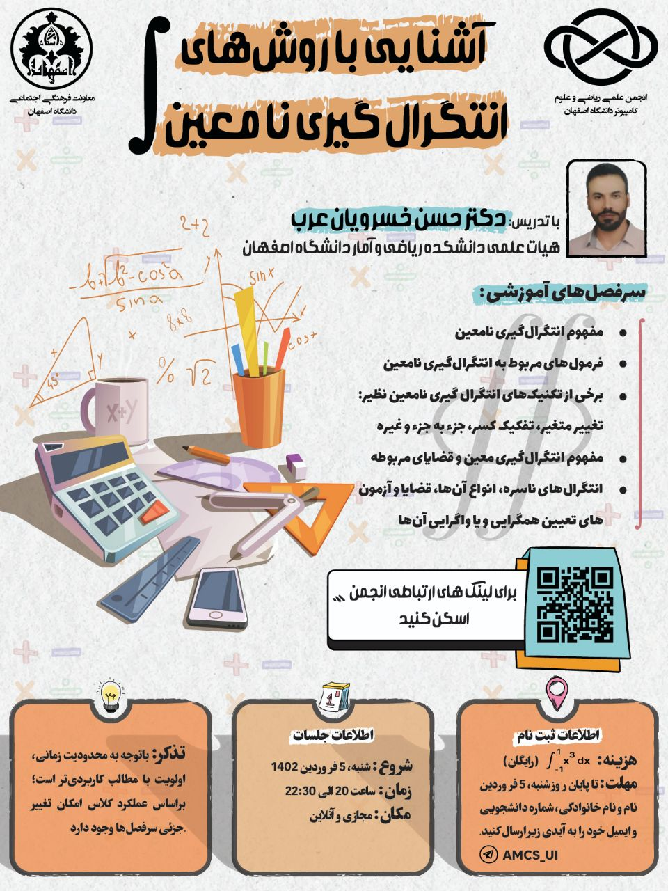

# آموزش روش‌های انتگرال‌گیری نامعین

- **سطح برنامه:** دانشگاهی

- **هزینه ثبت‌نام:** رایگان

- **زمان:** ۵ فروردین ۱۴۰۲، ساعت ۲۰ الی ۲۲:۳۰؛ اعلام زمان برگزاری جلسات بعدی در گروه کلاس

- **مکان:** مجازی؛ انتشار لینک جلسه در گروه کلاس 

- [لینک ویدئوهای ادیت شده کلاس](https://drive.google.com/drive/folders/1FqguUxqJ_d2Y_oDw8SRVH0Iz_NVX_9Wc)

## اهداف

- ارتقاء سطح علمی دانشجویان

- ایجاد بستری برای دسترسی به محتوای آموزشی مفید و کاربردی

- رفع نیاز دانشجویان دانشکده بنا به نظرسنجی

## خلاصه برنامه

پس از شناسایی وجود نیاز با استفاده از نظرسنجی‌های پیوسته از دانشجویان کارگاه روش‌های انتگرال‌گیری در بهار ۱۴۰۲ با پیشنهاد و همکاری انجمن علمی، اساتید دانشگاه اصفهان، به ویژه دکتر خسرویان عرب و اساتید مشاور انجمن، دکتر مجتبی رفیعی و دکتر علیرضا نصر اصفهانی برگزار شده و با استقبال زیادی از سوی دانشجویان همراه شد. همچنین بنا به درخواست دانشجویان به علت کاربرد و اهمیت بالای آموزش انتگرال به عنوان یکی از پایه‌های اصلی ریاضی، به صورت محتوای ویدئویی ادیت و در رسانه‌های انجمن منتشر شد.

- **مدرس دوره:** دکتر حسن خسرویان عرب، دکتری ریاضی کاربردی دانشگاه صنعتی امیرکبیر و هیأت علمی دانشکده‌ی ریاضی و آمار دانشگاه اصفهان

- **سر فصل‌های آموزشی:**

	
	- مفهوم انتگرال‌گیری نامعین
	
	
	- فرمول‌های مربوط به انتگرال‌گیری نامعین
	
	
	- برخی از تکنیک‌های انتگرال‌گیری نامعین نظیر: 
	
	
		- تغییر متغیر
	
	
		- تفکیک کسر
	
	
		- جزء به جزء
	
	
		- و ...
	
	
	- مفهوم انتگرال‌گیری معین و قضایای مربوطه
	
	
	- انتگرال‌های ناسره، انواع آن‌ها، قضایا و آزمون‌های تعیین همگرایی و یا واگرایی آن‌ها
