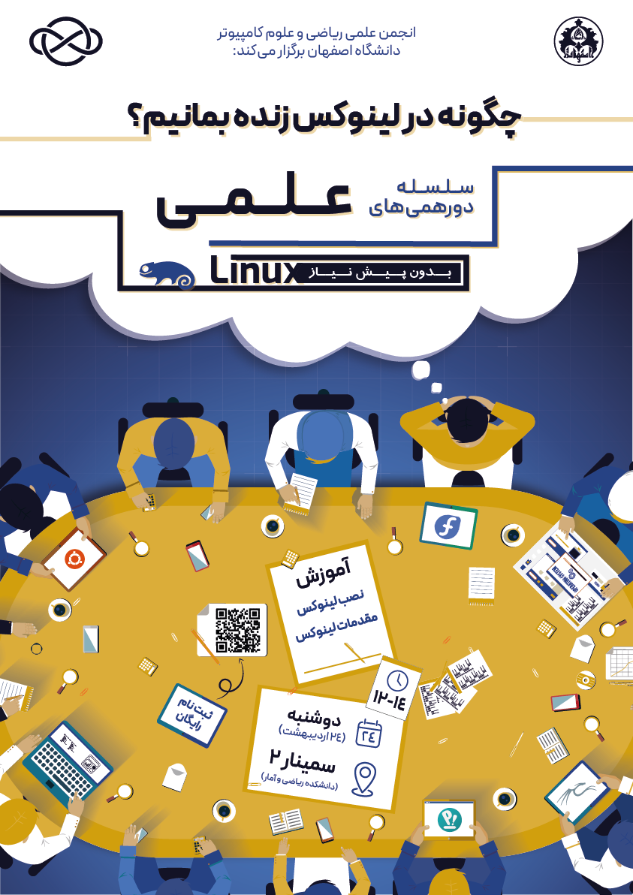

# دورهمی علمی: لینوکس

چگونه در لینوکس زنده بمانیم؟

- **سطح برنامه:** دانشگاهی

- **شرکت کنندگان:** ۲۵ دانشجوی کارشناسی رشته‌های علوم‌کامپیوتر، مهندسی کامپیوتر و برق دانشگاه اصفهان

- **هزینه ثبت‌نام:** رایگان

- **زمان و مکان:** ۲۴ اردیبهشت‌ماه ۱۴۰۲ در اتاق سمینار دانشکده ریاضی و آمار دانشگاه اصفهان

## اهداف

- افزایش سطح علمی دانشکده

- آشنایی دانشجویان با ابزارهای بازار کار و مسیر یادگیری

- سوق دادن دانشجویان به بازار کار

- پاسخگویی به نیازهای اعلام شده از طرف دانشجویان

- آشنایی اعضای جدید انجمن با روند برگزاری رویدادها

## خلاصه برنامه

پس از تغییر ساختار انجمن، در پروسه برنامه‌ریزی فعالیت‌های آینده انجمن، ایده ادغام برخی طرح‌ها از جنس علمی-کاربردی مطرح شد که در اردیبهشت ۱۴۰۳ تحت عنوان سلسله دورهمی‌های علمی شروع به برگزاری کرد. این دورهمی‌ها با محوریت رفع کاستی‌های چارت تحصیلی و تدریس تئوری در دانشگاه و سوق دانشجویان به یادگیری عملی و گروهی طرح‌ریزی شدند.

در این راستا، از آنجا که این هدف علمی-عملی در تعریف هر دورهمی تنیده بوده و از طرفی در دید اساتید مختلف از جمله استاد مشاور انجمن، دانشجویان و اعضای انجمن، موضوع لینوکس به عنوان نیازی مهم شناخته شده بود، عنوان لینوکس برای اولین جلسه از این دورهمی‌ها انتخاب شد و در نهایت در ۲۴ اردیبهشت ۱۴۰۳ اولین دوره سلسله دورهمی‌های علمی حول محور این موضوع با یادگیری دانشجو از دانشجو برگزار شد.

## روند برگزاری

پس از بررسی دقیق‌تر ایده با استاد مشاور و اخذ تایید ایشان، معاون فرهنگی دانشکده و ریاست انجمن‌های علمی دانشگاه، اقدامات، هماهنگی‌ها و اطلاع‌رسانی‌های لازم آغاز شد. دورهمی با حضور و راهنمایی دو تن از افراد مسلط و فعال در حیطه سیستم عامل لینوکس اجرا شد و حول این موضوع بحث و گفتگو شکل گرفت. در نهایت پس از اتمام دورهمی، با کیک و چای از شرکت کنندگان پذیرایی صورت گرفت.

- **منتورهای دورهمی:**

    - جناب آقای محمدرضا بیاتی، کارشناسی علوم‌کامپیوتر دانشگاه اصفهان ورودی ۱۳۹۹

    - جناب آقای امین مسعودی، کارشناسی علوم‌کامپیوتر دانشگاه اصفهان ورودی ۱۴۰۱    

- **مباحث مورد بحث:** در طول جلسه، جناب بیاتی در خصوص چرایی لینوکس و نحوه نصب آن توضیحاتی ارائه و آقای امین مسعودی راجع به نحوه استفاده روزمره و همچنین پیشرفته‌تر از این سیستم‌عامل، مطالبی را برای سایر دانشجویان از تجربه و دانش خود شرح دادند. سایر شرکت کنندگان نیز با مطرح نمودن سوالات خود و انتشار تجربه و دانش شخصی، وارد بحث شده و به صورت عملی، قدم‌های استفاده از این سیستم‌عامل را با راهنمایی منتورها طی کردند. بدین صورت، تمامی دانشجویان حاضر، به یادگیری از یکدیگر پرداختند.

## اثربخشی و بازخورد

با وجود محدودیت زمان اطلاع‌رسانی و ظرفیت ممکن برای یک دورهمی اثربخش، استقبال دانشجویان از این برنامه برای عوامل اجرایی دلگرم کننده بود. این امر شوق آنان را برای ادامه مسیر و برگزاری مجدد سلسله دورهمی‌ها افزایش داد و سبب برگزاری دوره‌های بعدی این رویداد شد. 

دانشجویان از رشته‌های علوم‌کامپیوتر، مهندسی کامپیوتر و برق در این دورهمی حضور داشتند و بازخورد مثبت و نظرات امیدوار کننده گسترده‌ای از طرف این عزیزان به تیم ارائه شد. بازخوردهای دریافت شده توسط اعضای انجمن بررسی شده و با چاره اندیشی و ارائه راهکار، باعث شناسایی کاستی‌ها در راستای مدیریت بیشتر بحث و لذا بهبود و پیشرفت این دورهمی‌ها شد.
