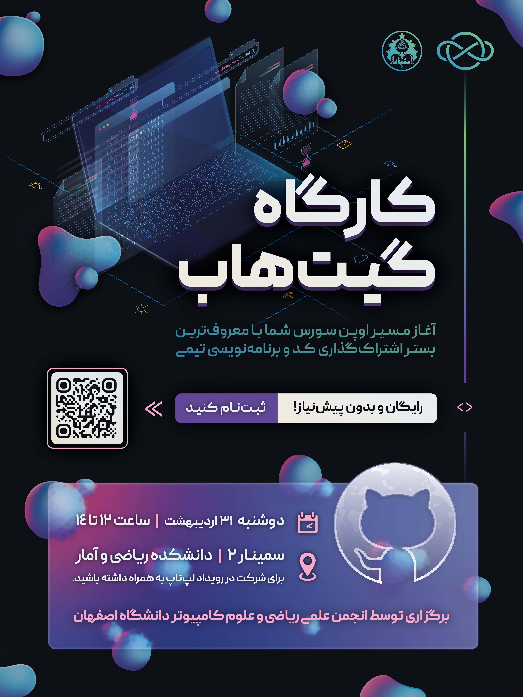

# کارگاه گیت‌هاب

*آغاز مسیر اوپن سورس شما با معروف‌ترین بستر اشتراک‌گذاری کد و برنامه‌نویسی تیمی*

- **سطح برنامه:** دانشگاهی

- **شرکت کنندگان:** ۳۰ دانشجوی کارشناسی از رشته‌های علوم‌کامپیوتر، مهندسی کامپیوتر، ریاضی و برق دانشگاه اصفهان

- **هزینه ثبت‌‎نام:** رایگان

- [لینک ثبت‌نام](https://app.epoll.pro/e/o/MDg1NDY4)

- **زمان و مکان:** ۳۱ اردیبهشت‌ماه ۱۴۰۳، ۱۲ الی ۱۴ اتاق سمینار دانشکده ریاضی و آمار دانشگاه اصفهان

## اهداف

- رفع مسئله کمبود دروس کاربردی و فقدان ارتباط دروس با عمل

- توانمندسازی دانشجویان در تکنولوژی‌های لازمه کار تیمی در صنعت

- معرفی بزرگترین بستر برنامه‌نویسی منبع آزاد به دانشجویان

- سوق دانشجویان به بازار کار و کاربرد

## خلاصه برنامه

وجود دروس متعدد تئوری در عوض فقدان دروس مرتبط با عمل، سبب می‌شود تا دانشجویان، کمتر با فضای کار عملی در صنعت آشنا شوند، لذا ابراز عدم اعتماد به نفس دانشجویان برای ورود به صنعت به علت دانش پایین، انجمن علمی ریکا را به سوی راه چاره‌ای کشید.

پس از ایده‌پردازی سلسله کارگاه‌هایی کاربرد محور در تکنولوژی، مشورت‌هایی با مدیران گروه دانشکده و استاد مشاور انجمن، دکتر مجتبی رفیعی، حول موضوعات کلیدی و ترتیب ارائه موضوعات انجام شد. از نتیجه این مشورت‌ها، کارگاه گیت و گیت‌هاب به عنوان اولویت‌های اصلی آموزشی تعیین شد و طرح مطرح شده با همکاری دانشجویان انجمن برای اردیبهشت‌ماه ۱۴۰۳ برنامه‌ریزی شد.

## روند برگزاری

طی این کارگاه، از نیروی دانشجویی فعال در دستیاری آموزشی دروسی مانند مبانی برنامه‌نویسی، برای انتقال روان و کاربردی مفاهیم به سایر دانشجویان کمک گرفته شد. در این راستا، طی کارگاهی دو ساعته و رایگان،  دانشجویان پس از درک مفاهیم اولیه گیت و گیت‌هاب، مشغول به کار به صورت عملی توسط سیستم‌های الکترونیکی خود همراه با نظارت مدرس، شدند. در طول کارگاه، پرسش و پاسخ و هم‌اندیشی‌ها نقش مهمی در رفع ابهامات دانشجویان داشت.

- **ارائه دهنده و منتور:** جناب آقای امین مسعودی، دستیار آموزشی درس مبانی برنامه‌نویسی، دارای سابقه ۵ سال فعالیت در زمینه برنامه‌نویسی و کار با گیت‌هاب و مورد تایید استاد مشاور.

- **مباحث کارگاه:** ابتدا جناب مسعودی به مرور و پاسخ سوالات پایه شرکت کنندگان برای درک موضوع مورد بحث پرداختند. موضوعات بررسی شده شامل موارد زیر می‌باشند:

    - گیت چیست؟

    - چرا و چگونه باید از گیت استفاده کنیم؟

    - گیت‌هاب چیست؟

    - نحوه نصب و استفاده از گیت‌هاب

    - گیت‌هاب چه خدماتی ارائه می‌دهد؟

    - و …

پس از درک مفاهیم، نوبت به دست‌به‌کد شدن عملی دانشجویان می‌رسید. در این بخش، افراد با نظارت ارائه دهنده، تلاش به انجام انواع اعمال با git commands شامل اتصال کامپیوتر و فایل‎‌های خود به سرور گیت، تغییر و به‌روزرسانی فایل‎‌ها، کار با repository و ... نمودند.

## اثربخشی و بازخورد

مهم بودن گیت و گیت‌هاب برای ورود به صنعت و وجود پروژه‌های متنوع نیازمند گیت‌هاب برای کار گروهی، نمایانگر هدف اصلی برگزاری این کارگاه مختصر بود که با وجود محدودیت زمان و تعداد، استقبال بالایی از دانشجویان را به همراه داشت. بنا به نظرسنجی‌ها، دانشجویان شرکت کننده و همچنین افرادی که فرصت شرکت پیدا نکرده بودند خواستار برگزاری کارگاه‌ها و برنامه‌های بیشتر این چنین بودند.

    
    <em>فضای کارگاه</em>

    
    <em>ارائه دهنده</em>

