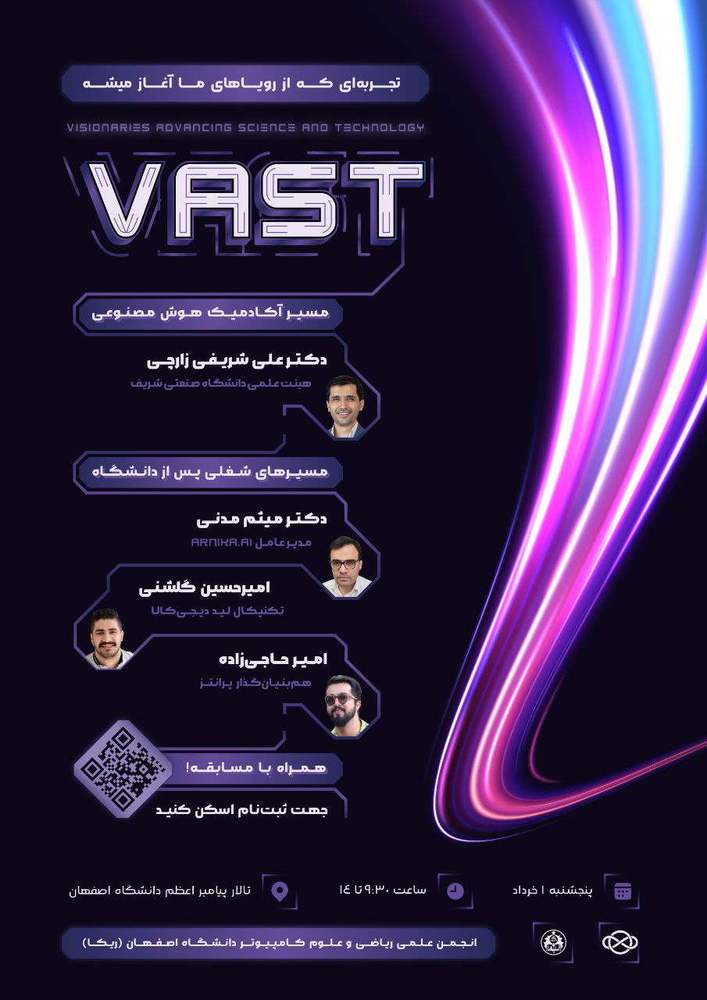

# گزارش رویداد VAST 2025  

- **مراکز همکار و اسپانسر**: شرکت ترب، شرکت آیتک
- **سخنرانان**:   
    - **دکتر میثم مدنی**، مدیرعامل آرنیکا و فارغ‌التحصیل دکتری دانشگاه صنعتی شریف.
    - **امیر حاجی‌زاده**، هم‌بنیان‌گذار و مدیرعامل پرانتز.
    - **امیرحسین گلشنی**، Technical Lead دیجی‌کالا. 
    - **دکتر علی شریفی زارچی**، عضو هیأت علمی دانشگاه صنعتی شریف.
- **شرکت‌کنندگان**: ۵۰۰ دانشجوی کارشناسی و کارشناسی ارشد رشته‌های علوم کامپیوتر، مهندسی کامپیوتر، ریاضی، آمار، مهندسی برق، زیست‌شناسی و... همچنین اساتید و کارمندان دانشگاه اصفهان، شرکت‌ها، دانشگاه‌ها و مراکز آموزشی معتبر
- **هزینه ثبت‌نام**: ۱۰۰ هزار تومان
- **زمان**: پنجشنبه ۱ خرداد ساعت ۱۰ الی ۱۴
- **مکان**: تالار پیامبر اعظم دانشگاه اصفهان

---

۱۵۰۰ نفر-ساعت تلاش، ۵۵۰ نفر مهمان، ۵۰ مهمان ویژه، ۴ سخنران برجسته در بزرگ‌ترین سالن دانشگاه اصفهان.  
**VAST**:  
> تجربه‌ای که از دل رویاها شروع می‌شود  

رویای استخدام شدن، رویای کشف مسیر شغلی مورد علاقه، رویای میزبانی از سخنرانان بزرگ در رویدادی بزرگ، رویای کسب تجربه‌هایی که به راحتی قابل انتقال نیستند، **رویای پیشرفت**.  

این رویا ها، به اندازه‌ای کافی بودند که جرقه‌ای در یک انجمن دانشجویی ایجاد کنند؛ انجمنی که در راستای اهدافش یک سال تمام تلاش کرد، ارزش خلق کرد، شکست خورد، دوباره برخاست و در نهایت با پیروزی‌هایی ملموس و تجربه‌ای بی‌نظیر آماده بود تا مسیر تازه‌ای را آغاز کند.  
**انجمن ریکا**.  

نتیجه‌ی این تلاش‌ها حیرت‌انگیز بود: در عرض تنها یک ماه، رویدادی بزرگ با سخنرانانی برجسته و تیمی دقیق متشکل از اعضای جدید و قدیم انجمن برگزار شد. رویدادی که می‌توان آن را نمونه‌ای از کمال در اجرا دانست؛ رویدادی که تأثیر آن شاید در ظاهر کمتر ملموس باشد، اما در باطن، نقطه‌ی شروع مهمی برای مسیر حرفه‌ای شرکت‌کنندگان ایجاد کرد و مسیر پیشرفت را برای آنان هموار نمود.

---

## طراحی و اهداف رویداد

VAST 2025 با هدف ایجاد یک مسیر روشن برای دانشجویان در انتخاب شغل و مسیر حرفه‌ای طراحی شد. بسیاری از دانشجویان، با وجود علاقه و استعداد در حوزه‌های مختلف، دچار سردرگمی بودند و نمی‌دانستند چگونه مسیرشان را به شکلی هدفمند پیش ببرند. انجمن ریکا تصمیم گرفت با گردآوری چهره‌های برجسته‌ی صنعت و دانشگاه، بستری فراهم کند تا دانشجویان بتوانند مسیرهای شغلی متنوع، فرصت‌های واقعی و تجربه‌های کاربردی را کشف کنند.  

رویداد شامل چهار سخنرانی تخصصی و یک مسابقه فنی بود. سخنرانی‌ها بر معرفی مسیرهای شغلی در حوزه‌های مختلف از پژوهش و بیوانفورماتیک گرفته تا مدیریت و منابع انسانی تمرکز داشتند. مسابقه نیز با محوریت امنیت وب و پیاده‌سازی سرویس احراز هویت طراحی شد تا فرصتی عملی برای دانشجویان ایجاد شود و تجربه‌ی کاربردی در دنیای حرفه‌ای کسب کنند.  

---

## سخنرانان

سخنرانان رویداد ترکیبی از چهره‌های برجسته‌ی علمی و صنعتی بودند که تجربه‌های واقعی خود را در اختیار دانشجویان قرار دادند:  

- **دکتر علی شریفی زارچی**، عضو هیأت علمی دانشگاه صنعتی شریف، به بررسی کاربردهای هوش مصنوعی در پژوهش‌های بیوانفورماتیک پرداخت و نکات تکنیکی و عملی این حوزه را ارائه کرد.  
- **دکتر میثم مدنی**، مدیرعامل آرنیکا و فارغ‌التحصیل دکتری دانشگاه صنعتی شریف، در سخنرانی خود با عنوان *مشاغل در عصر پسا هوش مصنوعی* به فرصت‌ها و تغییرات بازار کار پرداخت.  
- **امیر حاجی‌زاده**، هم‌بنیان‌گذار و مدیرعامل پرانتز، اهمیت منابع انسانی و نقش آن در شکل‌گیری تیم‌های کارآمد را تشریح کرد.  
- **امیرحسین گلشنی**، CTO دیجی‌کالا، تجربه‌ی مسیر شغلی خود پس از دانشگاه را از تاسیس استارتاپ تا فعالیت در شرکت‌های بزرگ با دانشجویان به اشتراک گذاشت.  

هر سخنران توسط یکی از اعضای کادر اجرایی معرفی شد تا ارتباط بهتر با مخاطب برقرار شود و فضای حرفه‌ای و رسمی سخنرانی حفظ گردد.

---

## مسابقه

بخش عملی VAST، مسابقه‌ای در حوزه‌ی **امنیت وب** و پیاده‌سازی سرویس احراز هویت (API Authentication) بود. این رقابت با استفاده از **GitHub Classroom** و سناریوهای تست خودکار طراحی شد تا دانشجویان به صورت عملی مهارت‌های برنامه‌نویسی و امنیتی خود را محک بزنند.  

نیاز کشور به امنیت وب و سرویس‌های قابل اعتماد الهام‌بخش طراحی این مسابقه بود.

هدف اصلی مسابقه، فراهم آوردن تجربه‌ای کاربردی و شناسایی دانشجویان توانمند برای معرفی به شرکت‌های صنعتی بود. مجموعاً بیش از **۸۰ نفر-ساعت** صرف طراحی و آماده‌سازی مسابقه و زیرساخت‌های آن شد. برای اطلاعات دقیق‌تر و جزئیات مراحل مسابقه، لینک [گزارش مجزا](./jobTask.md) ارائه شده است.  

---

## روند برگزاری  
فرایند آماده‌سازی رویداد طی یک ماه، با صرف بیش از **۱۵۰۰ نفر-ساعت** انجام گرفت. تیم اجرایی شامل ۲۰ نفر بود که عمدتاً از اعضای جدید انجمن تشکیل می‌شدند؛ تصمیمی که با هدف توانمندسازی نسل بعدی و ایجاد انگیزه و خلاقیت بیشتر اتخاذ شد.  

برای تبلیغات، ابتدا پست اصلی معرفی رویداد منتشر شد و در ادامه هر یک از سخنرانان به‌طور جداگانه معرفی شدند. ثبت‌نام از طریق پلتفرم زی‌لینک انجام شد و کدهای تخفیف مرحله‌ای در نظر گرفته شد تا حداکثر ظرفیت سالن تکمیل شود. همین استراتژی موجب شد تعداد ثبت‌نام‌ها از ۴۰۰ نفر فراتر رود و در روز رویداد حدود **۵۰۰ نفر** در سالن حضور داشته باشند.  

---

## آماده‌سازی و تدارکات

توجه ویژه‌ای به جزئیات و کیفیت تجربه شرکت‌کنندگان شد. هر یک از ۴۵۰ شرکت‌کننده پک ورودی دریافت کردند که شامل دو کوکی بسته‌بندی‌شده با روبان‌های آبی و بنفش، شیرکاکائو، یک پیکسل از مجموعه چهار حرف VAST، دستبند و کارت تخفیف اسپانسر بود. بسته‌بندی این پک‌ها بیش از **۷۰ نفر-ساعت** زمان تیم اجرایی را به خود اختصاص داد و یک روز کامل توسط ۱۰ نفر از اعضای تیم در خانه یکی از اعضا انجام شد.

پذیرایی شامل میوه، کیک و آبمیوه بود. میوه به ارزش ۳ میلیون تومان توسط انجمن تأمین شد و کیک و آبمیوه از طریق دانشگاه فراهم شد.  

همچنین، هماهنگی رفت و آمد سخنرانان شامل بلیط هواپیما و هزینه‌های جانبی بیش از ۲۰ میلیون تومان صرف شد و هتل توسط دانشگاه تأمین شد. طراحی گرافیکی و چاپ پوسترها نیز بدون هزینه و توسط دانشگاه انجام شد.  

این برنامه‌ریزی دقیق و تقسیم وظایف بین اعضای تیم اجرایی، تضمین کرد که رویداد بدون هیچ نقص و با کیفیتی بی‌نظیر برگزار شود.  

---

## منابع مالی و پشتیبانی

حمایت مالی و منابع در دسترس نقش کلیدی در موفقیت رویداد داشت. اسپانسر اصلی، شرکت ترب، مبلغ ۲۰ میلیون تومان ارائه کرد و اسپانسر دوم نیز با پرداخت ۷ میلیون تومان و درج لوگو و کارت تخفیف در پک‌ها، مشارکت خود را نشان داد.  

مجموع هزینه‌ها و منابع به صورت زیر بود:

- پک‌های ورودی: ۳۱.۵ میلیون تومان  
- پذیرایی (میوه): ۷ میلیون تومان  
- رفت و آمد سخنرانان: ۲۵ میلیون تومان  
- هتل سخنرانان: توسط دانشگاه  
- کیک و آبمیوه: توسط دانشگاه  
- طراحی و چاپ تبلیغات: توسط دانشگاه  
- هدیه تشکر از سخنرانان: توسط دانشگاه

با وجود هزینه‌های قابل توجه، مدیریت منابع به گونه‌ای بود که کیفیت رویداد حفظ شد و حمایت اسپانسرها و دانشگاه توانست بخش زیادی از هزینه‌ها را پوشش دهد.  

---

## آمار و ارقام

- زمان صرف‌شده برای برنامه‌ریزی و اجرا: **۱۵۰۰ نفر-ساعت**  
- آماده‌سازی پک‌ها: **۷۰ نفر-ساعت**  
- طراحی مسابقه و زیرساخت: **۸۰ نفر-ساعت**  
- تیم اجرایی: ۲۰ نفر  
- ثبت‌نام قطعی: ۴۰۰ نفر  
- مهمان ویژه: ۵۰ نفر  
- تخمین حضور واقعی: ۵۰۰ نفر  
- تعداد سخنرانان: ۴ نفر  
- ظرفیت سالن: ۳۰۰ نفر  

این داده‌ها نشان‌دهنده‌ی میزان تلاش و هماهنگی مورد نیاز برای برگزاری یک رویداد حرفه‌ای و باکیفیت در سطح ملی است.  

---

## بازخورد و دستاوردها

بازخوردها از تمامی گروه‌ها — شرکت‌کنندگان، سخنرانان و مسئولان دانشگاه — بسیار مثبت و دلگرم‌کننده بود. نظم، کیفیت اجرا و محتوای علمی رویداد بارها مورد تحسین قرار گرفت و حتی حراست دانشگاه نیز از نظم بی‌نقص و سطح بالای رویداد رضایت کامل خود را اعلام کرد.  

شرکت‌کنندگان از فرصت آشنایی با مسیرهای شغلی مختلف و تعامل با متخصصان برجسته، بهره‌مند شدند. بسیاری از دانشجویان که در انتخاب مسیر شغلی دچار سردرگمی بودند، توانستند با دریافت تجربه‌ها و راهنمایی‌های عملی، گام‌های اولیه برای آینده حرفه‌ای خود بردارند.  

سخنرانان نیز از سطح بالای اجرا و مدیریت رویداد رضایت داشتند و بر حرفه‌ای بودن تیم اجرایی تاکید کردند. مسابقه عملی نیز با استقبال خوب مواجه شد و توانست مهارت‌های کاربردی دانشجویان را به نمایش بگذارد و افراد برتر را برای معرفی به صنعت شناسایی کند.  

---

## نتایج

رویداد VAST 2025، علاوه بر تجربه‌ی علمی و عملی برای دانشجویان، دستاوردهای زیر را نیز به همراه داشت:

- ایجاد فرصتی بی‌نظیر برای دانشجویان جهت آشنایی با مسیرهای شغلی متنوع و فرصت‌های واقعی.  
- پرورش و توانمندسازی اعضای جدید انجمن در مدیریت یک رویداد بزرگ و پیچیده.  
- توسعه‌ی همکاری میان دانشگاه و صنعت و معرفی دانشجویان توانمند به شرکت‌ها و اسپانسرها.  
- تثبیت جایگاه انجمن ریکا به عنوان برگزارکننده‌ای حرفه‌ای و معتبر در سطح دانشگاه و شهر.  

---

## جمع‌بندی

VAST 2025 نقطه‌ی عطفی در تاریخ انجمن ریکا بود. این رویداد نشان داد که با برنامه‌ریزی دقیق، خلاقیت و کار گروهی، می‌توان حتی در مدت کوتاه، رویدادی در سطح ملی با کیفیت بالا برگزار کرد.  

ترکیب سخنرانی‌های متنوع، مسابقه عملی، پک‌های ورودی حرفه‌ای، مدیریت دقیق منابع مالی و تعامل با اسپانسرها و دانشگاه، تجربه‌ای به‌یادماندنی برای شرکت‌کنندگان و اعضای تیم ایجاد کرد.  

این تجربه نمونه‌ای از تحقق اهداف انجمن ریکا — توانمندسازی، انتقال تجربه و خلاقیت — است و الگویی ارزشمند برای رویدادهای آینده خواهد بود.  

