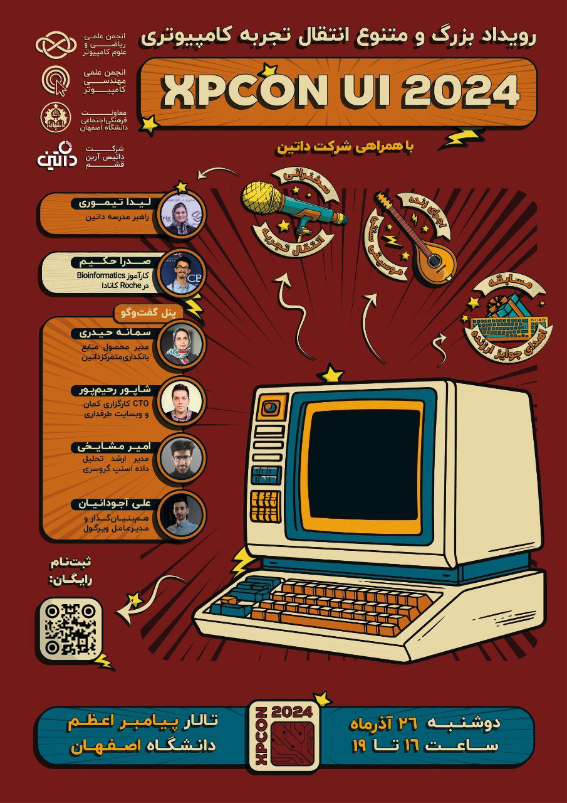

# رویداد انتقال تجربه کامپیوتری XPCON 2024

**آذرماه ۱۴۰۳ | انجمن علمی ریکا – دانشگاه اصفهان**

همه چیز آماده بود.

دومین دوره XPCon قرار بود روز ۲۶ آذر ماه ۱۴۰۳ در سالن اجتماعات بزرگ پیامبر اعظم دانشگاه اصفهان برگزار شود. تجربه‌ای از جنس گفتگو، نه فقط نمایش. سالن رزرو شده بود، سخنران‌ها دعوت شده بودند، تجهیزات فراهم شده بود، بلیت‌ها و اقامت‌ها تنظیم شده بودند، و برنامه‌ریزی تا جزئی‌ترین سطح اجرا شده بود.

این رویداد با حمایت مالی شرکت **داتین** قرار بود برگزار شود و با همکاری انجمن علمی مهندسی کامپیوتر دانشگاه اصفهان شکل گرفته بود. محتوای رویداد بر پایه‌ی انتقال تجربه از سوی فعالان برجسته‌ی صنعت فناوری طراحی شده بود؛ صادقانه، دقیق و بی‌واسطه. شرکت در رویداد برای عموم آزاد بود.

قرار بود در یک بعدازظهر فشرده، سخنرانی‌ها و یک پنل گفتگو داشته باشیم، با حضور:

- **لیدا تیموری** – راهبر مدرسه داتین  
- **صدرا حکیم** – کارآموز Bioinformatics در Roch، کانادا  
- **سمانه حیدری** – مدیر محصول منابع بانکداری متمرکز داتین  
- **شاپور رحیم‌پور** – CTO کارگزاری کمان و وب‌سایت طرفداری  
- **امیر مایخی** – مدیر ارشد تحلیل داده اسنپ‌گروسری  
- **علی آجودانیان** – هم‌بنیان‌گذار و مدیرعامل ویرگول  

همه‌چیز سر جای خودش بود. تا اینکه، **یک روز پیش از برگزاری**، اعلام شد:

> «به دلیل بحران کمبود نیرو، دوشنبه  ادارات، موسسات آموزش عالی، بانک‌ها، شهرداری‌ها و مراکز آموزشی استان تعطیل گردند.»

تصمیم در سطح استان گرفته شده بود. هیچ امکانی برای دسترسی به سالن، برگزاری جلسه یا حتی حضور فیزیکی در دانشگاه باقی نماند. XPCon 2024، با تمام زحمت‌ها و پیش‌زمینه‌اش، در آخرین لحظه لغو شد.

---

## واقعیت‌های پشت‌صحنه  
۷۰ کیلو موز.  
۲۵ شل آبمیوه.  
۳۰۰ عدد کاپ‌کیک.  
پک‌های پذیرایی کامل، روی دست‌مان ماندند.

اما تیم، آشفته نشد. اقلام به‌سرعت در صبح آن روز توزیع یا فروخته شدند. اطلاع‌رسانی‌ها انجام شد. ارتباط با سخنران‌ها مدیریت شد. و ما، یک «رویداد برگزارنشده» را هم، با همان دقتی مستندسازی کردیم که برای یک رویداد موفق انتظار می‌رفت.

قابل ذکر است که تمام اقلام در دانشگاه بودند و جهت پیشگیری از خراب شدن در صبح همان روز با التماس به دوستان حراست موز ها برداشته شدند و در کناره خیابان فروخته شدند.
مقدار قابل توجهی هم موز به شرکت های تک در اصفهان فروخته شد. 

---

## پس از لغو رویداد  
رویداد برگزار نشد.  
واقعیت این است که در شرایطی خاص، حتی بهترین برنامه‌ریزی‌ها هم ناکافی‌اند. تنها چیزی که باقی می‌ماند، واکنش حرفه‌ای‌ست.

و ما واکنش نشان دادیم:  
به‌موقع. منطقی. مسئولانه.

---

## ادامه مسیر  
با وجود لغو XPCon 2024، این ایده متوقف نشد. پس از بررسی شرایط، تصمیم گرفتیم تا آن را با بازنگری، در تاریخ دیگری اجرا کنیم.  
در نهایت، این رویداد با عنوان جدید **XPCon 2025**، با ترکیب تازه‌ای از سخنران‌ها و تجربه‌ها، **در سال بعد برگزار شد.**

---

## تجربه‌ها و دستاوردها  
- تیم اجرایی با یک بحران واقعی روبه‌رو شد و آن را کنترل کرد  
- رویدادی که برگزار نشد، به درسی جمعی برای ادامه‌ی مسیر تبدیل شد  
- ما فهمیدیم که حرفه‌ای بودن، فقط اجرای برنامه نیست؛ گاهی یعنی مدیریت لغو آن

