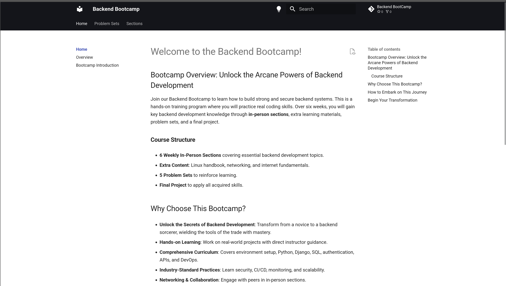
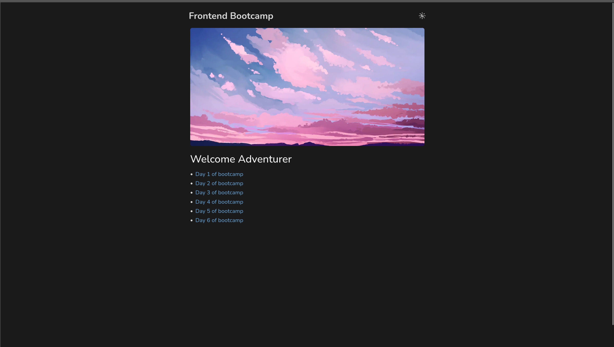
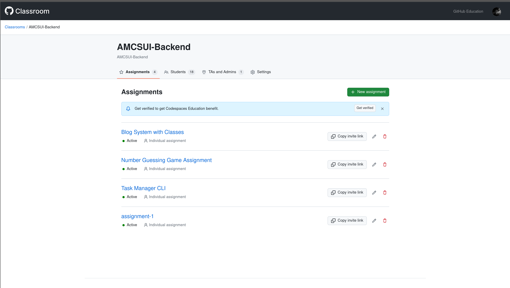

# زیرساخت بوتکمپ‌های وب

### مقدمه

بوتکمپ‌های بک‌اند و فرانت‌اند در بهار ۱۴۰۴ تنها مجموعه‌ای از جلسات آموزشی نبودند. در کنار محتوای آموزشی، برای نخستین‌بار تلاش شد زیرساختی پایدار طراحی شود که آموزش را منظم، قابل پیگیری، و مستند کند. این زیرساخت‌ها امروز نه‌تنها بخشی از حافظه‌ی آموزشی انجمن ریکا هستند، بلکه به الگویی برای رویدادهای بعدی نیز تبدیل شده‌اند.

---

### چی ساخته شد؟

برای هر بوتکمپ یک **وب‌سایت اختصاصی** طراحی شد که شامل موارد زیر بود:

- خلاصه مکتوب هر جلسه
- لینک ویدئوی ضبط‌شده‌ی جلسه
- تمرین‌ها و توضیحات آن‌ها
- لینک به GitHub Classroom مربوط به همان بوتکمپ

در GitHub Classroom، دانشجویان تمرین‌ها را دریافت، حل، و ارسال می‌کردند. سیستم به‌طور خودکار تمرین‌ها را تصحیح می‌کرد و نتیجه در اختیارشان قرار می‌گرفت. این فرایند تجربه‌ای واقعی از توسعه‌ی نرم‌افزار با ابزارهای صنعتی فراهم کرد.

- سایت بوتکمپ بک‌اند با استفاده از **Material for MkDocs** توسعه داده شد.
- سایت بوتکمپ فرانت‌اند با استفاده از **Next.js** ساخته شد.
- [لینک سایت بک‌اند](https://backend.amcsui.ir)
- [لینک سایت فرانت‌اند](https://frontend.amcsui.ir)

---

### چرا ساخته شد؟

اهداف طراحی زیرساخت‌ها چندلایه بودند:

- **داکیومنت کردن:** محتوای هر جلسه به‌صورت مکتوب و منظم ثبت شود.
- **نظم آموزشی:** مدرس پیش از هر جلسه ملزم به مرور و آماده‌سازی محتوای مکتوب بود.
- **دسترسی پایدار:** دانشجویان هر زمان بتوانند به منابع و ویدئوها مراجعه کنند.
- **مدیریت تمرین‌ها:** تکالیف به‌صورت ساختاریافته ارسال و تصحیح خودکار شوند.
- **راحتی دانشجویان:** همه‌چیز یک‌جا، ساده و شفاف در اختیارشان قرار گیرد.

---

### چطور ساخته شد؟

- طراحی سایت ها، پیاده‌سازی و آماده کردن سایت ها توسط **مدرسین دو دوره** انجام شد.
- توسعه و پیاده‌سازی طی چند هفته پیش از آغاز بوتکمپ‌ها انجام شد و در طول دوره نیز تکمیل و بهبود پیدا کرد.

---

### استفاده و بازخورد
- تمام دانشجویان بوتکمپ‌ها از این زیرساخت‌ها برای دریافت منابع و ارسال تمرین‌ها استفاده کردند.
- کار با سیستم برای دانشجویان ساده و روان بود.
- بازخوردها نشان داد که نظم و یکپارچگی آموزش به‌شکل محسوسی افزایش یافته است.
- اسکرین‌شات‌هایی از محیط سایت‌ها و Classroom‌ها به‌عنوان مستند ضمیمه گزارش شده است.

---

### نتیجه و ادامه مسیر

این زیرساخت‌ها هنوز پابرجا هستند و به‌عنوان مرجعی برای دانشجویان باقی مانده‌اند.  
ایده‌ی GitHub Classroom بعدها در رویدادهای دیگر نیز به‌کار گرفته شد؛ از جمله در مسابقه‌ی بزرگ ... که تجربه‌ای گسترده‌تر از کار تیمی و ارزیابی خودکار را فراهم کرد.

زیرساخت‌ها از جنس «سرمایه» هستند: سرمایه‌ای که از یک بوتکمپ شروع شد، اما به مسیرهای دیگر هم ادامه یافت.

---

**پیوست‌ها:**

- [مختصر بوتکمپ بک‌اند](http://backend.amcsui.ir/overview)
- [لیست تمارین بوتکمپ بک‌اند](https://backend.amcsui.ir/problem%20sets/)
- [لینک وب‌سایت بوتکمپ فرانت‌اند](https://frontend.amcsui.ir)
