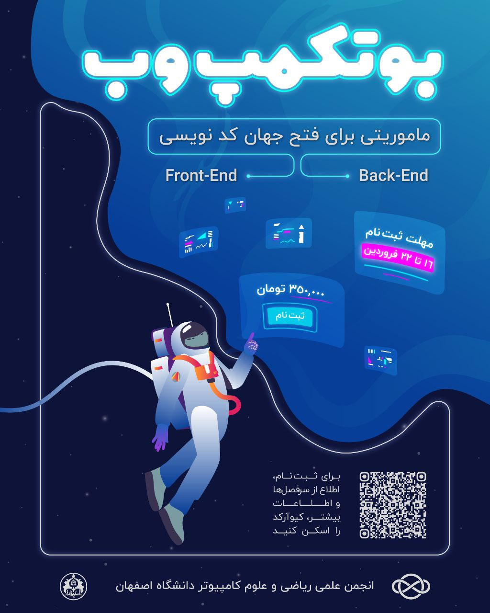
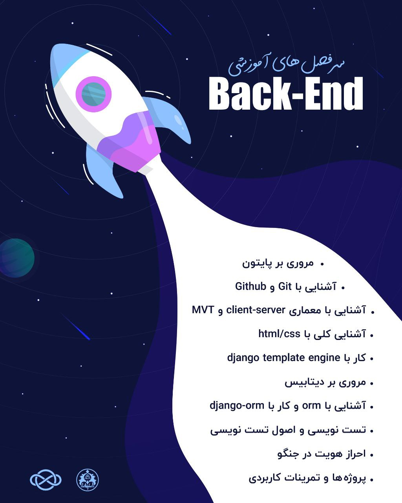
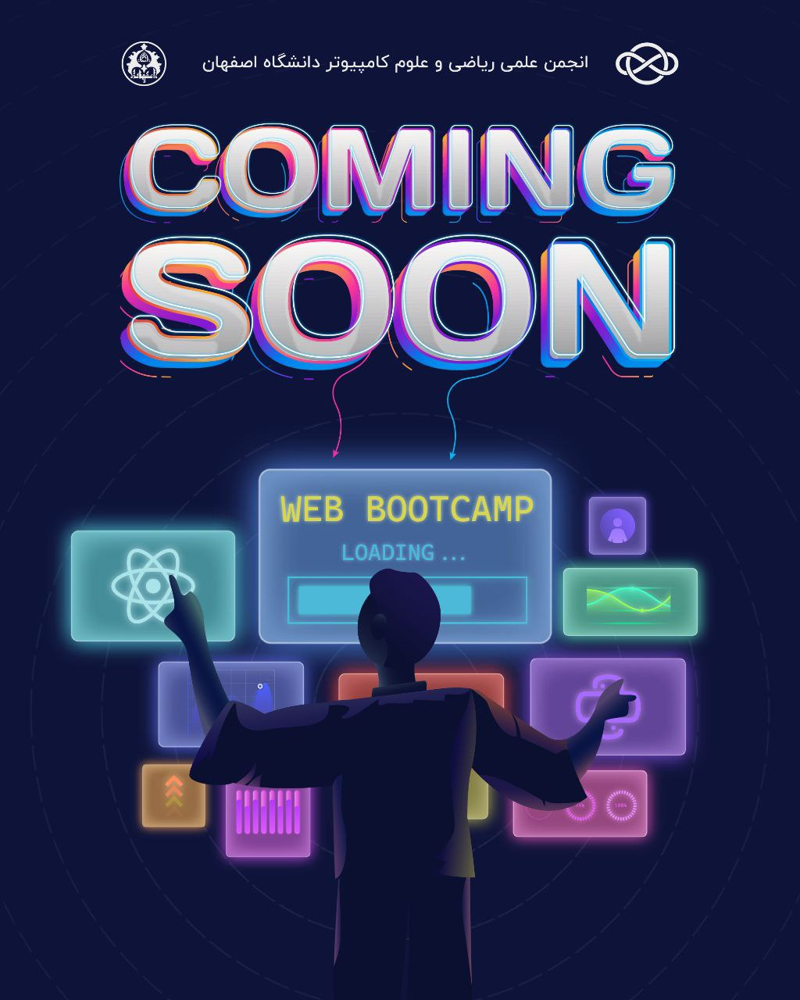

# بوتکمپ بک-اند

- **برگزارکننده**: انجمن علمی ریکا (ریاضی و علوم کامپیوتر دانشگاه اصفهان)
- **مدرس**: امین مسعودی و پدرام زمانی‌نژاد، دانشجویان کارشناسی علوم کامپیوتر و توسعه‌دهندگان بک‌اند
- **مراکز همکار**: مرکز رشد و نوآوری علوم انسانی، دانشگاه اصفهان
- **سطح برنامه**: فرادانشگاهی
- **شرکت‌کنندگان**: 25 دانشجوی کارشناسی و کارشناسی ارشد از رشته‌های علوم کامپیوتر و مهندسی کامپیوتر، دانشگاه‌های استان اصفهان
- **هزینه ثبت‌نام**: 350 هزار تومان برای دانشجویان دانشگاه اصفهان و 500 هزار تومان برای دانشجویان سایر دانشگاه‌ها
- **زمان**: از 21 فروردین ماه 1404 الی 1 خرداد ماه 1404
- **مکان**: مرکز رشد و نوآوری علوم انسانی دانشگاه اصفهان

---

### خلاصه  
**بوت‌کمپ بک‌اند** که توسط انجمن علمی ریکا و با همکاری مرکز رشد و نوآوری علوم انسانی دانشگاه اصفهان برگزار شد، یکی از برنامه‌های آموزشی ویژه و مهارت‌محور دانشگاه، در حوزه فناوری اطلاعات بود. این دوره با هدف آموزش مباحث پایه و پیشرفته در حوزه توسعه‌ی سمت سرور برای دانشجویان علاقه‌مند و فعال در این زمینه طراحی شد. در این بوتکمپ که طی 7 هفته و 14 جلسه برگزار گردید، بیش از 25 شرکت‌کننده از رشته‌ها و زمینه‌های مرتبط با کامپیوتر حضور یافتند. در طول بوت‌کمپ، شرکت‌کنندگان با زبان برنامه‌نویسی پایتون، فریم‌ورک جنگو (Django)، اصول کار با دیتابیس، گیت و گیت‌هاب، و نحوه توسعه‌ی پروژه‌های سمت سرور آشنا شدند. جلسات به‌صورت کارگاهی، پروژه‌محور و با مشارکت بالا برگزار شد و فضای پویا و حرفه‌ای برای یادگیری فراهم گردید.

---

### چیستی  
بوت‌کمپ بک‌اند یکی از برنامه‌های تخصصی در حوزه برنامه‌نویسی وب بود که به‌صورت فشرده در بازه‌ای مشخص در مرکز رشد و نوآوری علوم انسانی دانشگاه اصفهان برگزار شد. این دوره با حضور دو مدرس توانمند، آقایان امین مسعودی و پدرام زمانی‌نژاد، طراحی شد و مخاطب آن دانشجویان علاقه‌مند به توسعه سمت سرور و مفاهیم فنی پشت‌پرده وب‌سایت‌ها و اپلیکیشن‌ها بودند.

در این دوره، شرکت‌کنندگان به شکل تدریجی با مفاهیم زیر آشنا شدند:

* مروری بر زبان برنامه‌نویسی پایتون
* کار با Git و GitHub برای مدیریت نسخه و همکاری تیمی
* آشنایی با معماری client-server و الگوی MVT در جنگو
* مروری کوتاه بر HTML و CSS برای درک بهتر نحوه تعامل با فرانت‌اند
* معرفی ORM و کار با django-orm برای مدیریت داده‌ها
* استفاده از قالب‌ها و موتور قالب Django Template Engine
* بررسی ساختار دیتابیس‌ها و نحوه ارتباط با آن‌ها
* آموزش اصول تست‌نویسی و اجرای تست‌های خودکار در پروژه
* پیاده‌سازی سیستم احراز هویت کاربران
* انجام تمرین‌ها و پروژه‌های واقعی برای تثبیت مفاهیم

مدرسان این دوره علاوه بر تدریس مفاهیم نظری، تمرکز ویژه‌ای بر جنبه‌های عملی و کاربردی داشتند و تلاش شد تا شرکت‌کنندگان در پایان دوره، درک عملی قابل قبولی از چرخه توسعه‌ی یک اپلیکیشن بک‌اند داشته باشند.

---

### چرایی  
با توجه به نیاز روزافزون بازار کار به توسعه‌دهندگان بک‌اند و خلاهای موجود در آموزش رسمی دانشگاهی در این زمینه، برگزاری چنین بوت‌کمپی ضروری به‌نظر می‌رسید. در بسیاری از موارد، دانشجویان با مفاهیم تئوریک آشنا هستند، اما توانمندی لازم برای پیاده‌سازی یک پروژه واقعی برای ورود به بازار کار را ندارند.

اهداف اصلی این بوت‌کمپ:

1. ارتقای توانمندی دانشجویان در زمینه توسعه‌ی سمت سرور با زبان پایتون و فریم‌ورک Django.
2. فراهم آوردن فضای تمرین و تجربه با تمرین روی پروژه‌های واقعی در محیطی آموزشی و دوستانه.
3. آموزش ابزارها و مهارت‌های مکمل مانند Git، GitHub، تست‌نویسی و ORM.
4. ایجاد بستر شبکه‌سازی بین دانشجویان علاقه‌مند و فعالان حوزه فناوری اطلاعات.

به‌واسطه ماهیت عملی این بوت‌کمپ، بسیاری از شرکت‌کنندگان علاوه بر آشنایی با مفاهیم جدید، توانستند بین آنچه قبلاً به صورت تئوریک خوانده بودند و آنچه در دنیای واقعی پیاده‌سازی می‌شود، ارتباط برقرار کنند. این باعث انگیزه‌ی بیشتر و افزایش اعتماد‌به‌نفس برای ادامه‌ی مسیر حرفه‌ای آن‌ها شد.

---

### چگونگی
ایده اولیه‌ی برگزاری این بوت‌کمپ توسط تیم انجمن علمی ریکا و با مشورت استاد مشاور مطرح شد. در قدم بعدی جلساتی جهت نیازسنجی و بررسی علاقه‌مندی دانشجویان تشکیل شد، با توجه به این جلسات بود که طرح کلی دوره تنظیم شد. انتخاب مدرسان بر اساس تجربه‌ی عملی آن‌ها در حوزه توسعه‌ی بک‌اند، توانایی‌شان در آموزش مفاهیم پیچیده به زبان ساده و درک نیازمندی دانشجویان صورت گرفت.

مرحله برنامه‌ریزی:

* تدوین سرفصل‌های آموزشی در هماهنگی با مدرسان.
* تنظیم جدول زمان‌بندی و انتخاب مرکز رشد علوم انسانی به‌عنوان محل برگزاری.
* طراحی محتوای جلسات با تأکید بر تمرین و پروژه‌محوری.
* آماده‌سازی فضای آموزشی و تجهیزات لازم.
* تبلیغات و اطلاع‌رسانی در دانشگاه و شبکه‌های اجتماعی جهت جذب دانشجو.

مرحله اجرا:

در طول دوره، آموزش‌ها به‌صورت منظم و ساختاریافته برگزار شدند. هر جلسه شامل بخش نظری کوتاه، آموزش تعاملی و سپس تمرین عملی بود. شرکت‌کنندگان از همان هفته‌های نخست، شروع به کدنویسی کردند و به‌تدریج درگیر ساخت پروژه‌های کوچک شدند. حضور مدرسین در کنار دانشجویان باعث شد فرآیند یادگیری عمق بیشتری بگیرد و شرکت‌کنندگان با مفاهیم پایه و پیشرفته به‌طور هم‌زمان آشنا شوند.

فضای مرکز رشد و نوآوری، با امکانات مناسب و محیطی حرفه‌ای، نقش بسزایی در موفقیت برگزاری این دوره داشت. 

---

### نتایج و پیامدها
بازخوردهای دریافت‌شده از طریق فرم‌های نظرسنجی، نشان‌دهنده رضایت بالای شرکت‌کنندگان از سطح علمی دوره و شیوه تدریس بود. شرکت‌کنندگان ابراز کردند که این دوره علاوه بر اولین تجربه جدی‌شان در حوزه توسعه بک‌اند، برایشان راهگشا و الهام‌بخش نیز بوده است.

مهم‌ترین نتایج بوت‌کمپ بک‌اند:

* این دوره توانست درک دقیق‌تری از توسعه‌ی وب و نحوه عملکرد سمت سرور را ارائه دهد.
* شرکت‌کنندگان توانستند پروژه‌های ساده اما کاربردی را به‌تنهایی یا به‌صورت گروهی اجرا کنند.
* زمینه‌سازی برای ادامه آموزش در قالب دوره‌های پیشرفته‌تر یا ورود به بازار کار.
* برخی از دانشجویان دوره، پس از پایان بوت‌کمپ، پروژه‌های مستقل خود را آغاز کردند.

برگزاری چنین دوره‌ای باعث شد فضای علمی و عملیاتی دانشگاه در حوزه فناوری، غنی‌تر شود و انگیزه بیشتری در بین دانشجویان برای یادگیری تکنولوژی‌های نو ایجاد گردد.

---

### ضمائم 
- [لینک وبسایت](https://backend.amcsui.ir)

---

