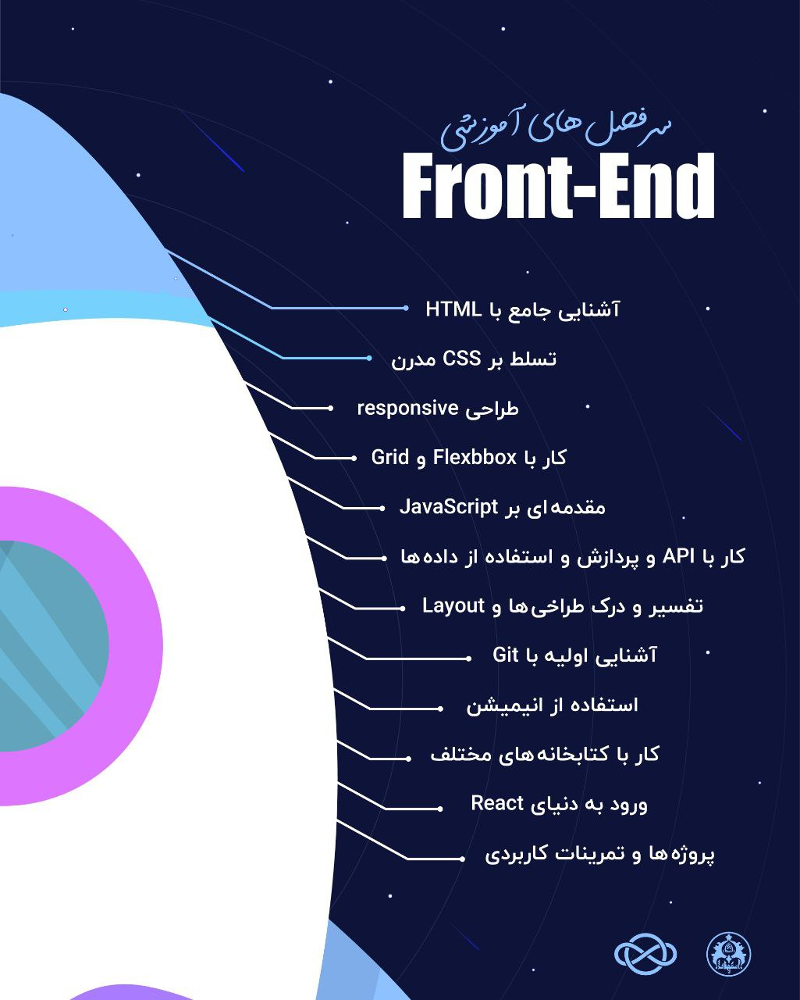

# بوتکمپ فرانت-اند

- **برگزارکننده**: انجمن علمی ریکا (ریاضی و علوم کامپیوتر دانشگاه اصفهان)
- **مدرس**: محمد ملائی، دانشجوی کارشناسی علوم کامپیوتر
- **مراکز همکار**: کارخانه نوآوری اسنواتک دانشگاه اصفهان
- **سطح برنامه**: فرادانشگاهی
- **شرکت‌کنندگان**: 25 دانشجوی کارشناسی و کارشناسی ارشد از رشته‌های علوم کامپیوتر و مهندسی کامپیوتر، دانشگاه‌های استان اصفهان
- **هزینه ثبت‌نام**: 350 هزار تومان برای دانشجویان دانشگاه اصفهان و 500 هزار تومان برای دانشجویان سایر دانشگاه‌ها
- **زمان**: از 21 فروردین ماه 1404 الی 1 خرداد ماه 1404
- **مکان**: کارخانه نوآوری اسنواتک دانشگاه اصفهان

---

### خلاصه  
بوت‌کمپ فرانت‌اند که به همت انجمن علمی ریکا (ریاضی و علوم کامپیوتر دانشگاه اصفهان) برگزار شد، تجربه‌ای آموزشی و مهارتی برای علاقه‌مندان حوزه‌ی طراحی و توسعه‌ی وب فراهم آورد. این بوت‌کمپ طی ۷ هفته و ۱۴ جلسه آموزشی در محل کارخانه نوآوری اسنواتک دانشگاه اصفهان برگزار گردید و در آن بیش از ۲۵ دانشجو از رشته‌های علوم کامپیوتر و مهندسی کامپیوتر حضور یافتند. هدف اصلی این رویداد، ارتقای توانمندی عملی شرکت‌کنندگان در زمینه‌ی طراحی سمت کاربر (Front-end) و ایجاد بستر مناسب برای یادگیری تعاملی، پروژه‌محور و کاربردی بود. در نهایت با ترکیبی از کارگاه‌های عملی و پروژه‌های گروهی تلاش شد تا فضایی پویا، کاربردی و هم‌افزا برای یادگیری ایجاد شود. 

---

### چیستی  
این بوت‌کمپ یک دوره‌ی آموزشی فشرده، در سطح فرادانشگاهی بود. این دوره علاوه بر دانشجویان دانشگاه اصفهان، پذیرای علاقه‌مندان از دانشگاه‌های مختلف استان نیز شد. هزینه‌ی ثبت‌نام برای دانشجویان دانشگاه اصفهان ۳۵۰ هزار تومان و برای دیگر دانشگاه‌ها ۵۰۰ هزار تومان تعیین شد. مدرس این دوره، محمد ملائی، با ترکیب آموزش‌های نظری و عملی تلاش کرد فضای یادگیری را به محیطی پویا و چالش‌برانگیز تبدیل کند.

مباحث متنوعی در این بوت‌کمپ مورد بررسی قرار گرفت که شامل:
• آشنایی جامع با HTML
•  تسلط بر CSS مدرن
•  ورود به دنیای React
•  طراحی responsive
•  کار با Flexbox و Grid
•  مقدمه‌ای بر JavaScript
•  کار با API و پردازش و استفاده از داده‌ها
•  تفسیر و درک طراحی‌ها و layout
•  آشنایی اولیه با Git
•  استفاده از انیمیشن
•  کار با کتابخانه های مختلف

این تنوع موضوعی موجب شد شرکت‌کنندگان، چه مبتدی و چه آشنا با این حوزه، بتوانند در پایان دوره مهارت‌های کاربردی لازم برای ساخت و طراحی صفحات وب را کسب کنند.
استاد این دوره از میان دانشجویان با تجربه در حوزه مربوطه انتخاب شد تا تجربه‌های عملی خود را به دیگر دانشجویان و شرکت‌کنندگان منتقل کند.

---

### چرایی  
برگزاری این بوت‌کمپ پاسخی به نیاز روزافزون بازار کار به نیروهای متخصص در حوزه توسعه وب بود. در شرایطی که صنعت فناوری به‌سرعت در حال رشد است و فرصت‌های شغلی متنوعی در زمینه طراحی و توسعه وب ایجاد شده، دانشجویان و فارغ‌التحصیلان به بستری نیاز دارند تا مهارت‌های خود را فراتر از مباحث دانشگاهی ارتقا دهند.

این بوت‌کمپ با هدف تحقق بخشیدن به موارد زیر برگزار شد:

1. ایجاد فرصتی برای یادگیری عملی و کاربردی در زمینه توسعه فرانت‌اند.
2. فراهم کردن بستر شبکه‌سازی میان دانشجویان، فارغ‌التحصیلان و فعالان صنعت.
3. پرورش توانایی‌های کار تیمی و مدیریت پروژه در محیطی شبیه‌سازی‌شده.
4. ایجاد انگیزه برای یادگیری عمیق‌تر و ادامه مسیر حرفه‌ای در حوزه فناوری اطلاعات.

فضای تعاملی و پروژه محور بودن جلسات باعث شد بسیاری از شرکت‌کنندگان، چه با پیش‌زمینه و چه بدون پیش‌زمینه‌ای در این حوزه، بتوانند از محتوای جلسه بهره ببرند. 

---

### چگونگی
فرایند برگزاری بوت‌کمپ در چند مرحله انجام شد. ابتدا ایده‌ی برگزاری دوره توسط جمعی از اعضای انجمن ریکا و با مشورت استاد راهنما مطرح گردید. در قدم بعدی، پس از بررسی نیازهای آموزشی و شرایط موجود، گروهی متشکل از شورای انجمن‌ و دانشجویان توانمند در این حوزه تشکیل شد تا سرفصل‌های آموزشی تدوین و برنامه‌ریزی اجرایی انجام گیرد.

**مرحله برنامه‌ریزی**:
در این مرحله، محتوای آموزشی بوت‌کمپ در قالب جلسات و کارگاه‌های عملی طراحی شد. جدول زمان‌بندی برگزاری جلسات با در نظر گرفتن ساعات مناسب برای دانشجویان و در هماهنگی با تقویم دانشگاه تنظیم گردید. همچنین مسئولیت‌های اجرایی میان اعضای تیم تقسیم شد؛ از جمله این مسئولیت‌ها می‌توان به:  هماهنگی فضای آموزشی، تهیه تجهیزات لازم (سیستم‌های رایانه‌ای، اینترنت پرسرعت و ویدئو پروژکتور)، طراحی محتوای آموزشی و ثبت‌نام شرکت‌کنندگان اشاره کرد.

**مرحله اجرا**:
بوت‌کمپ در طی 7هفته و 14 جلسه در کارخانه نوآوری اسنواتک دانشگاه اصفهان برگزار شد. مدرس دوره، آقای محمد ملائی با تسلط و تعامل، به تدریس مفاهیم اصلی می‌پرداختند و تمارین عملی برای پیاده‌سازی مباحث ارائه می‌شد. 

ساختار جلسات به‌گونه‌ای طراحی شده بود که از مفاهیم ابتدایی آغاز شده و تا درک کاربردی مباحث ادامه یابد. شرکت‌کنندگان در طول دوره با زبان‌ها، مفاهیم و ابزارهای مختلف آشنا شدند و با مشارکت، جوی پویا از طریق گفتگو و تعامل و همچنین تجربه عملی، ایجاد کرد. 

**مشارکت مسئولان و همکاران**:
اجرای موفق این بوت‌کمپ با حمایت مرکز نوآوری دانشگاه، مشارکت اعضای انجمن علمی ریکا و مشورت‌های استاد راهنما امکان‌پذیر شد.

---

### نتایج و پیامدها
بررسی نظرسنجی‌های پایانی و ارزیابی پروژه‌های نهایی نشان داد که بوت‌کمپ به بخش قابل‌توجهی از اهداف خود دست یافته است. شرکت‌کنندگان اعلام کردند که این بوت‌کمپ به آنها کمک کرده تا مهارت‌های عملی جدیدی بیاموزند و اعتمادبه‌نفس بیشتری برای ورود به بازار کار پیدا کنند.

از جمله دستاوردهای مهم بوت‌کمپ می‌توان به موارد زیر اشاره کرد:

* افزایش توانایی عملی دانشجویان در زمینه‌ی کدنویسی فرانت‌اند.
* تشکیل تیم‌های کوچک، که برخی از آن‌ها تصمیم به ادامه همکاری پس از بوت‌کمپ گرفتند.
* ایجاد ارتباط میان شرکت‌کنندگان و متخصصان صنعت برای فرصت‌های کارآموزی و اشتغال.
* افزایش انگیزه برای یادگیری بیشتر و ادامه مسیر حرفه‌ای در حوزه توسعه وب.

---

### ضمائم 
- [لینک وبسایت](https://frontend.amcsui.ir)

---

