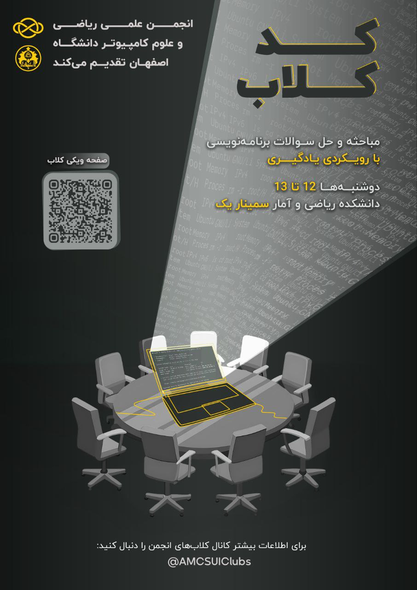

# کد کلاب

- **برگزارکننده**: انجمن علمی ریکا (ریاضی و علوم کامپیوتر دانشگاه اصفهان)
- **مدیریت کلاب**: داوود نصرتی، دانشجوی کارشناسی علوم‌کامپیوتر
- **سطح برنامه**: دانشگاهی
- **شرکت‌کنندگان**: ۲۰ دانشجوی کارشناسی و کارشناسی ارشد رشته‌های ریاضی، علوم و مهندسی کامپیوتر دانشگاه اصفهان
- **هزینه ثبت‌نام**: رایگان
- **زمان**: هر هفته ساعت ۱۲ الی ۱۳
- **مکان**: سالن سمینار دانشکده ریاضی و آمار دانشگاه اصفهان

---

### خلاصه

**کد کلاب** یکی از برنامه‌های شاخص نیم‌سال اول ۱۴۰۴–۱۴۰۳ انجمن علمی ریکا (ریاضی و علوم‌کامپیوتر دانشگاه اصفهان) بود که با هدف ایجاد بستری برای **یادگیری عمیق‌تر** کدنویسی و **حل مسئله** برگزار شد. این کلاب به‌عنوان یک محفل علمی، فرصتی فراهم کرد تا دانشجویان از رشته‌ها و دانشکده‌های مختلف در کنار یکدیگر، به بررسی مسائل الگوریتمی، تمرین مهارت‌های کدنویسی و تبادل دانش بپردازند.

در طول برگزاری، کد کلاب به محلی پرشور برای بحث و یادگیری جمعی بدل شد؛ جایی که علاقه‌مندان برنامه‌نویسی، چه در سطح مبتدی و چه در سطح پیشرفته، فضایی برای رشد فردی و گروهی یافتند.

کد کلاب در ۱۵ جلسه هفتگی شکل گرفت و با مدیریت آقای داوود نصرتی میزبان دانشجویانی از رشته‌ها و سطوح مختلف بود که علاقه‌مند به کدنویسی، حل مسائل و تفکر الگوریتمی بودند.
در هر جلسه، شرکت‌کنندگان با مسائلی که از پیش تعیین‌شده بود روبه‌رو می‌شدند و در فضایی آزاد و بدون فشار، به تبادل ایده، تجربه و حل مسئله می‌پرداختند.

>کد کلاب نه‌تنها یک تمرین ساده، بلکه تجربه‌ای ارزشمند برای به چالش کشیدن توانایی‌های کدنویسی، تقویت قدرت تفکر و حل مسئله و افزایش اعتماد به نفس در دانشجویان بود.

---

### چیستی

**کد کلاب** محفلی هفتگی بود که با محوریت حل مسائل برنامه‌نویسی و الگوریتمی برگزار می‌شد. جلسات به‌گونه‌ای طراحی شده بود که دانشجویان در فضایی دوستانه اما منظم، فرصت تمرین مستمر داشته باشند. منابع اصلی پرسش‌ها از پلتفرم‌های معتبر جهانی همچون _LeetCode_ و _Codeforces_ انتخاب می‌شد تا شرکت‌کنندگان با استانداردهای بین‌المللی حوزه‌ی برنامه‌نویسی رقابتی آشنا شوند.

در هر جلسه، علاوه بر حل مسائل، مباحثی پیرامون تکنیک‌های بهینه‌سازی کد، روش‌های طراحی الگوریتم، تحلیل زمانی و مقایسه‌ی رویکردهای مختلف نیز مطرح می‌شد. این رویکرد سبب می‌شد کلاب نه تنها محلی برای تمرین عملی، بلکه بستری برای یادگیری مفاهیم بنیادین علوم کامپیوتر باشد.

مسائل و سوالات متنوع و جذابی در طول دوره مطرح شد، از جمله:

- Merge Sorted Array
- Remove Element
- Majority Element
- Rotate Array
- Best time to Buy and Sell Stock
- Best time to Buy and Sell Stock ii
- Jump Game
- Jump Game ii
- H-Index
- Insert Delete GetRandom 0(1)
- Product of Array Except Self
- Gas Station
- Candy
- Trapping Rain Water
- Roman to Integer
- Integer to Roman
- Length of Last Word
- Longest Common Prefix
- Reverse Words in a String

تنوع مسائل و درجه‌ سختی آنها باعث شد که شرکت‌کنندگان با انواع مختلف مسائل و روش‌های حل متفاوت آشنا شوند.

---

### چرایی

در سال‌های اخیر، نیاز به فعالیت‌های دانشجویی در حوزه‌ی کدنویسی بیش از پیش احساس می‌شد. بسیاری از دانشجویان، چه در ابتدای مسیر یادگیری و چه در مراحل پیشرفته‌تر، به فضایی نیاز داشتند که در آن بدون فشارهای رسمی آموزشی، بتوانند تمرین کنند، اشتباه کنند، تجربه بیاموزند و در کنار هم رشد نمایند.

کد کلاب دقیقاً در پاسخ به این نیاز طراحی شد. این کلاب نه تنها فرصتی برای افزایش مهارت‌های حل مسئله و آمادگی برای مسابقات برنامه‌نویسی بود، بلکه محلی برای شکل‌گیری ارتباطات علمی و دوستانه میان دانشجویان رشته‌های مختلف به شمار می‌آمد. به‌نوعی، کلاب ریکا به یک «اجتماع کوچک یادگیری» تبدیل شد؛ اجتماعی که با انگیزه‌ی فردی آغاز می‌شد اما در نهایت به یک تجربه‌ی جمعی ارزشمند منتهی می‌گشت.

کد کلاب با این رویکرد شکل گرفت که:

- بستری برای تمرین، یادگیری و اشتباه و تجربه کردن بدون فشارهای رسمی آموزشی ایجاد کند.
- ارتباط میان علاقه‌مندان و افراد توانمند در مباحث الگوریتمی و کدنویسی را تقویت کند.
- انگیزه یادگیری و کسب تجربه در حوزه برنامه‌نویسی و الگوریتم‌ها را بالا ببرد.

این جلسات با فضایی صمیمی و حضور شرکت‌کنندگان با سطوح مختلف، فرصتی ایجاد کرد تا همه بتوانند بدون ترس از اشتباه، مهارت‌های خود را تقویت کنند و از بازخوردهای دیگر افراد حاضر در جلسه و هم‌فکری با آنها بهره ببرند.

---

### چگونگی

روند اجرای کد کلاب ساختاری منظم داشت که سبب پایداری و جذابیت آن می‌شد:

1. انتخاب مسائل: در ابتدای هر هفته مجموعه‌ای از مسائل متنوع با سطوح مختلف سختی از وبگاه‌های بین‌المللی انتخاب و از طریق کانال انجمن منتشر می‌شد. این انتخاب‌ها متناسب با سطح شرکت‌کنندگان و با هدف پوشش موضوعات گوناگون، از الگوریتم‌های پایه‌ای تا مسائل پیشرفته، صورت می‌گرفت.

2. جلسه حضوری: دانشجویان در روز مقرر شده در سالن سمینار گردهم می‌آمدند. ابتدا فرصتی برای کار فردی یا گروهی روی مسائل فراهم می‌شد. این بخش به شرکت‌کنندگان کمک می‌کرد تا تمرکز خود را روی موضوع گذاشته و دست‌ به‌ کد شوند.

3. بحث و تبادل‌نظر: در بخش دوم جلسه، حل‌مسائل به‌صورت جمعی بررسی می‌شد. راه‌حل‌های مختلف روی تخته یا لپ‌تاپ ارائه و نقد می‌شدند. در این فرآیند، نه‌تنها پاسخ صحیح بلکه مسیرهای اشتباه یا ناکارآمد نیز بررسی می‌شد تا همگان از تجربه‌ی یکدیگر بیاموزند.

4. مدیریت و هدایت: داوود نصرتی به‌عنوان مدیر کد کلاب، نقش کلیدی در هدایت مباحث و ایجاد فضای تعاملی داشت. با مدیریت منسجم او، جلسات به‌گونه‌ای پیش می‌رفت که همه‌ی شرکت‌کنندگان، صرف‌نظر از سطح مهارتشان، فرصتی برای مشارکت و یادگیری پیدا می‌کردند.

این ساختار موجب شد کد کلاب به برنامه‌ای مستمر و پرثمر تبدیل شود، نه یک رویداد گذرا.

---

### نتایج و پیامدها

کد کلاب ریکا فراتر از یک برنامه‌ی آموزشی ساده بود و آثار مثبت متعددی بر جای گذاشت:

- گسترش دامنه‌ی مشارکت: دانشجویانی از رشته‌های مختلف و حتی دانشکده‌های دیگر در جلسات حاضر شدند. این تنوع، کیفیت بحث‌ها را افزایش داده و به تبادل دیدگاه‌های متفاوت منجر شد.
- ارتقای مهارت‌ها: شرکت‌کنندگان توانستند به‌طور مستمر توانایی‌های حل مسئله، تحلیل الگوریتمی و کدنویسی خود را بهبود دهند. بسیاری از آنان اذعان داشتند که سرعت و دقتشان در حل مسائل به‌طور محسوسی ارتقا یافته است.
- الهام‌بخشی: حضور برخی از دانشجویان باتجربه، از جمله مقام‌آوران مسابقات برنامه‌نویسی ACM، الهام‌بخش دیگران بود و فضای رقابتی–همیارانه‌ای ایجاد کرد.
- ایجاد جامعه‌ی پویا: کد کلاب به شکل‌گیری یک اجتماع کوچک از علاقه‌مندان کدنویسی کمک کرد؛ اجتماعی که خارج از محدودیت‌های رسمی کلاس‌های دانشگاهی، با انگیزه‌ی یادگیری و رشد جمعی پیش می‌رفت.

به‌طور کلی، کد کلاب توانست جایگاه خود را به‌عنوان یک فعالیت ارزشمند در میان دانشجویان تثبیت کند و الگویی موفق برای برگزاری برنامه‌های مشابه در آینده باشد.

