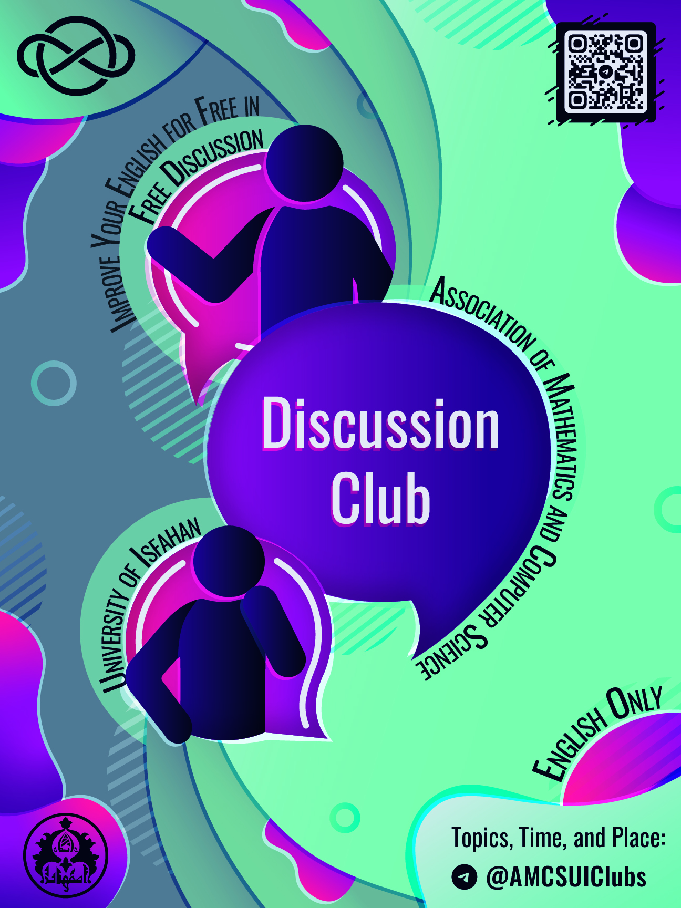

# دیسکاشن کلاب

- **برگزارکننده**: انجمن علمی ریکا (ریاضی و علوم کامپیوتر دانشگاه اصفهان)
- **مدیریت کلاب**: ریحانه باقری، دانشجوی کارشناسی علوم‌کامپیوتر
- **سطح برنامه**: دانشگاهی
- **شرکت‌کنندگان**: ۲۰ دانشجوی کارشناسی و کارشناسی ارشد رشته‌های ریاضی، علوم کامپیوتر و... دانشگاه اصفهان
- **هزینه ثبت‌نام**: رایگان
- **زمان**: هر هفته ساعت ۱۲:۳۰ الی ۱۴
- **مکان**: سالن سمینار دانشکده ریاضی و آمار دانشگاه اصفهان

---

### خلاصه

انجمن علمی ریکا (ریاضی و علوم کامپیوتر دانشگاه اصفهان) مجموعه نشست‌‌هایی آموزشی-تعاملی با عنوان **دیسکاشن کلاب‌** در سال تحصیلی ۱۴۰۴-۱۴۰۳ با هدف ارتقای مهارت مکالمه زبان انگلیسی در محیطی دوستانه و علمی برگزار کرد.این کلاب در سال ۱۴۰۱ افتتاح شد و تا امروز نیز ادامه داشته. این کلاب در قالب ۲۰ جلسه حضوری و ۹ جلسه آنلاین و به صورت هفتگی شکل گرفت و با مدیریت **خانم ریحانه باقری** میزبان دانشجویانی از رشته‌ها و سطوح مختلف بود که علاقه‌مند به تمرین زبان و تبادل نظر در موضوعات متنوع بودند.

در هر جلسه، شرکت‌کنندگان با موضوعی از پیش تعیین‌شده و پرسش‌هایی جذاب روبه‌رو می‌شدند و در فضایی آزاد و بدون فشار، به تبادل ایده و تجربه می‌پرداختند. مباحث مطرح‌شده، از چالش‌های روان‌شناسی و اجتماعی تا تأثیر فناوری و مسائل فرهنگی را شامل می‌شد. این فرایند نه‌تنها به بهبود و گسترش دایره لغات و مهارت گفتاری افراد کمک می‌کرد، بلکه موجب می‌شد افراد قدرت کلام و واژگان خود را به چالش بکشند.

>دیسکاشن کلاب نه‌تنها یک تمرین زبان ساده، بلکه تجربه‌ای ارزشمند برای به چالش کشیدن توانایی‌های زبانی، تقویت اعتمادبه‌نفس در بیان نظرات به زبان انگلیسی و ایجاد ارتباطات جدید میان دانشجویان بود.

---

### چیستی

**دیسکاشن کلاب** یک رویداد آموزشی-تعاملی بود که به علاقه‌مندان زبان انگلیسی این فرصت را داد تا در محیطی علمی، دوستانه و پویا به تمرین مهارت مکالمه بپردازند و توانایی‌های خود را تقویت کنند.

در هر جلسه، موضوعی از پیش تعیین‌شده معرفی می‌شد و شرکت‌کنندگان با پرسش‌ها و مثال‌های مرتبط به بحث می‌پرداختند و در تعامل با یکدیگر به دانش زبانی خود می‌افزودند. موضوعات متنوع و جذابی در طول دوره مطرح شد، از جمله:

- Social Anxiety (اضطراب اجتماعی)
- Reality vs Expectations Trap (دام واقعیت در برابر انتظارات)
- The Influence of Technology on Human Relationships (تأثیر فناوری بر روابط انسانی)
- Procrastination (به تعویق انداختن)
- Effect of Birth Order (تأثیر ترتیب تولد)
- Second Class CitizenShip (شهروندی درجه دو)
- Education System: Savior or Disaster Itself (سیستم آموزشی: نجات‌بخش یا مخرب؟)
- Superstitions (خرافات)
- In Your Twenties (دهه بیست سالگی)
- 36 Questions Mentioned in New York Times (سوال نیویورک تایمز۳۶)
- Shaped by the Feed: How Social Media and Society Influence Our Choices (تأثیر شبکه‌های اجتماعی و جامعه بر انتخاب‌های ما)
- Social Anxiety ( اضطراب اجتماعی)
- Generation Gap (شکاف نسلی)
- Language Effect (اثر زبان)
- Conformity & Groupthink: The Power Of Social Influence (هم رنگی و تفکر گروهی: قدرت نفوذ اجتماعی)
- Crime & Consequence: Understanding Justice In Modern Society (جرم و پیامدهایش: فهم عدالت در جامعه مدرن)
- Behind The Scenes Of Known Antagonists (پشت پرده ضدقهرمان‌های شناخته شده)
- Around The World In 80 Minutes (دور دنیا در ۸۰ دقیقه)
- A Debate On Originality And Individuality (بحثی درباره اصالت و فردیت)
- Justice (عدالت)

این تنوع موضوعی باعث شد که شرکت‌کنندگان علاوه بر تمرین زبان، با دیدگاه‌ها و جهان‌بینی‌های متفاوت نیز آشنا شوند.

---

### چرایی

زبان انگلیسی یکی از مهم‌ترین زبان‌های زنده دنیاست و یادگیری آن نه‌تنها یک مهارت، بلکه یک امتیاز جدی در زندگی روزمره، تحصیل و کار محسوب می‌شود. با رشد ارتباطات بین‌المللی، توانایی صحبت روان و دقیق به این زبان به یک ضرورت بدل شده است. برگزاری جلسات به صورت هفتگی و مستمر باعث شد تا افراد با صحبت راجع به موضوعات گوناگون با سایر شرکت کنندگان در سطوح مختلف، به دایره واژگان خود بیفزایند، نحوه بیان مطالب موردنیاز خود به روش‌های گوناگون فراگیرند و حتی با نظرات و جهان‌بینی سایر افراد راجع به موضوعاتی جالب آشنا شوند.

دیسکاشن کلاب با این رویکرد شکل گرفت که:

- بستری برای مکالمه واقعی و بدون فشار آزمون ایجاد کند.
- ارتباط میان علاقه‌مندان به زبان انگلیسی را تقویت کند.
- انگیزه یادگیری و استفاده عملی از زبان را بالا ببرد.

این جلسات با فضایی صمیمی و حضور شرکت‌کنندگان در سطوح زبانی مختلف، فرصتی ایجاد کرد تا همه بتوانند بدون ترس از اشتباه، مهارت خود را تقویت کنند و از بازخوردهای دیگر افراد حاضر در جلسه بهره ببرند.

---

### چگونگی

جلسات دیسکاشن کلاب به صورت هفتگی، در زمان‌هایی که با اکثریت شرکت‌کنندگان هماهنگ شده بود و در صورت امکان به صورت حضوری در دانشکده و یا به صورت آنلاین در بستر گوگل میت برگزار می‌شد. پیش از هر نشست، موضوع جلسه همراه با مجموعه‌ای از پرسش‌های راهنما برای اعضا ارسال می‌شد تا فرصت داشته باشند درباره آن فکر کنند و ایده‌هایشان را آماده نمایند. این سوالات امکان بحث و مشارکت را برای شرکت‌کنندگان و انعطاف در پاسخ‌دهی را به وجود می‌آورد.

در ابتدای هر جلسه، مدیر برنامه (خانم ریحانه باقری) با معرفی موضوع، فضای بحث را شکل می‌داد و قوانین ساده‌ای برای حفظ نظم و احترام متقابل یادآوری می‌کرد. سپس گفت‌وگو آغاز می‌شد و هر فرد به‌نوبت یا به‌دلخواه، دیدگاه خود را بیان می‌کرد. سایر اعضا نیز با پرسیدن سؤال، ارائه مثال یا نقد سازنده، بحث را گسترش می‌دادند.

پرسش‌های طراحی‌شده انعطاف کافی داشتند تا افراد با سطوح مختلف زبان بتوانند در بحث شرکت کنند و بیان آزادانه نظرات، حتی با خطاهای زبانی، تشویق می‌شد. علاوه بر موضوعات اصلی، گاهی تجربه‌های شخصی یا اخبار روز نیز به بحث اضافه می‌شد که هم جذابیت و پویایی جلسه را افزایش می‌داد و هم باعث یادگیری واژگان و ساختارهای تازه می‌شد.

---

### نتایج و پیامدها

شرکت‌کنندگان حاضر در جلسات اهداف متفاوتی را دنبال می‌کردند، اما دیسکاشن کلاب با حفظ روند خود توانست بخش عمده‌ای از آن‌ها را برآورده کند. مهم‌ترین نتایج عبارت بودند از:

- گسترش دایره لغات و بهبود روانی گفتار
- افزایش اعتمادبه‌نفس در مکالمه انگلیسی
- آشنایی با موضوعات و دیدگاه‌های متنوع در تعامل با افراد دیگر
- ایجاد انگیزه برای ادامه یادگیری و ارتقای سطح زبان انگلیسی
- بهبود مهارت‌های شنیداری و درک مطلب از طریق گفت‌وگوهای واقعی

در مجموع، دیسکاشن کلاب نه‌تنها به‌عنوان یک تمرین زبانی، بلکه به‌عنوان یک تجربه فرهنگی و اجتماعی ارزشمند برای شرکت‌کنندگان باقی ماند.

