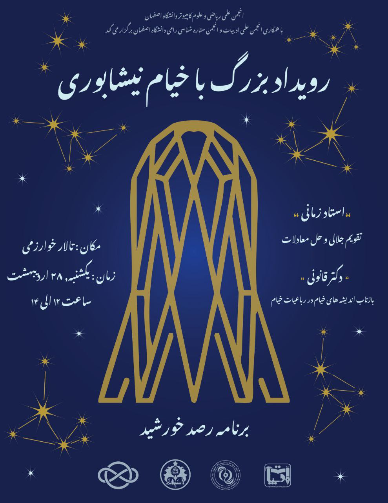

# رویداد خیام نیشابوری

- **برگزارکننده**: انجمن علمی ریکا (ریاضی و علوم کامپیوتر دانشگاه اصفهان) با همکاری انجمن ادبیات دانشگاه اصفهان و انجمن ستاره‌شناسی رامی
- **سخنرانان**: استاد اکبر زمانی، دکتر حمیدرضا قانونی

* **مراکز همکار**: دانشکده ریاضی و آمار دانشگاه اصفهان، انجمن ادبیات دانشگاه اصفهان و انجمن ستاره‌شناسی رامی

- **سطح برنامه**: دانشگاهی
- **شرکت‌کنندگان**: حدود ۳۰ نفر از دانشجویان و علاقه‌مندان به علوم ریاضی، نجوم و ادبیات
- **هزینه ثبت‌نام**: رایگان
- **زمان**: یکشنبه ۲۸ اردیبهشت ماه ۱۴۰۴
- **مکان**: تالار خوارزمی دانشکده ریاضی و آمار دانشگاه اصفهان

---

### خلاصه

رویداد بزرگ خیام نیشابوری با همکاری سه انجمن علمی دانشگاه اصفهان برگزار شد؛ رویدادی که به یاد و نام حکیم عمر خیام، شاعر، ریاضی‌دان و ستاره‌شناس برجسته‌ی ایرانی، شکل گرفت. این برنامه در تاریخ ۲۸ اردیبهشت ماه ۱۴۰۴ و با حضور حدود ۳۰ نفر از علاقه‌مندان در تالار خوارزمی دانشکده ریاضی و آمار دانشگاه اصفهان برگزار شد. دو سخنرانی علمی و ادبی درباره اندیشه‌ها و رباعیات خیام توسط **آقای دکتر قانونی** و تقویم جلالی و حل معادلات توسط **استاد اکبر زمانی**، فضای برنامه را سرشار از دانش و گفت‌وگو کرد. هرچند بخش رصد خورشید به دلیل شرایط جوی لغو شد، اما تجربه‌ای صمیمی، آموزنده و الهام‌بخش برای شرکت‌کنندگان رقم خورد. افتتاح سخنرانی ها با سخنرانی افتخاری ریس دانشکده، **آقای دکتر حمید بیدرام** بود.

---

### چیستی

این رویداد یک برنامه‌ی یک‌روزه بود که هدف اصلی آن بررسی ابعاد گوناگون زندگی و آثار خیام نیشابوری از منظر ادبی و علمی بود. محورها و موضوعات اصلی شامل:

- بازتاب اندیشه‌ها و فلسفه‌ی خیام در رباعیات،
- بررسی تقویم جلالی و دستاوردهای ریاضی او.

این مباحث توسط دو سخنران برجسته ارائه شد:

- دکتر قانونی با نگاهی تحلیلی و دقیق به رباعیات خیام، لایه‌های عمیق‌تر فلسفی و ادبی را آشکار ساخت.
- استاد زمانی با توضیح مفاهیم ریاضی و نجومی مرتبط با تقویم جلالی، شرکت‌کنندگان را به قرن پنجم هجری برد.

برنامه قرار بود با کارگاه و رصد خورشید ادامه یابد که متأسفانه به دلیل شرایط محیطی انجام نشد. با این حال تلاش مسئولان و دانشجویان برای مدیریت صدا، اجرا و هماهنگی‌ها بسیار ارزشمند بود.

---

### چرایی

انجمن‌های برگزارکننده با این هدف مشترک گرد هم آمدند که یاد و میراث خیام، این چهره‌ی چندبُعدی تاریخ ایران، زنده نگه داشته شود. خیام نمادی است از پیوند میان علم و هنر؛ پیوندی که در دنیای امروز بیش از پیش به آن نیازمندیم. اهداف اصلی رویداد چنین بودند:

- گرامی‌داشت یاد و آثار خیام در حوزه‌های شعر، ریاضی و نجوم.
- ترغیب دانشجویان به مطالعه‌ی تاریخ علم و ادبیات ایران.
- ایجاد فضای میان‌رشته‌ای برای تبادل‌نظر و هم‌افزایی بین دانشجویان رشته‌های مختلف.

استقبال و حضور فعال دانشجویان نشان داد که این اهداف تا حد زیادی تحقق یافته‌اند.

---

### چگونگی

ایده‌ی برگزاری این رویداد ابتدا در انجمن علمی ریاضی و علوم‌کامپیوتر شکل گرفت و سپس با مشارکت انجمن‌های ادبیات و ستاره‌شناسی رامی به مرحله‌ی اجرا رسید. مراحل برنامه‌ریزی شامل انتخاب محورهای اصلی، هماهنگی با اساتید سخنران (دکتر قانونی و استاد زمانی)، طراحی زمان‌بندی و تأمین تجهیزات موردنیاز بود.

با توجه به محدودیت‌ها، بسیاری از امور اجرایی از جمله صدا و تصویربرداری به‌طور داوطلبانه توسط دانشجویان انجام شد. این روحیه‌ی مشارکتی سبب شد که اجرا با کیفیت مطلوب و فضایی پرنشاط همراه باشد.

---

### نتایج و پیامدها

بازخوردهای دریافتی از شرکت‌کنندگان نشان‌دهنده‌ی ارزشمند و مفید بودن برنامه بود. تحلیل‌های ادبی و علمی ارائه‌شده در سخنرانی‌ها مورد استقبال قرار گرفت و علاقه‌ی تازه‌ای برای مطالعه‌ی آثار و اندیشه‌های خیام در میان دانشجویان ایجاد شد.

پیامدهای مهم این رویداد عبارت بودند از:

- افزایش آگاهی نسبت به ابعاد چندگانه‌ی شخصیت خیام،
- ایجاد ارتباط علمی و ادبی میان دانشجویان رشته‌های مختلف،
- تقویت تجربه‌ی همکاری‌های میان‌رشته‌ای در سطح دانشگاه،
- و پرورش روحیه‌ی کار گروهی در میان اعضای انجمن‌ها.

هرچند بخش رصد عملی نشد، اما فضای پرشور و علمی رویداد توانست اثری ماندگار بر جای بگذارد و انگیزه‌ای برای برگزاری رویدادهای مشابه و گسترده‌تر در آینده فراهم آورد.

---

### ضمائم

---
