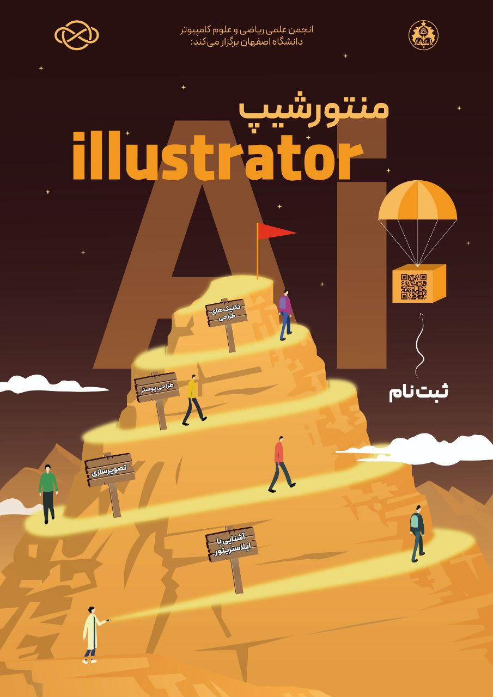

# منتورشیپ ایلاستریتور

- **برگزارکننده**: انجمن علمی ریکا (ریاضی و علوم کامپیوتر دانشگاه اصفهان)
- **منتور**: امیرحسین کامرانی‌نژاد، دانشجوی کارشناسی علوم‌کامپیوتر
- **سطح برنامه**: دانشگاهی
- **شرکت‌کنندگان**: ۱۰ دانشجوی کارشناسی ریاضی و علوم کامپیوتر
- **هزینه ثبت‌نام**: رایگان
- **زمان**: در طول سال تحصیلی **۱۴۰۳ تا ۱۴۰۴**
- **مکان**: دانشکده ریاضی و آمار دانشگاه اصفهان و بستر مجازی گوگل میت

---
### خلاصه  

انجمن علمی ریکا، در پاسخ به نیاز روزافزون دانشجویان و همچنین ضرورت‌های داخلی خود، اقدام به اجرای **طرح منتورشیپ گرافیک و تصویرسازی** کرد. این طرح در طول سال تحصیلی ۱۴۰۳ تا ۱۴۰۴، جایگزین کارگاه‌های آموزشی سنتی شد . این طرح با هدف **تربیت طراحان گرافیک کارآمد و تقویت تیم‌های داخلی انجمن** و همچنین **توانمندسازی دانشجویان برای کسب درآمد** از طریق یادگیری ابزارهای کاربردی (مانند ایلاستریتور) سازماندهی شد. هسته‌ی اصلی این طرح، تشکیل **حلقه‌های یادگیری گروهی** با نظارت مستمر منتورهای مجرب بود، که در آن هنرجویان محتوای شخصی‌سازی‌شده دریافت می‌کردند، تمرینات چالشی و متنوع انجام می‌دادند و به‌صورت منظم بازخورد ساختاریافته دریافت می‌کردند. موفقیت این رویکرد، هم در تقویت مهارت‌های تخصصی و هم در ارتقای توانایی‌های جانبی همچون مدیریت پروژه، تقسیم کار و کار تیمی، در نظرسنجی‌های پایانی به‌وضوح تأیید شد.

---
### چیستی  

«طرح منتورشیپ گرافیک و تصویرسازی» یک برنامه **آموزشی-پرورشی عمیق و تخصصی** بود که توسط انجمن علمی ریکا در طول سال تحصیلی **۱۴۰۳ تا ۱۴۰۴** اجرا شد. این طرح با همفکری و تأیید استاد مشاور انجمن، به عنوان جایگزینی برای کارگاه‌های آموزشی سنتی انتخاب شد، زیرا هدف، صرفاً آموزش ابزار نبود. ماهیت این طرح بر **شکل‌گیری حلقه‌های یادگیری گروهی و دانشجویی** با نظارت یک یا چند منتور مجرب استوار بود. در تعریف این طرح، بر **نقش پر اهمیت تعامل افراد با یکدیگر** در یادگیری تأکید شد تا امکان گفت‌وگو، پرسش و پاسخ، و یادگیری متقابل برای شرکت‌کنندگان فراهم شود.

هدف آموزشی این رویداد، فراتر از تسلط بر نرم‌افزارهایی مانند **ایلاستریتور (Illustrator)** بود؛ بلکه به **آموزش اصول مبانی تصویرسازی و طراحی بر اساس استانداردهای روز** توجه داشت تا هنرجویان بتوانند محتوای تولید شده توسط خود را به سطح حرفه‌ای برسانند. این طرح با ایجاد بستری نوین، امکان رشد و یادگیری متقابل را فراهم کرد، به‌طوری‌که مسیر یادگیری همراه با پشتیبانی افراد مجرب (منتورها) و دریافت بازخورد مستمر و شخصی‌سازی‌شده طی شد.

---
### چرایی  

این طرح منتورشیپ، با هدف پاسخگویی هم‌زمان به نیازهای دانشجویان و انجمن، بر اساس مشورت با استاد مشاور و با هدف‌گذاری‌های زیر اجرا شد:

1. **توانمندسازی شغلی دانشجویان:** آموزش ابزارهای کاربردی (مانند ایلاستریتور) به دانشجویان به‌گونه‌ای که قابلیت **کسب درآمد** را برای آنان فراهم آورد و مسیر اشتغال‌زایی را تسهیل کند.

2. **سرمایه‌گذاری برای آینده انجمن:** رفع نیاز بالای انجمن به طراحان گرافیک بیشتر، جهت کاهش حجم کاری افراد محدود و **سرمایه‌گذاری بلندمدت** برای جذب و آموزش اعضای کارآمد برای تیم‌های داخلی.

3. **ایجاد مسیر یادگیری هدفمند:** پاسخ به درخواست‌های دانشجویان برای یادگیری از گرافیست‌های حرفه‌ای انجمن، با ایجاد فرصت استفاده از تجربیات و راهنمایی‌های دانشجویان باسابقه‌تر در یک **مسیر یادگیری خودآموز و شناسایی بهتر نقاط ضعف و قوت فردی**.

4. **تغییر الگوی آموزشی:** حرکت از کارگاه‌های سنتی به **طرح منتورشیپ** که متمرکز بر شکل‌گیری گروه‌های دانشجویی و **گفت‌وگو و یادگیری متقابل** است، تا از اتلاف وقت هنرجویان جلوگیری شده و محتوای متناسب با نیاز آنان ارائه گردد.

---
### چگونگی

1. **فراخوان و تشکیل گروه:** پس از انتشار **فراخوان شروع طرح منتورشیپ**،‌ ثبت‌نام‌کنندگان به عضویت **گروه تلگرامی** طرح درآمدند که به عنوان فضای اصلی تعامل و پرسش و پاسخ عمل می‌کرد. 

2. **تعیین سطح و محتوا:** در آغاز، منتورها با هر هنرجو **صحبت‌های تخصصی** انجام دادند تا سطح توانمندی و نیازهای او به‌درستی تعیین شود. سپس، محتوای آموزشی متناسب با نیاز هر هنرجو، از منابع مختلف و با در نظر گرفتن امکان **انتخاب محتوا با بیشترین اثربخشی** برای هر فرد، گردآوری و در اختیار او قرار داده می‌شد. محتوای ارائه شده فراتر از آموزش صرف ابزارها بود و به **مفاهیم پایه‌ای کار با وکتور و اصول طراحی** نیز می‌پرداخت.

3. **تمرینات و بازخورد فردی:** در ادامه مسیر، **تسک‌ها و تمرینات چالشی و متنوع** که قسمت‌های مورد نیاز کار با نرم‌افزار و طراحی را پوشش می‌دادند، به اعضا واگذار می‌شد. پس از انجام وظایف، **فیدبک‌های لازم** توسط منتورها و سایر اعضای حلقه جهت بهبود طرح، اصولی‌تر شدن کار و رفع اشکال به آن‌ها منتقل می‌گردید.

4. **جلسات هفتگی و کار گروهی:** برای پیشرفت بیشتر، در پایان هر هفته **جلسات تحلیل و بررسی گروهی** برگزار می‌شد. در این جلسات، ضمن بیان نکات کلیدی برای ارتقاء سطح طراحی توسط منتورها، به سؤالات اعضا پاسخ داده می‌شد. همچنین، اعضا طبق صلاحدید منتورها، به **گروه‌های چند نفره تقسیم شده** و **پروژه‌های گروهی** متناسب با توانایی‌ها و نیازمندی‌های آنان مشخص می‌شد.

5. **نظارت مستمر:** به منظور نگه داشتن هنرجوها در مسیر یادگیری، اقداماتی مانند **دریافت بازخورد و گزارش عملکرد به‌طور پیوسته** از شرکت‌کنندگان و نظارت مداوم در گروه تلگرامی انجام می‌شد.

---
### نتایج و پیامدها

طرح منتورشیپ گرافیک و تصویرسازی با موفقیت توانست به اهداف تعیین‌شده در زمینه آموزش عمیق، توانمندسازی دانشجویی و تأمین نیروی ماهر دست یابد.

- **کسب مهارت‌های چندگانه:** ثمره اصلی این طرح، فراتر از تقویت مهارت‌های طراحی و تسلط بر نرم‌افزار ایلاستریتور، **یادگیری تجربه مدیریت پروژه، تقسیم کار و کار تیمی** بود که همگی مهارت‌های حیاتی در بازار کار هستند.

- **تأمین نیروی کارآمد:** این رویکرد به قصد آموزش اعضای کارآمد برای انجمن صورت گرفت و موفق شد بخشی از نیاز انجمن به نیروی طراحی گرافیک ماهر را برای آینده برطرف کند.

- **آموزش قابلیت کسب درآمد:** یکی از پیامدهای مهم طرح، فراهم کردن امکان **کسب درآمد برای دانشجویان** از طریق فراگیری این مهارت تخصصی و کاربردی بود که با موفقیت در میان هنرجویان رواج یافت.

- **رضایت شرکت‌کنندگان:** بنا به نظرسنجی‌ها، **رضایت بالا** از ساختار منتورشیپ، محتوای شخصی‌سازی‌شده و دریافت بازخورد مستمر، حاکی از موفقیت این مدل آموزشی نوین در دانشکده بود.

---
### ضمائم 

---
