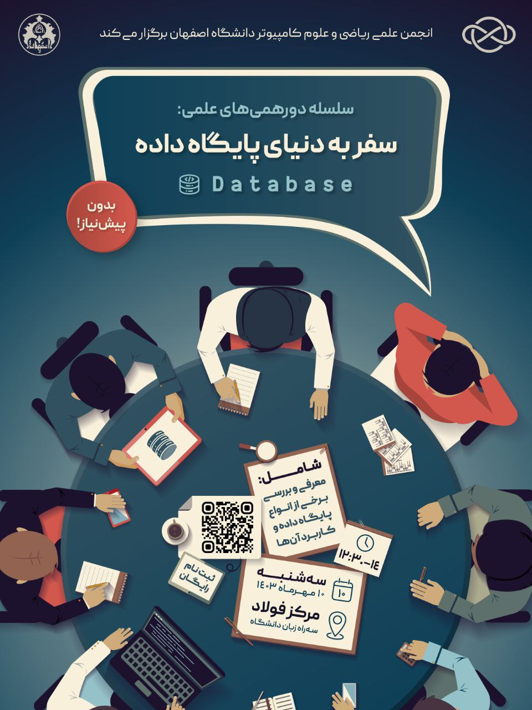

# دورهمی علمی پایگاه‌های داده

- **برگزارکننده**: انجمن علمی ریکا (ریاضی و علوم کامپیوتر دانشگاه اصفهان)
- **تسهیل‌گر**: امین مسعودی دانشجوی کارشناسی علوم کامپیوتر و توسعه‌دهنده بک‌اند
- **مراکز همکار**: مرکز نوآوری فولاد مبارکه دانشگاه اصفهان
- **سطح برنامه**: دانشگاهی
- **شرکت‌کنندگان**: ۳۰ دانشجوی کارشناسی از رشته‌های علوم کامپیوتر، مهندسی کامپیوتر و برق دانشگاه‌های استان اصفهان
- **هزینه ثبت‌نام**: رایگان
- **زمان**: ۱۰ مهرماه ۱۴۰۳  
- **مکان**: مرکز نوآوری فولاد مبارکه دانشگاه اصفهان

---

### خلاصه  
در تاریخ ۱۰ مهرماه ۱۴۰۳، انجمن علمی ریکا (ریاضی و علوم‌کامپیوتر دانشگاه اصفهان) نخستین دورهمی علمی خود در سال تحصیلی را با محوریت «پایگاه‌های داده» برگزار کرد. این نشست با هدف آشنایی عملی با انواع مدل‌های داده‌ای و درک بهتر معماری‌های مختلف دیتابیس طراحی شده بود. در طی این جلسه، علاوه بر بررسی ساختار پایگاه‌های داده رابطه‌ای و NoSQL، مفاهیم کلیدی آن‌ها نیز به زبان ساده مرور شد. فضای رویداد، صمیمی، مشارکتی و مفهومی بود و شرکت‌کنندگان از طریق مثال‌های عملی، مفاهیم متنوعی را تجربه کردند. با توجه به بازخوردهای مثبتی که در پایان از سوی شرکت‌کنندگان دریافت شد، این رویداد آغازی جدی برای یک مسیر علمی و نوآورانه‌ در انجمن ریکا بود.

---

### چیستی  
«دورهمی علمی: پایگاه داده» نشستی مفهومی-عملی بود که با هدف آشنا کردن دانشجویان با معماری‌های مختلف دیتابیس و تفاوت‌های آن‌ها برگزار شد. این برنامه تمرکز ویژه‌ای بر ارائه‌ی مفاهیم پایه‌ با زبان ساده، تعاملی و درعین‌حال دقیق داشت تا برای طیف متنوعی از شرکت‌کنندگان (با پیش‌زمینه‌های مختلف) قابل‌فهم باشد.

در آغاز، مروری اجمالی بر تاریخچه و اهمیت پایگاه‌های داده در سیستم‌های نرم‌افزاری صورت گرفت. سپس مفاهیم کلیدی همچون Interface، DataBase، DNMS، Distributed Computing،‌ Scaling، Atomicity، Consistency، Concurrency و تفاوت آن‌ها در دیتابیس‌های مختلف به‌اختصار معرفی شدند تا زمینه برای درک بهتر موضوعات پیش رو برای همه‌ی شرکت‌کنندگان فراهم شود.

بخش نخست جلسه به پایگاه‌های داده رابطه‌ای (Relational Databases) اختصاص داشت. با اتصال به یک سرور MySQL و اجرای کوئری‌هایی مانند SELECT و JOIN، ساختارT مزایا و معایب این مدل از نزدیک بررسی شد.

در بخش دوم، وارد جهان پایگاه‌های داده‌ی NoSQL شدیم. چهار دسته اصلی به ترتیب معرفی و همراه با مثال کاربردی تحلیل و بررسی شدند:

* Columnar 
* Key-Value (نمونه: Redis، etcd)
* Document-Oriented (نمونه: MongoDB)
* Graph

تمرکز این بخش بر شناخت کاربردهای واقعی و متداول، نقاط قوت و ضعف هر مدل بود و نمونه‌ای عملی از نحوه استفاده نیز نمایش داده شد.

---

### چرایی  
در فضای آموزشی دانشگاه، معمولاً آموزش پایگاه داده‌ها به مدل‌های رابطه‌ای و دستورات SQL محدود می‌شود؛ اما دنیای توسعه نرم‌افزار، گستره‌ی وسیع‌تری از ابزارها و معماری‌ها را پیش روی توسعه‌دهندگان می‌گذارد.

این دورهمی در پاسخ به سه نیاز اصلی شکل گرفت:

* ایجاد درکی مفهومی و مقایسه‌ای از مدل‌های مختلف داده‌ای
* پوشش عملیاتی بخش‌هایی که در آموزش رسمی و آکادمیک دانشگاهی مغفول مانده‌اند
* توانمندسازی دانشجویان برای انتخاب ابزار و معماری مناسب در حل مسائل واقعی

همچنین با توجه به ارائه‌ی درس «پایگاه داده‌ها» در ترم جاری، برگزاری این برنامه فرصت مناسبی برای ارائه‌ی محتوای مکمل و بستری برای تعمیق بخشیدن به یادگیری عملی فراهم کرده بود. 

فضای تعاملی جلسه باعث شد دانشجویان با پیش‌زمینه‌های گوناگون و حتی بدون پیش‌زمینه، به‌راحتی با مفاهیم ارتباط برقرار کنند. در ادامه با توجه به بازخوردها و استقبال شرکت‌کنندگان، تیم اجرایی را بر آن داشت تا در ترم آتی دورهمی جدیدی با عنوان «راهکارهای ذخیره‌سازی» برگزار کند.

---

### چگونگی
این رویداد به‌صورت حضوری و در فضای مرکز نوآوری فولاد مبارکه برگزار شد. شرکت در جلسه برای تمام دانشجویان آزاد و رایگان بود.

**مدرس جلسه، آقای امین مسعودی** (دانشجوی علوم‌کامپیوتر و توسعه‌دهنده بک‌اند) با تسلط کامل، زبانی روان و ساختاری مرحله‌به‌مرحله، که از مفاهیم ابتدایی آغاز و تا درک کاربردی ساختارها ادامه داشت، مفاهیم را به‌گونه‌ای ارائه داد که هم برای مبتدی‌ها قابل‌فهم باشد، و هم برای آشنایان با حوزه دیتابیس نکات جدیدی در بر داشته باشد.

مراحل اجرای جلسه به شرح زیر بود:
1. مقدمه درباره چیستی پایگاه داده‌ها و کاربرد آن‌ها
2. آموزش مقدماتی مفاهیم کلیدی (Atomicity، Concurrency و ...)
3. بررسی پایگاه داده‌های رابطه‌ای + اتصال به سرور MySQL و اجرای کوئری
4. معرفی مدل‌های مختلف NoSQL با مثال‌های عملی
5. جمع‌بندی، بحث آزاد و دریافت بازخورد از شرکت‌کنندگان

فضای نشست کاملاً تعاملی طراحی شده بود. شرکت‌کنندگان با ابزارها و پایگاه‌های داده مختلف آشنا شدند و فرصت طرح پرسش، مشارکت در بحث و مشاهده‌ی مثال‌های عملی را داشتند. این موضوع باعث شد جوی پویا و یادگیری‌محور ایجاد شود. همچنین استفاده از پایگاه‌های داده واقعی در طول جلسه، بر کیفیت آموزشی آن افزود.

تیم اجرایی رویداد متشکل از ۵ نفر از اعضای فعال انجمن بود که علاوه بر برنامه‌ریزی، وظایف مربوط به تبلیغات، تدارک فضا، تنظیم محتوا و اجرای فنی را بر عهده داشتند.

---

### نتایج و پیامدها
دورهمی علمی پایگاه داده با تکیه بر آموزش کاربردی، ساده‌سازی مفاهیم، ایجاد فضای گفت‌وگومحور و مشارکت فعال دانشجویان توانست به هدف اصلی خود یعنی آشنایی عملی و قابل‌فهم با دنیای پایگاه‌های داده دست یابد.
بازخوردهای دریافت‌شده در انتهای جلسه حاکی از رضایت بالا نسبت به ساختار محتوا و سبک اجرا بود. مهم‌ترین نقاط قوت از دید مخاطبان عبارت بودند از:

* قابل‌فهم بودن موضوعات پیچیده
* تعامل بالا بین مدرس و شرکت‌کنندگان
* کاربردی بودن مطالب در فضای واقعی توسعه نرم‌افزار

یکی از نظرات پرتکرار در پایان جلسه این بود:

> «کاش برای موضوعاتی مثل شبکه، Storage یا DevOps هم همچین دورهمی‌هایی بذارید.»

تیم ریکا با توجه به این بازخوردها، تصمیم گرفت برگزاری چنین نشست‌هایی را به‌عنوان بخشی از برنامه بلندمدت خود ادامه دهد و در ترم آتی، دورهمی علمی دیگری با محوریت راهکارهای ذخیره‌سازی برگزار کند.
این تصمیم در جهت تحقق اهداف انجمن ریکاست:
 **توانمندسازی، انتقال تجربه و خلاقیت.**

---

### ضمائم 
- [فایل اسلایدهای ارائه](./statics/database.pptx) 
---

