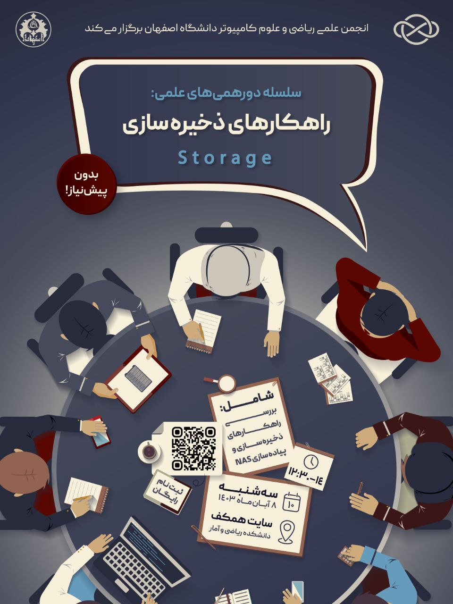

# دورهمی علمی: راهکار های ذخیره‌سازی
**پاییز ۱۴۰۳ | انجمن علمی ریکا – دانشگاه اصفهان**

**تاریخ برگزاری:** ۸ آبان‌ماه ۱۴۰۳  
**مکان:** مرکز نوآوری فولاد مبارکه، دانشگاه اصفهان (حضوری)  
**مدرس / تسهیل‌گر:** امین مسعودی – دانشجو و توسعه‌دهنده بک‌اند  
**ظرفیت:** ۲۰ نفر  
**تعداد عوامل اجرایی:** ۵ نفر  
**حضور:** آزاد و رایگان برای عموم 

---

قرار بود یک جلسه علمی-عملی برگزار کنیم؛ چیزی بیشتر از یک ارائه یا کلاس. می‌خواستیم از نزدیک با هم یک NAS راه بیندازیم، معماری‌های ذخیره‌سازی داده را لمس کنیم—SAN، DAS، NAS را مقایسه کنیم، ساختار Object / Block / File Storage را بچینیم، و در نهایت Ceph را ببینیم، نه فقط درباره‌اش بشنویم.

جلسه طراحی شده بود به سبک Home Lab:  
با هاردهای اکسترنالی که از قبل تهیه کرده بودیم، قرار بود به کمک یک سیستم، محیط آزمایشی بسازیم و موضوعی را یاد بگیریم که در فضای دانشگاهی معمولاً فرصت کار با آن پیش نمی‌آید.

مدرس مشخص شده بود. محتوا آماده بود. ثبت‌نام انجام شده بود. مکان (مرکز نوآوری فولاد مبارکه) هماهنگ شده بود. تبلیغات هم انجام شده بود.

اما یک چیز نداشتیم: **یک کامپیوتر**.

درخواست‌مان را به دانشکده دادیم. ساده بود: "یک سیستم از سایت دانشکده برای یک بعدازظهر."  
پاسخ اما ساده نبود. ریس وقت دانشکده گفتند مسئول فاوای دانشکده عوض شده و الان مسئول فاوا نداریم باید بروید فاوا. فاوا گفت: دانشکده مسئول فاوا دارد و چند هفته پیش منصوب شده بروید دانشکده.  
بعد پیشنهاد شد از دانشکده مهندسی کامپیوتر Raspberry Pi قرض بگیریم. آن‌جا گفتند: فقط برای دانشجویان مهندسی‌ست، نه علوم کامپیوتر.  

دوندگی‌ها به جایی نرسید. زمان‌مان تمام شد. جلسه‌ای که باید برگزار می‌شد، برگزار نشد.

---

این شکست فقط به خاطر نداشتن یک دستگاه کامپیوتر نبود. به خاطر اتکای بیش‌ازحد به ساختارهایی بود که عملاً حمایتی نمی‌کنند. درس مهمی گرفتیم:  
**هیچ‌گاه مسیر یک رویداد را از روی رضایت یا همکاری دانشکده تعریف نکن.**

از آن پس، تصمیم گرفتیم:

- برای هیچ رویدادی در اتوماسیون درخواست ننویسیم و یا بدنبال تایید دانشکده نباشیم  
- برای هیچ رویدادی بر روی حمایت دانشکده حساب نکنیم
- تا جای ممکن در فعالیت های دانشکده که زینفع ان دانشجو یا استاد نیست کمکی نکنیم
- فرآیند رسمی کردن رویدادها را از مسیرهایی پیش ببریم که در آن پاسخ‌گویی، معنا دارد  
- و در نهایت، **مستقل‌تر فکر کنیم و عمل کنیم**

---

درست است که این جلسه برگزار نشد، اما چیزهایی از دل آن ساختیم که شاید از خود جلسه باارزش‌تر بود:  
**تجربه، اصلاح مسیر، و ایستادن روی پای خودمان.**  
سه چیزی که نامشان در بیانیه اهداف ما هم آمده:  
توانمندسازی. انتقال تجربه. خلاقیت.

---

**پیوست‌ها:**  
- [لینک ثبت نام](https://t.me/AMCSUI/3736)