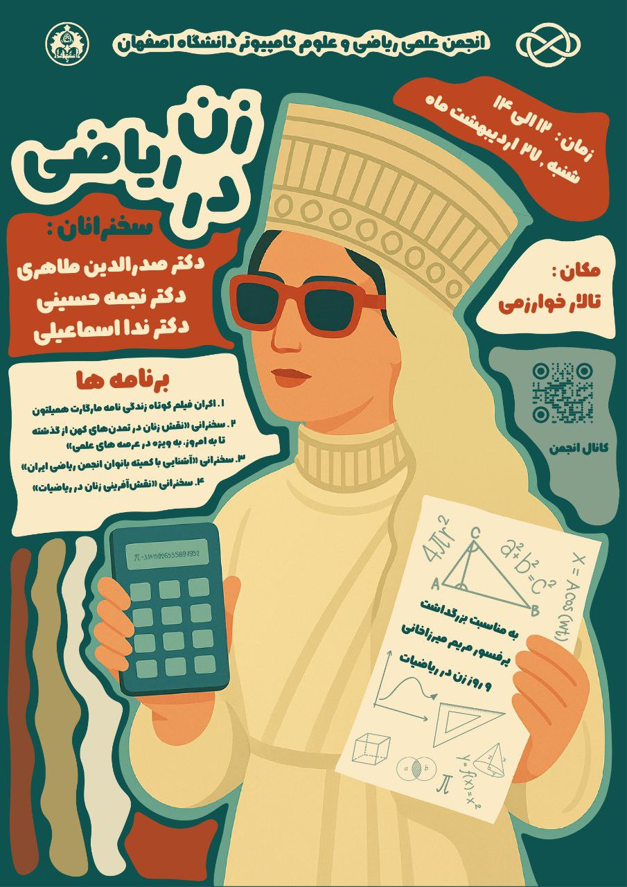

# زن در ریاضی

- **برگزارکننده**: انجمن علمی ریکا (ریاضی و علوم کامپیوتر دانشگاه اصفهان)
- **سخنرانان**:
  
    - **دکتر صدرالدین طاهری** (هیئت علمی دانشگاه هنر اصفهان و نویسنده کتاب ایزدبانوان در فرهنگ و اساطیر)
    - **دکتر نجمه حسینی** (هیئت علمی دانشگاه اصفهان و برگزیده جایزه جهانی مریم میرزاخانی)
    - **دکتر ندا اسماعیلی** (هیئت علمی دانشگاه اصفهان و مسئول کمیته بانوان انجمن ریاضی ایران)

- **سطح برنامه**: دانشگاهی
- **شرکت‌کنندگان**: بیش از ۸۰ نفر از دانشجویان دانشگاه اصفهان و دانشگاه هنر اصفهان، به همراه اساتید برجسته
- **هزینه ثبت‌نام**: رایگان
- **زمان**: شنبه ۲۷ اردیبهشت ۱۴۰۴، ساعت ۱۲ تا ۱۳:۳۰
- **مکان**: تالار خوارزمی دانشکده ریاضی و آمار دانشگاه اصفهان

---

### خلاصه

رویداد **زن در ریاضی** به مناسبت بزرگداشت پروفسور مریم میرزاخانی و روز جهانی زن در ریاضیات، توسط انجمن علمی ریکا (ریاضی و علوم‌کامپیوتر دانشگاه اصفهان) برگزار شد. این رویداد شامل اکران مستند، سخنرانی‌های علمی و معرفی فرصت‌های علمی ویژه بانوان بود و با حضور پرشور دانشجویان و اساتید، فضایی الهام‌بخش و علمی پدید آورد. روایت‌هایی از نقش زنان در ریاضیات، از تمدن‌های کهن تا دستاوردهای معاصر، شرکت‌کنندگان را با تاریخچه و اهمیت جایگاه زنان در علم آشنا کرد.

---

### چیستی

این رویداد بخشی از جنبش جهانی **روز زن در ریاضیات** است که هر ساله در دانشگاه‌ها و مؤسسات علمی جهان به مناسبت بزرگداشت پرفسور مریم میرزاخانی برگزار می‌شود. امسال، انجمن علمی ریکا نیز با پیوستن به این جریان جهانی، برنامه‌ای متنوع شامل اکران فیلم مستند درباره‌ی زنان دانشمند، سخنرانی اساتید برجسته در زمینه تاریخ و فلسفه علم و همچنین معرفی کمیته بانوان انجمن ریاضی ایران را برگزار کرد.

ویژگی خاص این برنامه، ترکیب نگاه تاریخی، فرهنگی و علمی به نقش زنان در ریاضیات بود؛ از ایزدبانوان و دانشمندان باستانی گرفته تا پروفسور مریم میرزاخانی.

پوستر رویداد زن در ریاضی در صفحه آکادمی جهانی ریاضی نیز بارگذاری شد. چرا که این روز، روز مهمی در جهان ریاضیات است. رویداد با حضور بیش از ۸۰ نفر از دانشجویان دانشگاه اصفهان و دانشگاه هنر اصفهان برگزار شد.

---

### چرایی

هدف اصلی از برگزاری این رویداد، گرامیداشت نام و یاد پروفسور مریم میرزاخانی و تأکید بر اهمیت حضور زنان در جامعه علمی بود. در جهانی که هنوز مشارکت زنان در حوزه‌های علوم پایه با چالش‌هایی روبه‌رو است، این رویداد تلاش داشت با ارائه‌ی الگوها و نمونه‌های موفق، انگیزه‌ای برای دانشجویان و علاقه‌مندان فراهم کند.

این رویداد فرصت ارزشمندی برای تقویت حضور زنان در فضای آکادمیک علوم پایه به ویژه ریاضیات بود.

این برنامه سه هدف کلیدی را دنبال می‌کرد:

- الهام‌بخشی و الگوسازی: معرفی زندگی و دستاوردهای زنان دانشمند به‌ویژه مریم میرزاخانی.
- تقویت حضور زنان در فضای علمی: تأکید بر فرصت‌ها و مسیرهای پیش‌روی دانشجویان دختر در حوزه ریاضیات.
- گفتگوی بین‌رشته‌ای: ایجاد بستری برای هم‌اندیشی دانشجویان و اساتید در حوزه‌های مختلف علوم انسانی و پایه.

---

### چگونگی

ایده برگزاری این برنامه از سوی اعضای انجمن علمی ریکا مطرح شد و با همکاری استادان مشاور و سخنرانان برجسته، به شکل یک رویداد دانشگاهی طراحی گردید. مراحل اجرا شامل بخش‌های زیر بود:

1. سخنرانی دکتر ندا اسماعیلی: معرفی کمیته بانوان انجمن ریاضی ایران و فرصت‌های علمی برای دانشجویان دختر.
2. اکران مستندی کوتاه درباره زندگی مارگارت همیلتون، دانشمند نامدار علوم کامپیوتر.
3. سخنرانی دکتر صدرالدین طاهری: بررسی نقش زنان در تمدن‌های کهن از گذشته تا به امروز و مشارکت آنان در علوم و فرهنگ.
4. پخش ویدیوی دو دقیقه‌ای در راستای بزرگداشت زنان دانشمند.
5. سخنرانی دکتر نجمه حسینی: معرفی دستاوردهای پروفسور مریم میرزاخانی و جایزه‌ی جهانی به نام ایشان.
6. پذیرایی و عکس دسته‌جمعی به‌عنوان حسن‌ختام برنامه.

---

### نتایج و پیامدها

بازخوردها نشان داد که این برنامه توانست به اهداف از پیش تعیین‌شده دست یابد. شرکت‌کنندگان، به‌ویژه دانشجویان دختر، از محتوای الهام‌بخش و علمی برنامه استقبال کردند. سخنرانی‌ها، علاوه بر معرفی فرصت‌ها، نگاه تازه‌ای به تاریخ علم و نقش زنان در آن ایجاد کرد. همچنین با ایجاد گفتگوهای الهام‌بخش به ترویج فرهنگ علمی و الگوسازی از چهره‌های موثر پرداخت و به بازنگری نگرش‌های فرهنگی نسبت به مشارکت زنان در حوزه های تخصصی کمک کرد.

نتایج برجسته‌ی رویداد شامل این موارد بود:

- افزایش انگیزه و اعتمادبه‌نفس بانوان دانشجو برای حضور فعال‌تر در عرصه‌های علمی.
- آشنایی شرکت‌کنندگان با فرصت‌های ملی و بین‌المللی مرتبط با زنان در ریاضیات.
- تقویت روحیه همکاری و گفتگو میان رشته‌های مختلف.
- پیوند بیشتر جامعه علمی دانشگاه با جنبش جهانی روز زن در ریاضیات.

این رویداد نمونه‌ای موفق از هم‌افزایی علم و فرهنگ بود که توانست یاد و نام زنان اثرگذار در تاریخ ریاضیات را زنده نگاه دارد.
