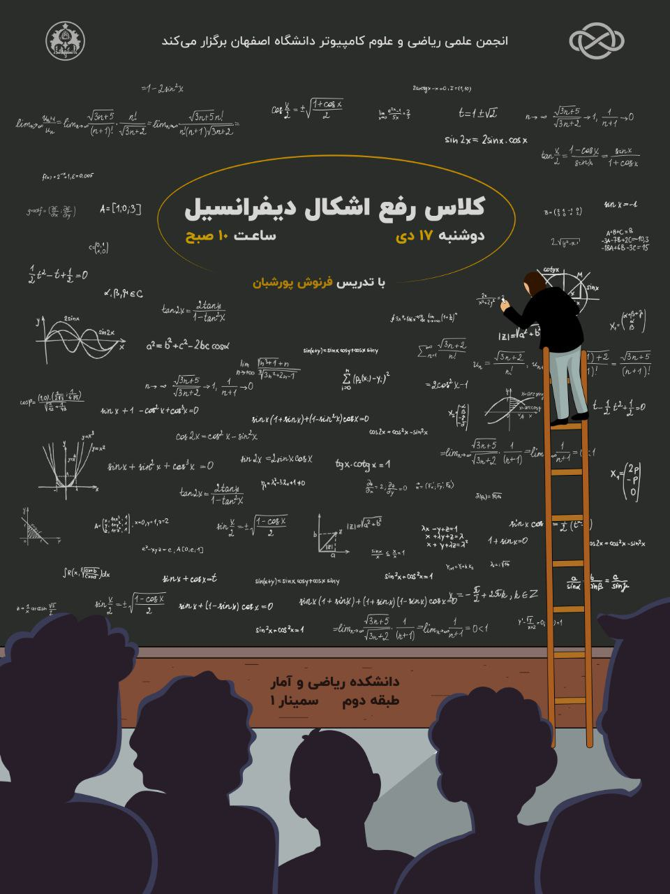

# رفع اشکال دیفرانسیل

- برگزارکننده: انجمن علمی ریکا (ریاضی و علوم کامپیوتر دانشگاه اصفهان)
- مدرس: فرنوش پورشبان، دانشجوی کارشناسی علوم‌کامپیوتر
- سطح برنامه: دانشگاهی
- شرکت‌کنندگان: ۳۰ دانشجوی کارشناسی علوم پایه و مهندسی
- هزینه ثبت‌نام: رایگان
- زمان: دوشنبه ۱۷ دی‌ماه، ساعت ۱۰ صبح
- مکان: دانشکده ریاضی و آمار دانشگاه اصفهان

---

### خلاصه  
انجمن علمی ریاضی و علوم‌کامپیوتر دانشگاه اصفهان در ادامه فعالیت‌های آموزشی خود و با هدف ارتقای سطح علمی دانشجویان، اقدام به برگزاری یک جلسه رفع اشکال درسی در حوزه معادلات دیفرانسیل نمود. این جلسه آموزشی در تاریخ دوشنبه ۱۷ دی‌ماه از ساعت ۱۰ صبح در سالن سمینار ۱ دانشکده ریاضی و آمار برگزار گردید.
مدرس جلسه، خانم فرنوش پورشبان، دانشجوی کارشناسی علوم‌کامپیوتر، به آموزش و مرور نکات کلیدی مباحث پایانی این درس پرداختند و با ارائه مثال‌ها و تمرین‌های کاربردی، فضایی مناسب برای رفع اشکال دانشجویان ایجاد شد.

---

### چیستی  
کلاس رفع اشکال معادلات دیفرانسیل، یکی از برنامه‌های پشتیبان آموزشی انجمن علمی بود که با مشورت استاد راهنما، با هدف مرور مباحث کلیدی و آماده‌سازی دانشجویان برای امتحانات پایان‌ترم برگزار گردید.
این جلسه به‌طور ویژه بر مباحث مهم نیم‌سال تحصیلی تمرکز داشت و شامل:

* جواب‌های سری معادلات خطی مرتبه دوم
* تبدیل لاپلاس و کاربردهای آن
* دستگاه معادلات خطی مرتبه اول
* بررسی مثال‌های کاربردی و حل تمرین

دانشجویان حاضر توانستند ضمن رفع اشکالات درسی، در محیطی تعاملی و پویا با روش‌های مختلف حل مساثل آشنا شوند.

---

### چرایی  
درس معادلات دیفرانسیل یکی از دروس پایه و پرچالش برای بسیاری از دانشجویان رشته‌های ریاضی، علوم کامپیوتر و مهندسی است. به دلیل حجم گسترده مباحث و اهمیت بالای آن در دروس تخصصی‌تر، بسیاری از دانشجویان در فهم کامل مفاهیم یا حل مسائل با دشواری مواجه می‌شوند.

اهداف اصلی از برگزاری این کلاس عبارت بودند از:

1. مرور مباحث پایانی نیم‌سال، برای آمادگی بیشتر دانشجویان در آزمون پایان‌ترم.
2. تقویت توانایی حل تمرین‌های متنوع، به‌ویژه در زمینه دستگاه معادلات و تبدیل لاپلاس.
3. ایجاد فضایی تعاملی برای طرح پرسش‌ها و رفع اشکالات فردی دانشجویان.
4. ایجاد اعتمادبه‌نفس در دانشجویان، برای مواجهه با مسائل تحلیلی و محاسباتی دشوار.

---

### چگونگی
فرایند اجرای این برنامه در چند مرحله انجام شد:

* طراحی و برنامه‌ریزی: انجمن علمی با بررسی نیاز دانشجویان و مشورت با استاد راهنما و مدرسان، مباحث اصلی جلسه را مشخص کرد و پس از هماهنگی‌ و مشورت‌های لازم، خانم فرنوش پورشبان به‌عنوان مدرس جلسه انتخاب شدند.
* اطلاع‌رسانی: پوستر و فراخوان برگزاری جلسه از طریق کانال‌های اطلاع‌رسانی انجمن منتشر شد و دانشجویان علاقه‌مند برای حضور ثبت‌نام کردند.
* برگزاری جلسه: در روز برنامه، جلسه در سالن سمینار ۱ برگزار شد. مدرس جلسه، به توضیح مباحث با بیانی ساده و کاربردی پرداخت و پس از هر بخش، مثال‌ها و تمرین‌هایی برای تثبیت یادگیری دانشجویان حل شد.
* تعامل و پرسش و پاسخ: فضای جلسه به‌گونه‌ای طراحی شده بود که دانشجویان بتوانند اشکالات خود را مطرح کنند و پاسخ‌های روشن و مرحله‌به‌مرحله دریافت نمایند.

---

### نتایج و پیامدها
نتایج این جلسه نشان داد که برنامه توانست بخش قابل‌توجهی از نیاز دانشجویان را پوشش دهد. بازخوردهای دریافتی حاکی از رضایت بالای شرکت‌کنندگان بود.

مهم‌ترین دستاوردهای این جلسه عبارت بودند از:

* تقویت تسلط دانشجویان بر مباحث کلیدیُ به‌ویژه در زمینه جواب‌های سری و تبدیل لاپلاس.
* افزایش اعتمادبه‌نفس در حل مسائل تحلیلی و کاهش استرس نسبت به امتحان پایان‌ترم.
* آشنایی با روش‌های حل متنوع و کاربردی از طریق تمرین‌های ارائه‌شده.
* تشویق دانشجویان به شرکت در برنامه‌های مشابه برای دیگر دروس پایه و تخصصی.

---

