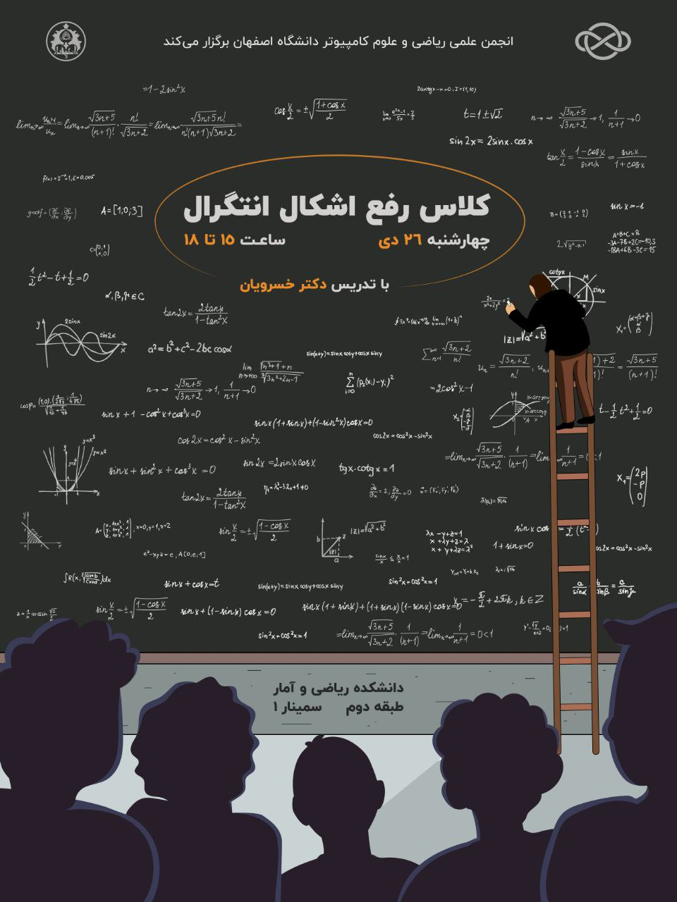

# رفع اشکال انتگرال

- برگزارکننده: انجمن علمی ریکا (ریاضی و علوم کامپیوتر دانشگاه اصفهان)
- مدرس: دکتر حسن خسرویان عرب، دکتری ریاضی کاربردی دانشگاه صنعتی امیرکبیر و هیأت علمی دانشکده‌ی ریاضی و آمار دانشگاه اصفهان 
- سطح برنامه: دانشگاهی
- شرکت‌کنندگان: ۳۰ دانشجوی کارشناسی علوم پایه و مهندسی
- هزینه ثبت‌نام: رایگان
- زمان: دوشنبه چهارشنبه ۲۶ دی‌ماه، ساعت ۱۵ تا ۱۸
- مکان: دانشکده ریاضی و آمار، دانشگاه اصفهان

---

### خلاصه  
انجمن علمی ریاضی و علوم‌کامپیوتر دانشگاه اصفهان در راستای ارتقای سطح علمی دانشجویان و ایجاد فضایی برای مرور و حل تمرین در مباحث مهم درسی، اقدام به برگزاری یک کلاس رفع اشکال در حوزه‌ی «انتگرال» نمود. این جلسه آموزشی با حضور جمعی از دانشجویان علاقه‌مند و با تدریس دکتر خسرویان عرب، عضو هیئت علمی دانشکده ریاضی و آمار، در تاریخ چهارشنبه ۲۶ دی‌ماه از ساعت ۱۵ تا ۱۸ در سالن سمینار ۱ دانشکده ریاضی و آمار برگزار گردید.

این کلاس با تمرکز بر مرور مفاهیم اساسی، حل تمرین‌های کاربردی و تشریح تکنیک‌های متداول انتگرال‌گیری، فرصتی ارزشمند برای دانشجویان فراهم آورد تا نقاط ضعف خود را شناسایی و برطرف کنند.

---

### چیستی  
کلاس رفع اشکال انتگرال یک رویداد علمی ـ آموزشی بود که به همت انجمن علمی ریاضی و علوم‌کامپیوتر دانشگاه اصفهان برگزار شد. هدف اصلی این کلاس، مرور مباحث مهم و کاربردی درس حسابان و ریاضی عمومی در زمینه انتگرال و کمک به دانشجویان برای آمادگی بیشتر در آزمون‌های پایان‌ترم و درک عمیق‌تر مفاهیم بود.

در این جلسه، مباحث زیر به‌طور جامع و مرحله‌به‌مرحله ارائه گردید:

* انتگرال‌گیری نامعین و فرمول‌های پایه‌ای
* تکنیک‌های پرکاربرد انتگرال‌گیری نامعین شامل تغییر متغیر، تفکیک کسر و روش جزء به جزء
* مفهوم انتگرال‌گیری معین همراه با مرور قضایای مرتبط
* انتگرال‌های ناسره و دسته‌بندی انواع آن‌ها
* قضایا و آزمون‌های همگرایی و واگرایی انتگرال‌های ناسره

این مباحث نه‌تنها پایه‌ای‌ترین موضوعات در درس‌های ریاضی عمومی محسوب می‌شوند، بلکه نقش مهمی در پیش‌نیاز بسیاری از دروس تخصصی دیگر در رشته‌های علوم پایه و مهندسی ایفا می‌کنند.

---

### چرایی  
برگزاری این کلاس در پاسخ به نیاز دانشجویان برای رفع اشکالات متداول در مباحث انتگرال صورت گرفت.
بخش قابل‌توجهی از دانشجویان با وجود گذراندن کلاس‌های درس اصلی، همچنان در یادگیری یا حل مسائل مربوط به انتگرال با چالش مواجه بودند. این مشکل عمدتاً ناشی از موارد زیر بود:

1. تنوع تکنیک‌ها و فرمول‌ها که حفظ و به‌کارگیری صحیح آن‌ها دشوار است.
2. کمبود زمان در کلاس‌های اصلی دانشگاهی برای تمرین و حل مسائل متعدد.
3. اهمیت کلیدی انتگرال در سایر دروس تخصصی و آزمون‌های مهم.
4. نیاز به آموزش کاربردی و تمرکز بر حل تمرین به جای تدریس صرفاً تئوری.

به همین دلیل، انجمن علمی تصمیم گرفت با برگزاری این جلسه، بستری برای آموزش تعاملی و رفع اشکال عملی دانشجویان فراهم آورد تا آنان بتوانند با آمادگی بیشتری به سراغ مباحث پیشرفته بروند.

---

### چگونگی
این کلاس با برنامه‌ریزی دقیق، همکاری دانشکده ریاضی و آمار و مشورت استاد راهنما برگزار شد. مراحل اجرای فعالیت به شرح زیر بود:

* برنامه‌ریزی و هماهنگی: انجمن علمی با مشورت استاد راهتما و اساتید گروه ریاضی مباحث مورد نیاز را شناسایی و سرفصل‌های اصلی جلسه را تدوین کرد. پس از هماهنگی‌ و مشورت‌های لازم، دکتر خسرویان عرب به‌عنوان مدرس جلسه انتخاب شدند.
* اطلاع‌رسانی: از طریق کانال‌های ارتباطی انجمن، پوستر و فراخوان رسمی برای دانشجویان منتشر شد. اطلاعیه‌ها شامل زمان، مکان و محتوای جلسه بود تا علاقه‌مندان بتوانند ثبت‌نام و حضور پیدا کنند.
* برگزاری جلسه: در روز مقرر(دوشنبه چهارشنبه ۲۶ دی‌ماه)، کلاس در سالن سمینار ۱ واقع در دانشکده ریاضی و آمار دانشگاه اصفهان برگزار گردید. جلسه‌ای سه ساعته که شامل توضیح مفاهیم، حل تمرین‌های نمونه و پاسخ به پرسش‌های دانشجویان بود. فضای تعاملی جلسه باعث شد که دانشجویان بتوانند اشکالات فردی خود را به‌طور مستقیم مطرح کنند.
* ابزار و منابع: مدرس جلسه با بهره‌گیری از جزوه‌های آموزشی و مثال‌های متنوع، مفاهیم را به‌صورت مرحله‌به‌مرحله و قابل‌فهم برای دانشجویان تشریح کردند.

---

### نتایج و پیامدها
نتایج حاصل از این کلاس نشان داد که جلسه توانسته است بخش زیادی از اهداف آموزشی را محقق کند. بازخوردهای دانشجویان حاکی از آن بود که این کلاس کمک شایانی در درک بهتر مباحث انتگرال‌گیری و افزایش اعتمادبه‌نفس آنان برای حل مسائل داشته است.

مهم‌ترین دستاورد‌های برگزاری این جلسه عبارت بودند از:

* افزایش توانایی حل مسائل و به‌کارگیری تکنیک‌های انتگرال‌گیری در تمرین‌ها.
* ایجاد انگیزه در دانشجویان، برای تمرین بیشتر و مرور مطالب درسی.
* تقویت ارتباط میان استاد و دانشجو، در فضایی غیررسمی‌تر نسبت به کلاس‌های معمول.
* زمینه‌سازی برای برگزاری جلسات مشابه در مباحث دیگر، متناسب با نیاز دانشجویان.

---

### ضمائم 
- [لینک ویدیوهای آموزشی](../Events/integration.md)

---

