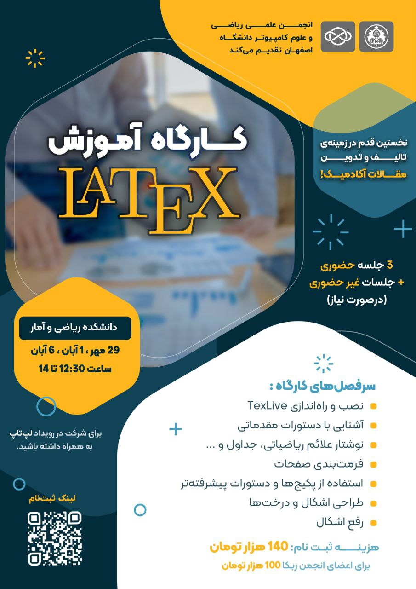

# کارگاه آموزش Latex

- برگزارکننده: انجمن علمی ریکا (ریاضی و علوم کامپیوتر دانشگاه اصفهان)
- مدرس: داوود نصرتی، دانشجوی کارشناسی علوم‌کامپیوتر
- سطح برنامه: دانشگاهی
- شرکت‌کنندگان: ۳۰ دانشجوی کارشناسی علوم پایه و مهندسی
- هزینه ثبت‌نام: ۱۰۰ هزار تومان برای اعضای انجمن ریکا و ۱۴۰ هزار تومان برای دیگر دانشجویان
- زمان: ۲۹ مهر ماه، ۱، ۶ و ۱۰ آبان ماه ۱۴۰۳
- مکان: دانشکده ریاضی و آمار دانشگاه اصفهان و بستر مجازی گوگل میت

---

### خلاصه  
انجمن علمی ریاضی و علوم‌کامپیوتر دانشگاه اصفهان در ادامه فعالیت‌های آموزشی خود با کمک و مشورت استاد راهنما با هدف ارتقای توانمندی‌های علمی دانشجویان، کارگاه آموزشی LaTeX را برگزار کرد. این کارگاه که شامل سه جلسه حضوری و یک جلسه تکمیلی غیرحضوری بود، توانست بستری برای آشنایی دانشجویان با نگارش حرفه‌ای متون علمی و آکادمیک فراهم کند.
با توجه به کاربرد گسترده LaTeX در نگارش مقالات علمی، پایان‌نامه‌ها و کتاب‌های دانشگاهی، این کارگاه مورد استقبال دانشجویان رشته‌های مختلف قرار گرفت و فضایی تعاملی برای آموزش و تمرین عملی ایجاد شد.

---

### چیستی  
کارگاه آموزش LaTeX به‌عنوان یکی از گام‌های مهم در مسیر حرفه‌ای شدن در نگارش علمی برگزار شد. LaTeX یک سیستم حروف‌چینی قدرتمند است که به‌ویژه برای نگارش متون علمی و ریاضیاتی کاربرد فراوان دارد.
در این کارگاه، علاوه بر آموزش مفاهیم مقدماتی، شرکت‌کنندگان با دستورات پیشرفته و روش‌های فرمت‌بندی حرفه‌ای نیز آشنا شدند تا بتوانند تمارین برخی از دروس و خروجی‌های پژوهشی خود را مطابق با استانداردهای بین‌المللی آماده کنند.

سرفصل‌های اصلی کارگاه:

* نصب و راه‌اندازی  VS Code و LaTeX-Workshop.
* آموزش دستورات پایه برای شروع نگارش متون.
* نگارش علائم و فرمول‌های ریاضی، ایجاد جداول و نمودارها.
* تنظیم ساختار صفحات، سرفصل‌ها، و فهرست مطالب.
* طراحی اشکال و نمودارهای درختی با بسته‌های حرفه‌ای.
* معرفی و استفاده از بسته‌ها و دستورات پیشرفته‌تر برای نیازهای خاص.
* پاسخ به سوالات و رفع اشکالات عملی شرکت‌کنندگان.

---

### چرایی  
هدف از برگزاری این کارگاه، پاسخ به یکی از نیازهای مهم دانشجویان و پژوهشگران یعنی نگارش متون علمی استاندارد بود. با توجه به اینکه تحویل تمارین برخی از دروس مهم و تاثیرگذار از جمله ساختمان داده و الگوریتم در قالب LaTeX برای دانشجویان حائز اهمیت است و همچنین بسیاری از مجلات معتبر علمی در سطح ملی و بین‌المللی تنها مقالاتی را می‌پذیرند که با LaTeX نگارش شده باشند، فراگیری این ابزار برای دانشجویان و پژوهشگران یک ضرورت محسوب می‌شود. 

دلایل اصلی برگزاری:

1. کمک به دانشجویان در نگارش پایان‌نامه‌ها و مقالات پژوهشی.
2. آشنایی با استانداردهای بین‌المللی در تدوین متون علمی.
3. ایجاد توانایی در استفاده از LaTeX برای پروژه‌های درسی و پژوهشی.
4. ارتقای مهارت‌های نرم‌افزاری دانشجویان به‌عنوان سرمایه‌ای ماندگار برای آینده‌ی علمی و شغلی آنان.
5. فراهم‌کردن محیطی برای یادگیری عملی و تعاملی همراه با حل تمرین و رفع اشکال.

---

### چگونگی
این کارگاه در سه جلسه‌ی حضوری و یک جلسه‌ی مجازی تکمیلی برگزار شد. روند برگزاری به‌گونه‌ای طراحی شده بود که دانشجویان از همان ابتدا به‌صورت عملی وارد کار شوند. در آغاز هر جلسه، مدرس مفاهیم پایه‌ای را توضیح می‌داد و سپس به‌صورت زنده مراحل نصب و استفاده از VS Code و LaTeX-Workshop را نمایش می‌داد تا شرکت‌کنندگان هم‌زمان با او پیش بروند. دانشجویان با در دست داشتن لپ‌تاپ‌های شخصی خود، فرصت داشتند در طول جلسه تمامی مراحل را تجربه کرده و پرسش‌های خود را به‌صورت مستقیم مطرح کنند.

علاوه بر آموزش دستورات مقدماتی و فرمت‌بندی متون، مثال‌های متنوعی از نگارش معادلات ریاضی، جداول و طراحی اشکال ارائه شد تا دانشجویان با کاربردهای واقعی LaTeX آشنا شوند. همچنین در طول جلسات، فضایی تعاملی برای رفع اشکال و پاسخ به پرسش‌های فردی فراهم شد و دانشجویان می‌توانستند چالش‌های خود را همان‌جا با کمک مدرس برطرف کنند.

جلسات به‌گونه‌ای برنامه‌ریزی شده بود که در پایان دوره، هر شرکت‌کننده توانایی تهیه یک سند کامل و استاندارد علمی را داشته باشد و در صورت نیاز به یادگیری عمیق‌تر، منابع و بسته‌های تکمیلی نیز در اختیارشان قرار گرفت. همچنین ویدیوهای هر جلسه ضبط شده و در دسترس دانشجویان قرار گرفت.

---

### نتایج و پیامدها
برگزاری این کارگاه آثار مثبت قابل‌توجهی به همراه داشت:

* دانشجویان توانستند با نصب موفق LaTeX و انجام تمرین‌ها، تجربه نگارش علمی را رقم بزنند.
* بسیاری از شرکت‌کنندگان پس از کارگاه توانستند تمارین، جزوات و پروژه‌های خود را در قالب استاندارد و حرفه‌ای آماده کنند.
* آشنایی با بسته‌ها و قابلیت‌های پیشرفته، زمینه را برای کارهای تحقیقاتی جدی‌تر فراهم کرد.
* شرکت‌کنندگان مهارت‌هایی کسب کردند که می‌تواند در مسیر تحصیلات تکمیلی و همکاری با مجلات علمی و همایش‌های بین‌المللی به‌طور مستقیم کاربرد داشته باشد.
* استقبال دانشجویان نشان داد نیاز به چنین آموزش‌هایی جدی است و انجمن در آینده نیز برنامه‌های مشابهی را در دستور کار قرار خواهد داد.

---

### ضمائم  

[لینک ۱](../Events/latex.md)

---

