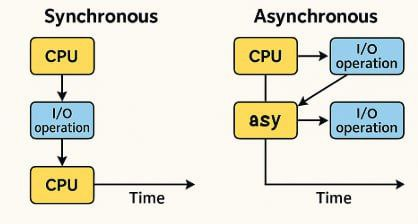

# 🚀 چطور CPU توی پایتون الکی منتظر نشه؟

اگه با **پایتون** کار کرده باشی، می‌دونی عملیات I/O مثل خوندن فایل یا درخواست به API، باعث می‌شه CPU همینطوری دست‌ به‌ سینه منتظر بمونه.

🔺 فرض کن ۱۰ تا API بزنی و هر کدوم ۲ ثانیه طول بکشه. بدون هیچ ترفندی، برنامه‌ت حداقل ۲۰ ثانیه طول می‌کشه!

### ⁉️ اما راه‌حل چیه؟ 

#### استفاده از async/await

با **async** به CPU می‌گی:
«اگه رسیدی به یه عملیات I/O، معطل نشو! برو سراغ کارهای دیگه. وقتی اون تموم شد، برگرد ادامه بده.»

💻 نمونه‌ی کدش رو [اینجا](https://colab.research.google.com/drive/1gfP697GHI23_Bv0wvl8MMz-aDHFX4-WK?usp=sharing)می‌تونی ببینی.

### نتیجه؟
🔻 همون مثال بالا، به جای **۲۰ ثانیه**، توی **۲ ثانیه** اجرا می‌شه! اونم بدون نیاز به سربار multi-threading.

📌 مخصوصاً برای **برنامه‌نویس‌های وب و دیتا** که دائم با **API** و **scraping** سر و کار دارن، **async** یه نجات‌دهنده‌ست.

#### 👥 Contributors

<a href="https://github.com/Nazanin-Izadi">