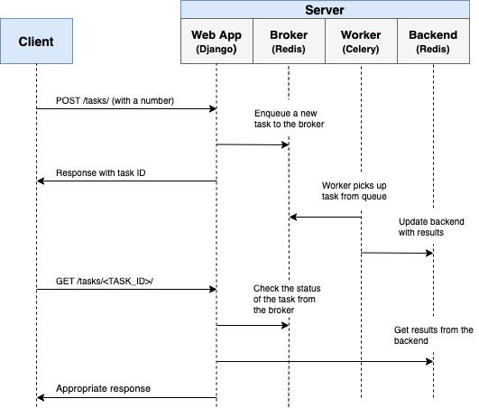

# 🥦 نجات‌دهنده تسک‌های سنگین در بک‌گراند، Celery

⏳ تصور کن لازم داری یه کاری رو انجام بدی، اما نمی‌خوای اپلیکیشن اصلیت معطل بشه. شاید اولین چیزی که به ذهنت برسه **async/await** یا **multithreading** توی پایتون باشه. درسته، این‌ها ممکنه کمک کننده باشن، ولی هنوز داری تسک‌ها رو داخل اپ خودت اجرا می‌کنی.

🧨 حالا فکر کن تعداد تسک‌ها یهو زیاد بشه، مثلاً یه وب‌سایت داری که باید صدها ایمیل رو هم‌زمان بفرسته. توی همچین شرایطی اپلیکیشنت ممکنه به مشکل بخوره.

💥 اینجاست که **کتابخونه Celery** وارد بازی می‌شه. (آره، کرفس! شاید چون تسک‌ها رو شاخه‌ شاخه مدیریت می‌کنه👀؟!)
حالا **Celery** با کمک **broker‍هایی** مثل **RabbitMQ** یا **Redis**، کارهای زمان‌بر رو می‌فرسته توی بک‌گراند.

### 📌 در نتیجه:

-تسک‌ها به‌صورت **asynchronously** اجرا می‌شن.
-اپلیکیشن اصلیت دیگه درگیر نمی‌شه.
-و منابع سیستمت آزاد می‌مونه.

💡 *برای دونستن جزئیات بیشتر می‌تونی [این لینک](https://docs.celeryq.dev/en/v5.5.3/getting-started/introduction.html#get-started) رو مطالعه کنی.*

#### 👥 Contributors

<a href="https://github.com/pedramzamaninejad">