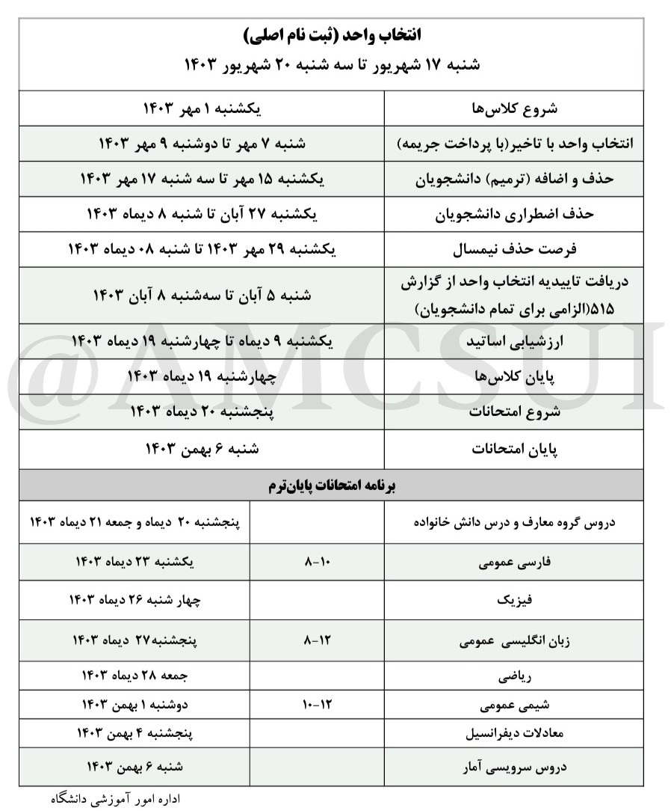
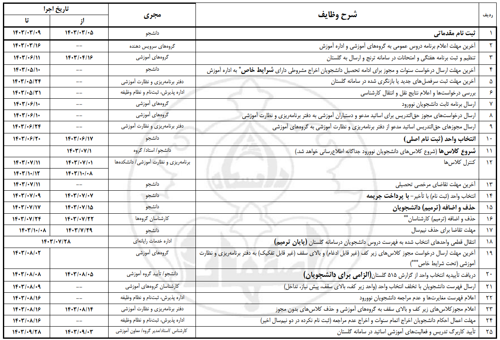
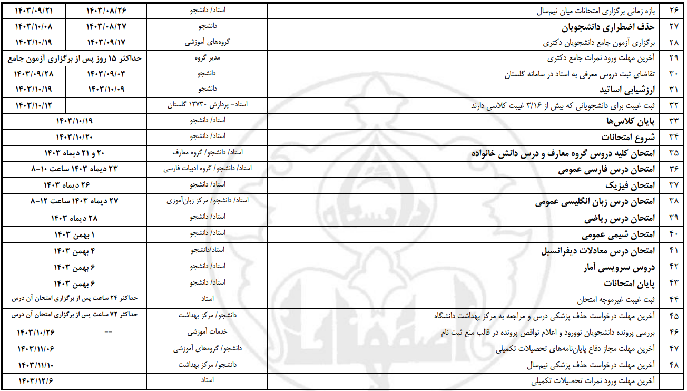

# تقویم آموزشی و تفضیلی

## تقویم آموزشی نیم‌سال اول سال تحصیلی ۱۴۰۳-۱۴۰۴ 

[فایل pdf تقویم آموزشی ۱۴۰۳-۱۴۰۴](amozeshi1403-1404.pdf)

## تقویم تفضیلی نیم‌سال اول تحصیلی ۱۴۰۳-۱۴۰۴ 

⚠️  \*این درخواست‌ها تنها برای دانشجویانی است که دارای شرایط خاص مستند هستند. لذا از ارسال درخواست‌هایی که فاقد مستندات لازم برای شرایط خاص می‌باشد،خودداری شود.

⚠️  \*\*این ترمیم تنها برای ادغام، حذف و اضافه کردن دروسی است که (به ویژه برای دروس آزمایشگاهی) پس از حذف و اضافه دانشجویان دچار مشکل شده یا به زیر حد نصاب رسیده است. لذا، با توجه به گزارش‌گیری از سامانه و تطبیق آن با برنامه‌های جاری گروه‌ها، از هرگونه تغییر ساعت و جابجایی در سایر برنامه‌های دروس که قبلا به سامانه ترنج فرستاده شده خودداری شود.

⚠️  \*\*\*این درخواست‌ها تنها برای موارد ویژه‌ای است که بعد از حذف و اضافه دانشجویان یا ترمیم کارشناسان به‌وجود آمده و گروه با در نظر گرفتن تمام شرایط، راهکاری جز اخذ مجوز از دفتر برنامه‌ریزی و نظارت آموزشی نداشته است.

[فایل pdf تقویم تفضیلی نیم‌سال اول ۱۴۰۳-۱۴۰۴](tafsili1403-1404-1.pdf)

**رویداد‌های مهم:**

📅  **انتخاب واحد:** شنبه ۱۷ تا سه‌شنبه ۲۰ شهریور ماه

📅  **شروع کلاس‌ها:** یکشنبه ۱ مهر ماه

📅  **حذف و اضافه:** یکشنبه ۱۵ تا سه‌شنبه ۱۷ مهر ماه

📅  **حذف اضطراری:** یکشنبه ۲۷ آبان تا شنبه ۸ دی‌ ماه

📅  **حذف نیم‌سال:** یکشنبه ۲۹ مهر تا شنبه ۸ دی‌ ماه

📅  **ارزشیابی اساتید:** یکشنبه ۹ تا چهارشنبه ۱۹ دی‌ ماه

📅  **پایان کلاس‌ها:** چهارشنبه ۱۹ دی‌ ماه

📅  **شروع امتحانات:** پنجشنبه ۲۰ دی ماه 
