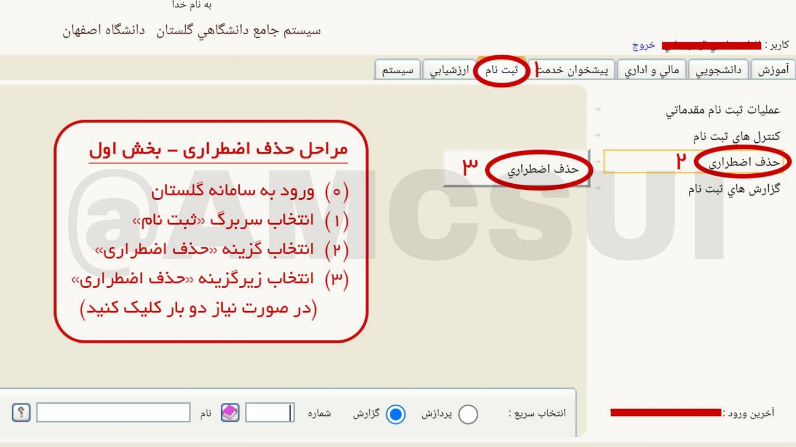
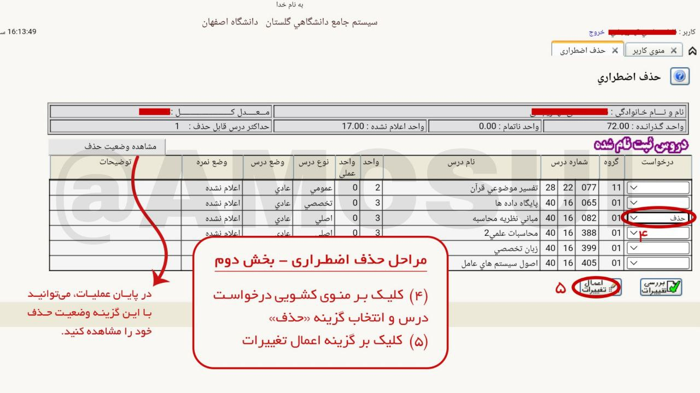

# راهنمای آموزشی

## انتخاب واحد

جهت انجام عملیات ثبت‌نام شما در **ساعت ۸ صبح روز مقرر شده** می‌توانید با ورود به **[سامانه‌ی گلستان](https://golestan.ui.ac.ir/home/Default.htm) >> سربرگ ثبت نام >> عملیات‌های ثبت‌نام >> ثبت نام اصلی** نسبت به انتخاب واحد، اقدام نمایید. جهت دسترسی به لیست درس‌های ارائه شده برای شما نیز، با جستجوی کدهای ۲۱۱ و ۲۱۲ نسبت به کد درس‌های مدنظرتان آگاه خواهید‌شد.

⚠️  با توجه به باز شدن صفحه «ثبت‌نام اصلی» راس زمان مقرر و امکان اختلاف ساعت سامانه گلستان با ساعت رسمی کشور، لازم است که به **ساعت سامانه توجه داشته‌باشید و مطابق با آن پیش روید**.

⚠️  در پایان هر مرحله، حتما روی گزینه **«اعمال تغییرات»** کلیک کنید. در صورت ثبت درس برای شما، در قسمت وضع ثبت واژه **«ثبت»** و در پایین صفحه پیام **«عملیات شما با موفقیت انجام شد.»** را مشاهده خواهید‌کرد. در صورت بروز خطا، با نگه داشتن موس روی واژه **«خطا»** می‌توانید علت خطا را بررسی و نسبت به رفع آن اقدام نمایید.

[ویدئو آموزش گام به گام انتخاب واحد](https://drive.google.com/file/d/1TF3cncbAmKTF-L1YrJyW_shb0Wc3QLjk/view?usp=sharing)

### نکات مهم و اشتباهات رایج

🔸 **مجوز ثبت‌نام**

اگر مجوز ثبت‌نام برای شما داده نشده‌باشد، مجاز به انتخاب واحد نخواهید بود. بنابراین حتما قبل از روز انتخاب واحدتان، آن را بررسی کنید تا با مشکل روبه‌رو نشوید. 

🔸  **اعمال تغییرات**

بعد از انتخاب هر درس باید گزینه اعمال تغییرات را انتخاب کنید تا درس به واحد‌های انتخابی شما اضافه شود. 

### اولویت‌های انتخاب دروس

1. **دروس عمومی:** به دلیل اینکه دروس معارف و عمومی برای دانشجویان تمامی رشته‌ها به صورت مشترک ارائه می‌شوند، ظرفیت‌های این دروس سریع‌تر از سایر دروس تکمیل خواهند‌ شد. بنابراین توصیه می‌کنیم **الویت را با انتخاب دروس معارف و عمومی** قرار دهید. 

2. **دروس پایه:** در انتخاب دروس، دروس پایه به دلیل وجود چند شعبه برخلاف دروس تخصصی رشته‌ی مورد نظر از امکان افزایش ظرفیت کمتری برخوردار هستند.

3. **دروس تخصصی:** این دروس معمولا به تعداد دانشجویان مجاز برای شرکت در کلاس آن‌ها و مخصوص گروه آموزشی شما ارائه می‌شوند. بنابراین احتمال بروز مشکل در اخذ آن‌ها به مراتب کمتر از سایر دروس می‌باشد.

4. **دروس نیازمند به دریافت مجوز:** دروسی که در انتخاب واحد با خطا روبه‌رو می‌شوند و نیاز به مجوز دارند، به دلیل زمان‌بر بودن فرآیند بررسی و تایید، در **آخرین الویت‌ برای انتخاب واحد** قرار می‌گیرند.

⚠️ حتما **برای دروس عمومی و معارف چند شعبه** را در نظر داشته باشید تا در صورت پر شدن ظرفیت یک شعبه، فرصت اخذ آن درس را کاملا از دست ندهید.

⚠️ توصیه می‌شود پس از انتخاب واحد، سامانه گلستان را **دوباره بارگزاری (Refresh)** کنید تا از ثبت واحد‌های خود مطمئن شوید.

### درخواست مجوز و رفع خطا

اگر در هنگام انتخاب واحد، پس از انتخاب گزینه «بررسی تغییرات» یا «اعمال تغییرات» به هرگونه **خطا** برخورد کردید، می‌توانید با نگه داشتن موس روی «خطا»، طبق راهکارهای زیر نسبت به رفع آن اقدام نمایید:

- در صورتی که خطا از نوع **تداخل** باشد نمی‌توانید درس را بردارید.

- اگر **پیش نیاز** درس را پاس نکردید می‌توانید در صورت موافقت گروه هم‌نیاز کرده یا رفع پیش‌نیاز کنید. 

- اگر **ظرفیت** کلاس تکمیل شده‌است، می‌توانید در صورت موافقت گروه‌ها درس را با گروه دیگری بردارید یا درخواست افزایش ظرفیت کنید.

⚠️  برای ارائه درخواستتان، از بین لیست نمایش داده شده با کلیک بر روی **درخواست مورد نظر با توجه به خطای دریافتی >> درخواست مجوز**، آن را ثبت کنید تا توسط کارشناس بررسی شود. در قسمت توضیحات، حتما **علت درخواست خود را ذکر کنید**؛ زیرا درخواست شما بدون آن پذیرفته نمی‌شود. همچنین جهت تسریع فرآیند، می‌توانید **تلفنی یا حضوری** آن را پیگیری کنید.

برای اطلاع از شماره **کارشناسان آموزشی و شماره دفتر مدیران و معاونین گروه** [کلیک](/دانشکده) کنید. 

⚠️  توصیه می‌کنیم در صورت امکان درس را با استاد دیگری بردارید تا در صورت رد درخواستتان، درس را از دست ندهید.

[ویدئو درخواست مجوز و رفع خطا در سامانه گلستان](https://drive.google.com/file/d/1l1aDqDok7wKLfKv0H0e6--oP3QiH3YyI/view?usp=sharing)

## حذف اضطراری

### شرایط حذف اضطراری

- حذف اضطراری دروس فقط در یک بازه مشخص شده در [تقویم آموزشی](دانشکده/اطلاعات%20ترمی/تقویم%20آموزشی%20و%20تفضیلی) ممکن بوده و به صورت عمومی تمدید نمیشه.

- تعداد واحدهای باقی‌‎مانده دانشجوی کارشناسی و کارشناسی ارشد پس از حذف درس یا دروس، به ترتیب نباید کمتر از ۱۲ و ۸ واحد باشد. 

- به یاد داشته باشید هنگام انجام عملیات به هم‌نیاز و پیش‌‎نیاز بودن درس‌ها توجه کنید چرا که در صورت حذف درس، درس‌‌های وابسته به آن نیز حذف خواهند شد.

- در طول دوره کارشناسی، محدودیتی برای جمع تعداد حذف اضطراری ندارید اما در طول هر نیمسال فقط امکان حذف ۱ درس وجود دارد. دانشجویان مقطع کارشناسی ارشد، تنها امکان حذف ۱ درس را در کل دوره کارشناسی ارشد دارند.

- تنها دروس نظری قابل حذف بوده و امکان حذف دروس عملی یا عملی-نظری مانند کارآموزی، پروژه، آزمایشگاه، ورزش و تربیت بدنی وجود ندارد.

- با اخذ مجدد درس حذف شده در ترم‌های آینده، برای دانشجو بدهی معادل شهریه نوبت دوم ایجاد می‌شود.

### مراحل عملیات حذف اضطراری

1. ورود به [سامانه گلستان](https://golestan.ui.ac.ir)
2. انتخاب سربرگ **ثبت‌نام**
3. گزینه **حذف اضطراری**
4. انتخاب تک گزینه **حذف اضطراری** در منوی ظاهر شده (در صورت باز نشدن صفحه دوباره کلیک کنید)
5. کلیک بر روی منوی کشویی ستون **درخواست** درس مورد نظر و انتخاب گزینه **حذف** 
6. کلیک بر روی **اعمال تغییرات** 

⚠️  در صورتی که از حذف درس منصرف شدید، تا قبل از اتمام بازه حذف اضطراری می‎‌توانید با ورود مجدد به سامانه و تغییر گزینه **حذف** در منوی کشویی به حالت قبلی (خالی) و کلیک بر روی **اعمال تغییرات**، عملیات حذف درس رو لغو کنید!
