# چارت تحصیلی

## چارت درسی علوم‌کامپیوتر

### مقطع کارشناسی برای ورودی‌های ۱۴۰۰ به بعد

**طرح کلی برنامه**
  
  
  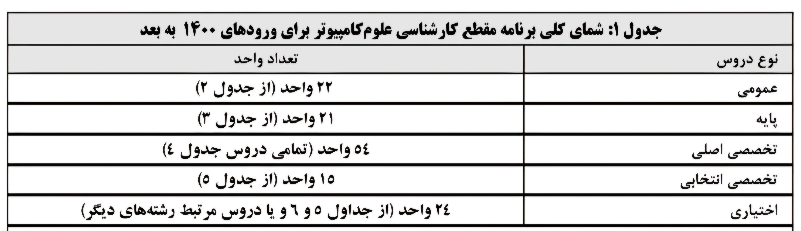
  
  
  - دانشجویان باید ۱۳۶ واحد درسی را در قالب ذکر شده اخذ کنند.

  - دانشجوی رشته علوم‌کامپیوتر (بدون کهاد) باید در مجموع ۲۴ واحد که حداقل ۱۵ واحد آن از جدول ۶ و دروس مازاد جدول ۵ باشد را به عنوان درس اختیاری بگذراند. بقیه دروس اختیاری (حداکثر ۹ واحد) را میتوان از جداول دروس الزامی و اختیاری رشته‌های مرتبط دیگر در دانشگاه با نظر گروه آموزشی اخذ کرد. 

  - دانشجو می‌تواند با موافقت گروه آموزشی در رشته علوم‌کامپیوتر با کهاد در یکی از رشته‌های کارشناسی موجود در دانشگاه فارغ‌التحصیل شود. در این صورت بایستی حداقل ۱۸ واحد درسی اختیاری خود را از جداول دروس آن رشته بگذراند. این دروس نباید منطبق بر دروس اصلی و انتخابی(۶۹ واحد الزامی) رشته علوم‌کامپیوتر باشند یا با آن‌ها بیش از ۳۰ درصد همپوشانی داشته باشند. بقیه دروس(حداکثر ۶ واحد) را می‌توانند از جدول ۶ یا مازاد جدول ۵ یا جداول دروس الزامی و اختیاری رشته‌های مرتبط دیگر با نظر گروه آموزشی اخذ کنند.

  - دروس اختیاری مشترک بین جدول ۵ و ۶ و جداول رشته کهاد جزء دروس کهاد منظور خواهد شد.

**دروس عمومی**

  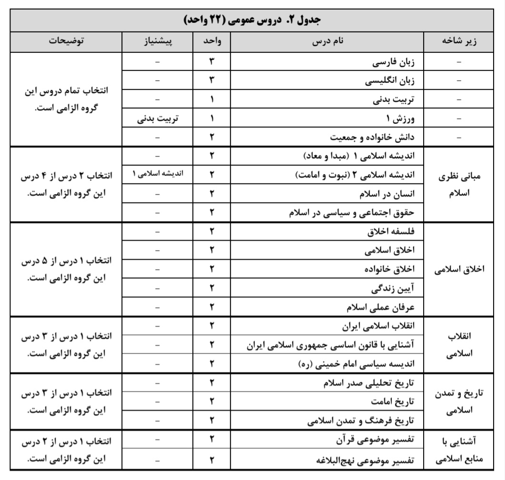

**دروس پایه**

  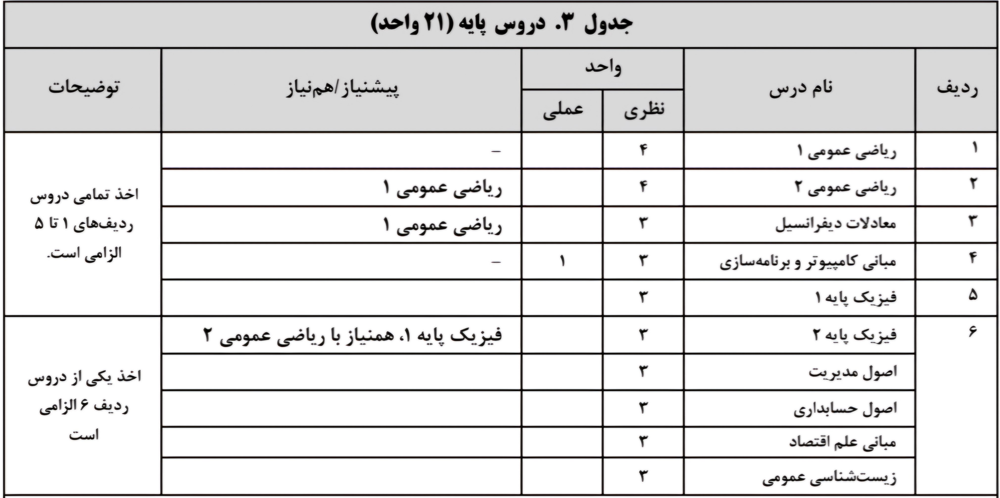
  
  
  ⚠️  دروس گذرانده شده مازاد بر یک درس از ردیف ۶ جدول به عنوان درس اختیاری تلقی خواهند شد.

**دروس تخصصی اصلی**

  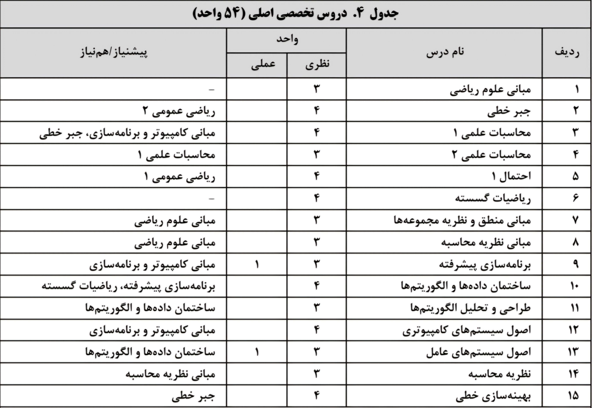
  
  
  ⚠️  گذارندن تمام ۵۴ واحد این جدول الزامی است.

**دروس تخصصی انتخابی**

  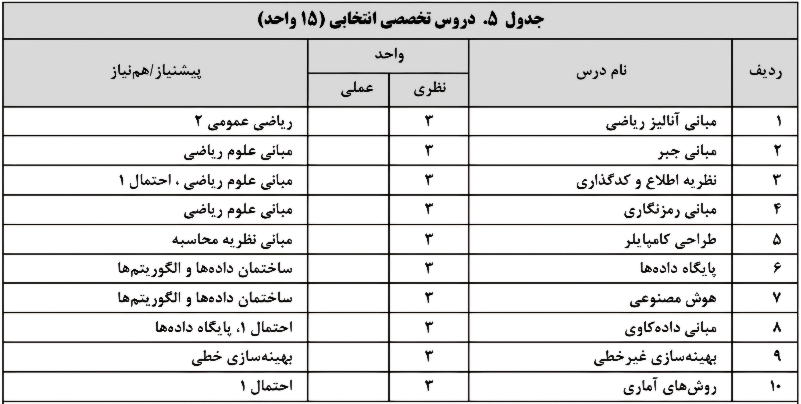
  
  
  ⚠️  گذراندن حداقل ۱۵ واحد این جدول الزامی است. 
  ⚠️  دروس مازاد بر ۱۵ واحد را که از جدول بگذرانید، جزء دروس اختیاری محاسبه می‌شود.

**دروس تخصصی انتخابی**

  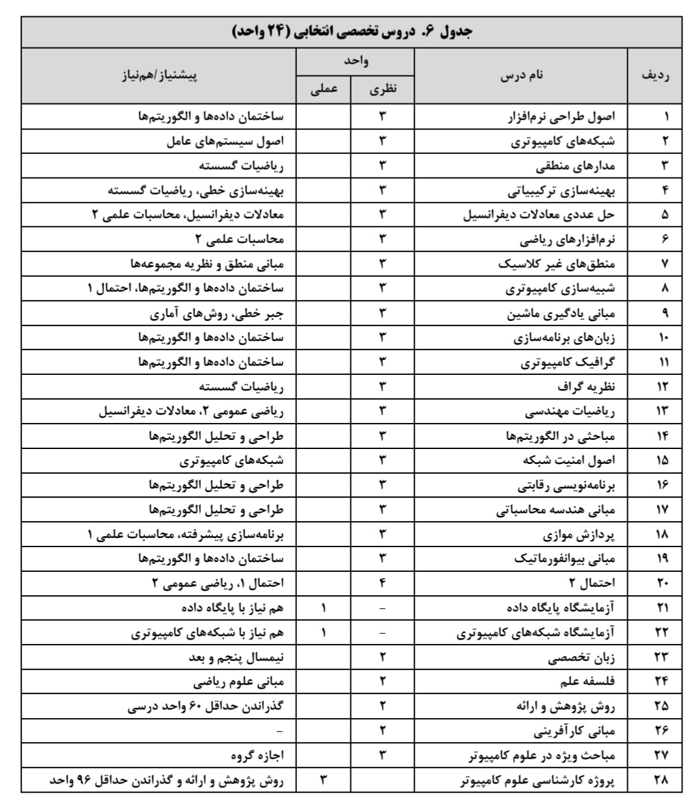  

**برنامه دروس**

  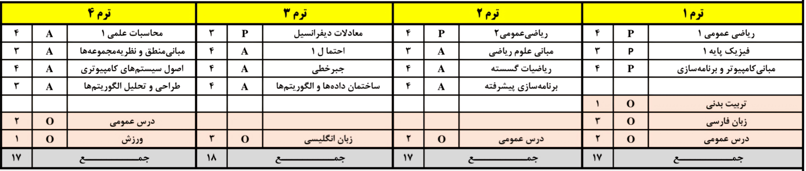
  
  
  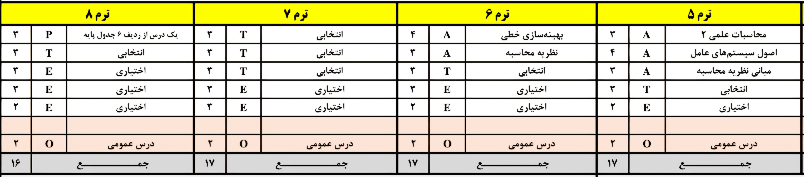
  
  
 **برنامه پیشنهادی**

  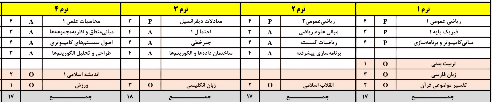
  
  
  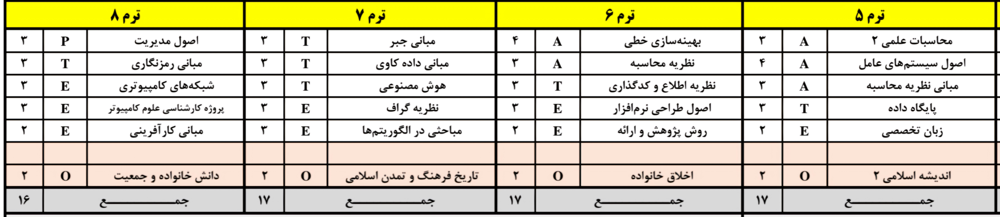

## چارت درسی ریاضیات و کاربردها

### مقطع کارشناسی برای ورودی‌های ۱۴۰۰ به بعد

**نیمسال اول**

  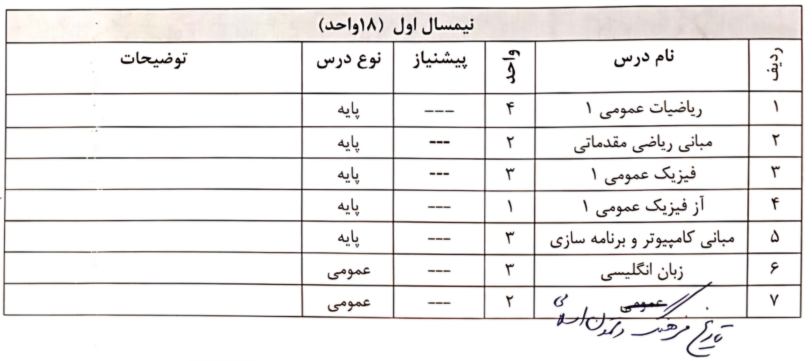  
  
**نیمسال دوم**

  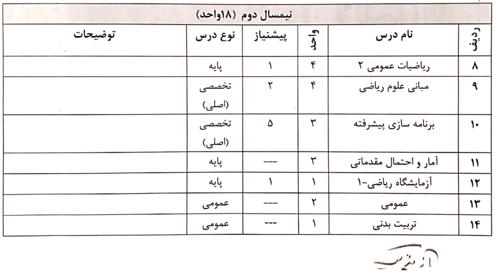  
  
**نیمسال سوم**

  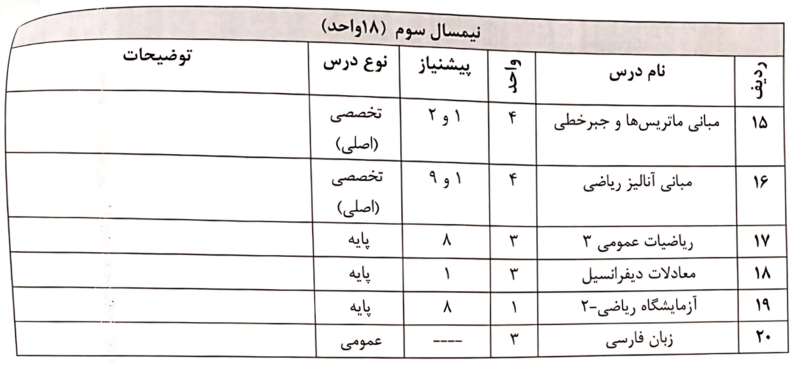  
  
**نیمسال چهارم**

  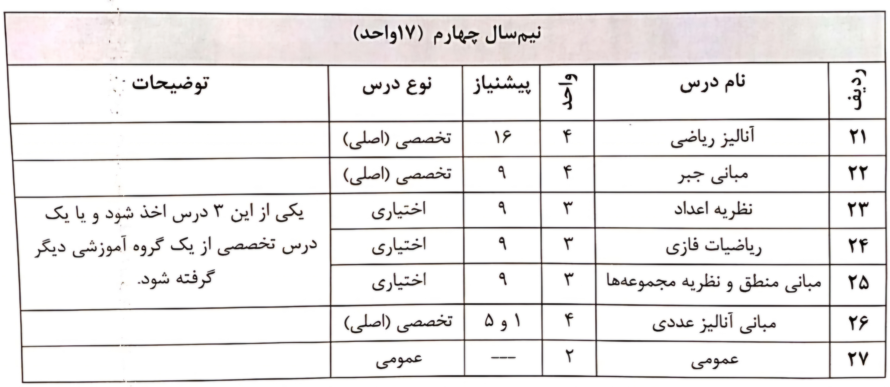  
  
**نیمسال پنجم**

  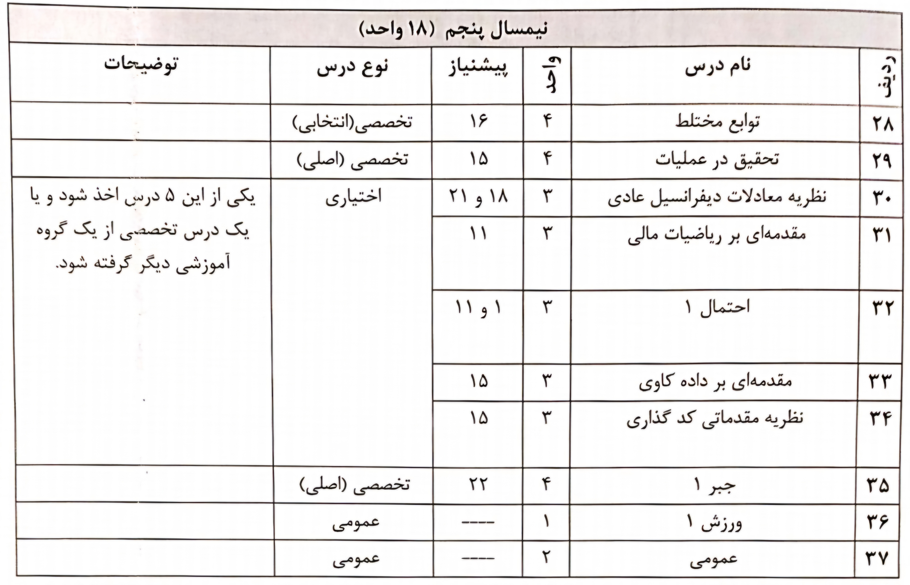  
  
**نیمسال ششم**

  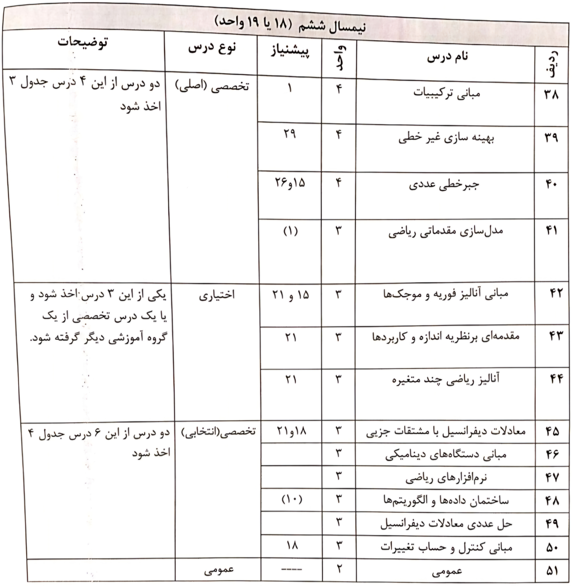  
  
**نیمسال هفتم**

  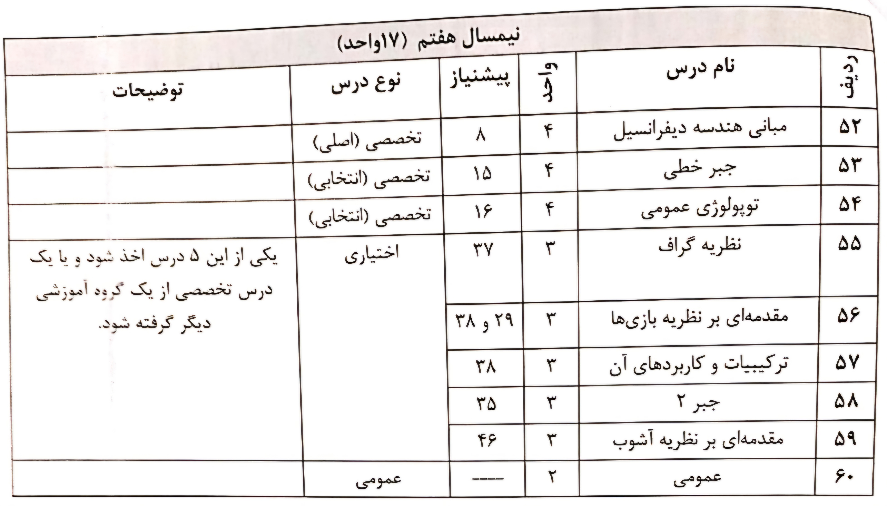  
  
**نیمسال هشتم**

  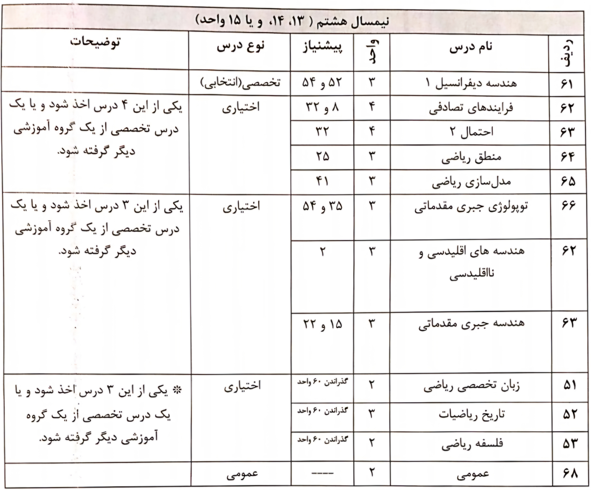  

⚠️  **نکات قابل توجه:**

- شماره‌هایی که داخل پرانتز قرار دارند بیانگر هم نیازی درس مربوطه می‌باشند.
  
  
- تعداد کل واحد حداقل ۱۳۷ می‌باشد.
  
  
- حداکثر ۶ واحد از دروس اختیاری را دانشجو می‌تواند از دروس تخصصی رشته‌های دیگر اخذ کند.
  
  
