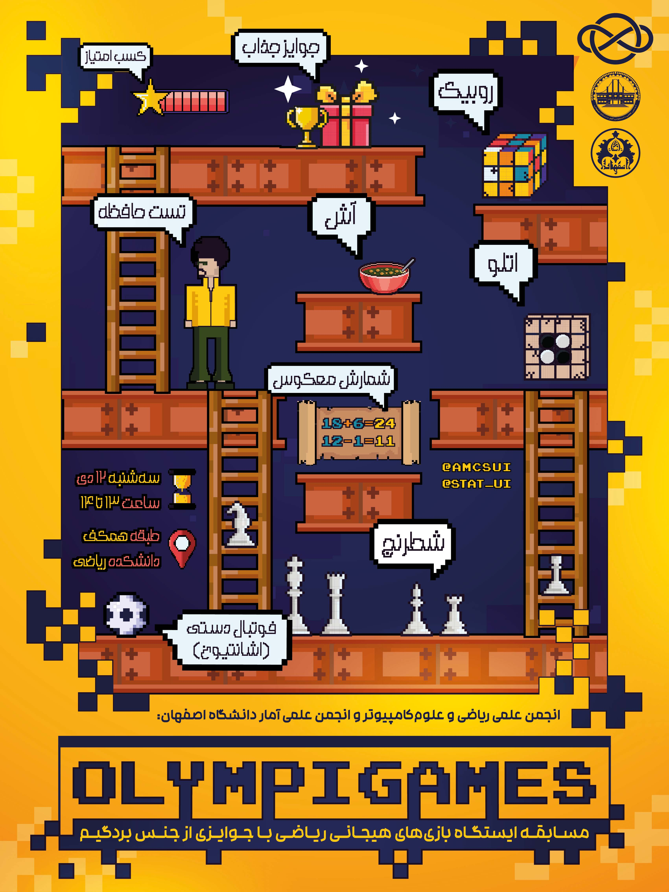
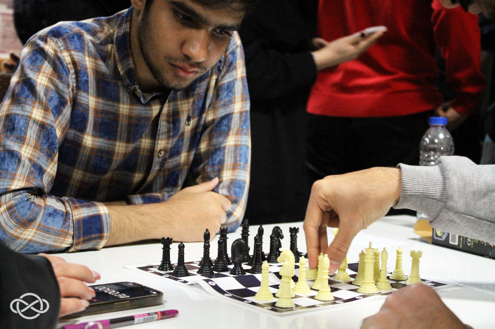
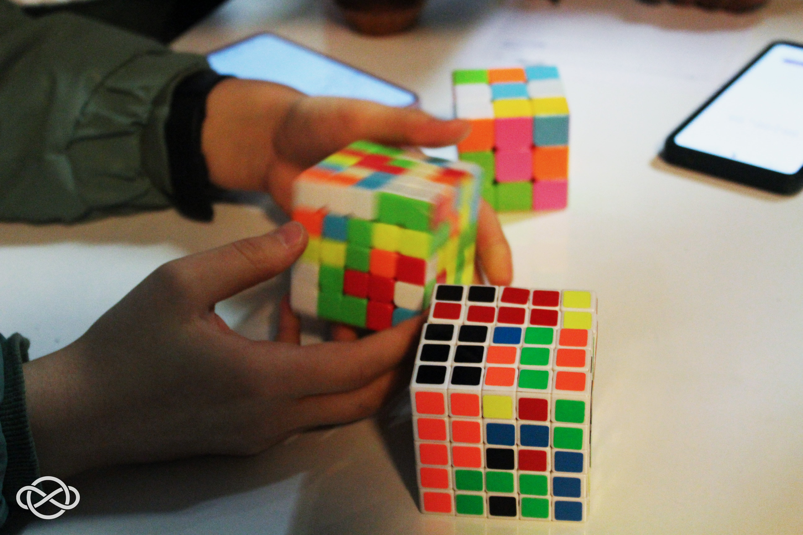
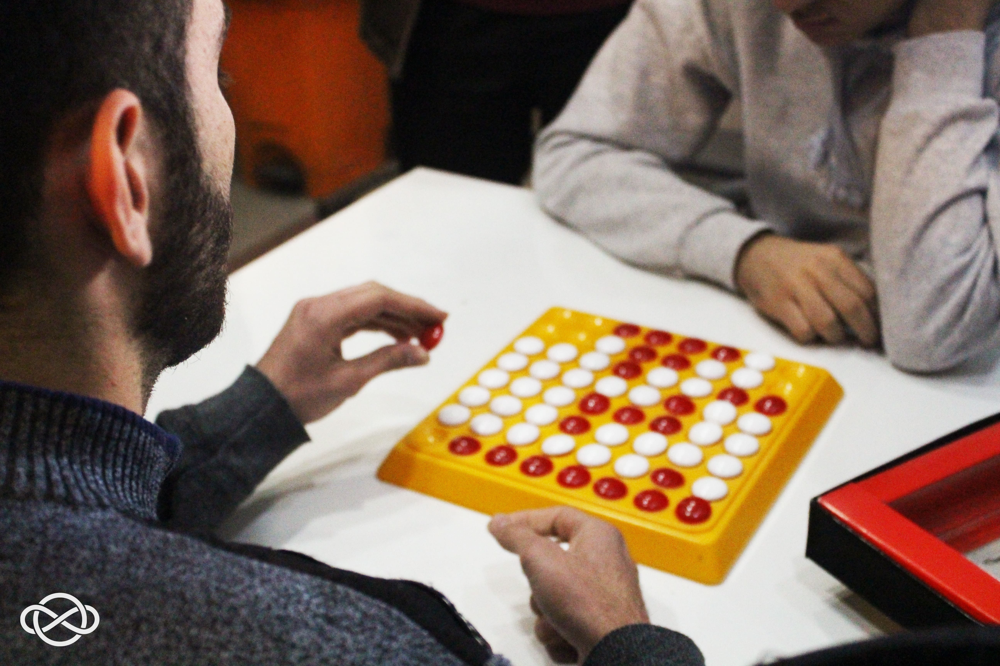
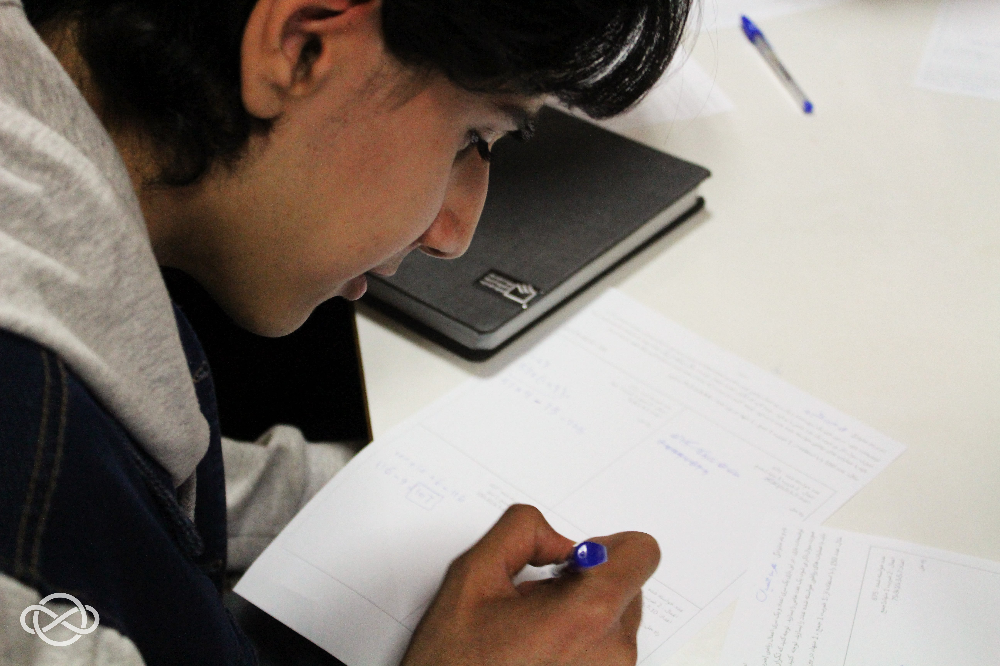
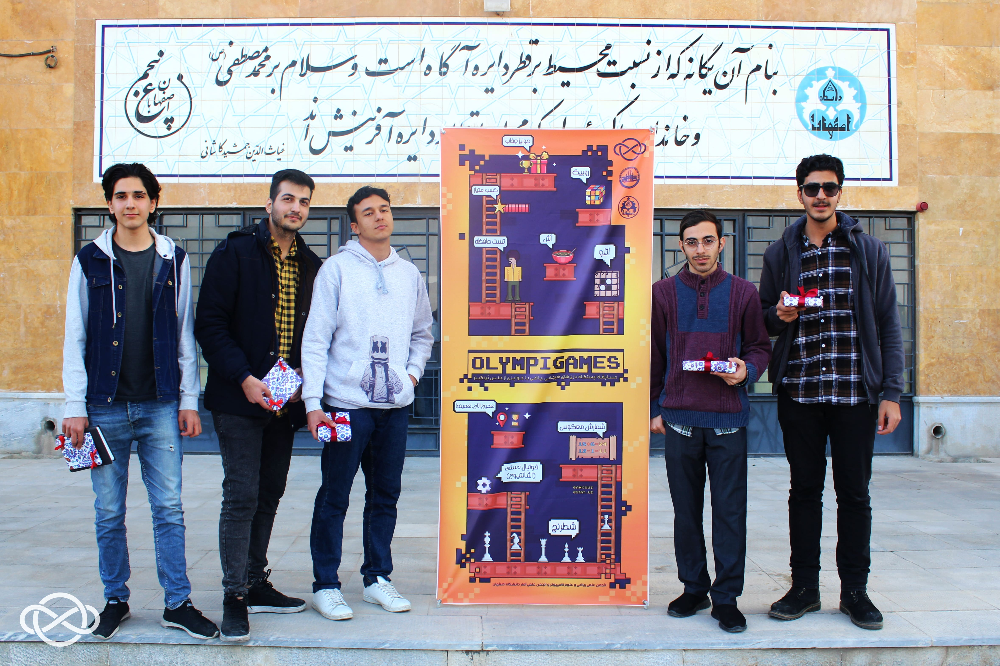
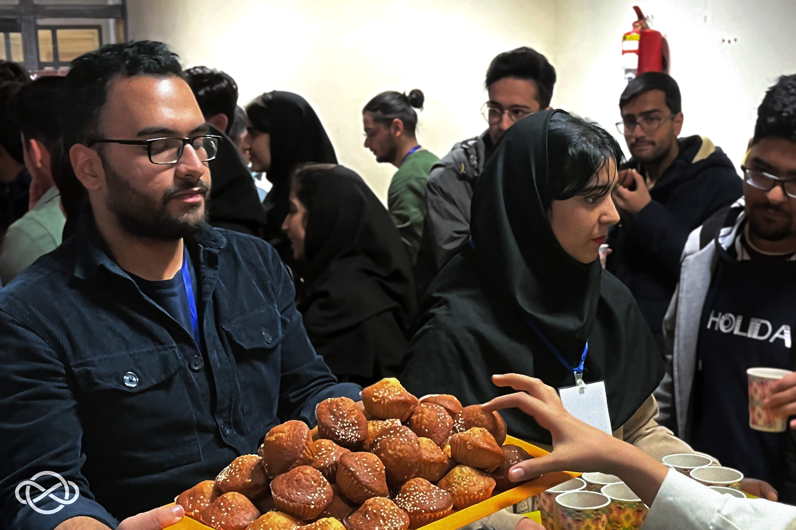
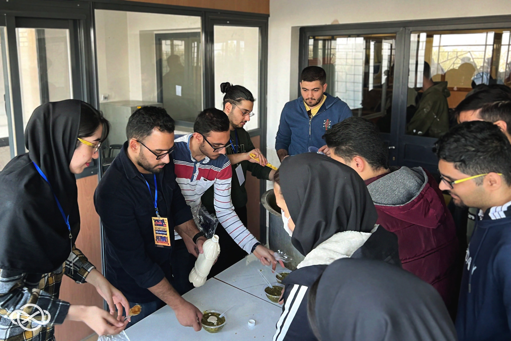
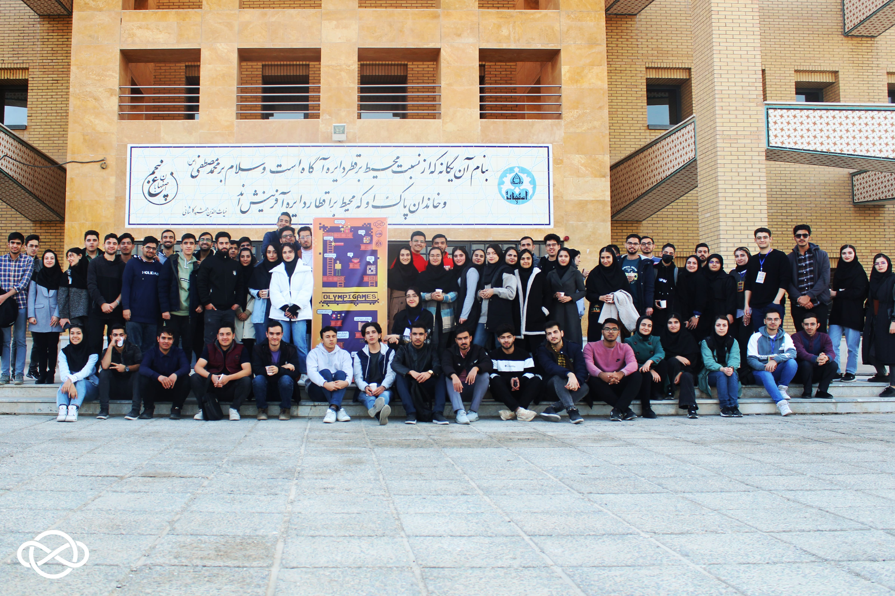
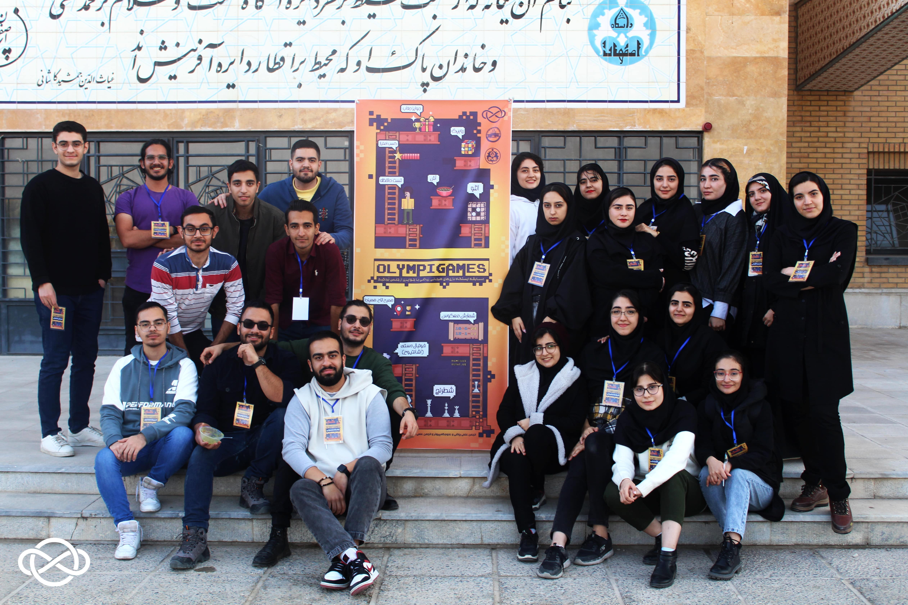

# مسابقه OlympiGames

**ایستگاه بازی‌های هیجانی ریاضی با جوایزی از جنس بردگیم به مناسبت روز دانشجو**

- **مراکز همکار:** انجمن علمی آمار دانشگاه اصفهان

- **سطح برنامه:** دانشگاهی

- **شرکت کنندگان:** ۲۰۰ دانشجوی کارشناسی رشته‌های علوم‌کامپیوتر، ریاضی، آمار و مهندسی کامپیوتر، استاد و کارمند دانشکده ریاضی و آمار دانشگاه اصفهان

- **هزینه ثبت‌‎نام:** رایگان

- **زمان و مکان:**  ۱۲ دی‌ماه ۱۴۰۲ ساعت ۱۳ الی ۱۴ در همکف دانشکده ریاضی و آمار دانشگاه اصفهان

## اهداف

- به تصویر کشیدن ابعاد جذاب دنیای ریاضیات سرشار از خلاقیت فکری برای دانشجویان

- حفظ پویایی و نشاط فضای دانشجویی نسل جوان در کنار جو علمی و پژوهش‌محور محیط دانشگاه

- تغییر فضای سرد غالب بر دانشکده به فضایی مملو از تعامل و تکاپو

- افزایش گرمی روابط دانشجویان با یکدیگر و اساتید و مسئولین دانشکده

## خلاصه برنامه

با فرارسیدن فصل امتحانات میان‌ترم و سایه انداختن آن به روی بزرگداشت روز دانشجو، انجمن علمی ریکا با پیشنهادات معاونت فرهنگی دانشکده، دکتر حمید بیدرام و مدیر گروه ریاضیات کاربردی و علوم کامپیوتر، دکتر محسن علمبردار، همچنین مشورت دانشجویان دلسرد و تحت فشار دانشکده که امکان تجربه جشن روز دانشجو را از دست داده بودند، تصمیم به حل این مسئله با برگزاری رویدادی جایگزین اما فراتر از یک جشن گرفت و ایده مسابقات OlympiGames را با استاد مشاور انجمن مطرح کرد.

در نهایت با همکاری انجمن علمی آمار و همراهی مسئولین دانشکده برای تهیه پذیرایی ویژه و تامین تمام فضای همکف ساختمان، انجمن این رویداد را در راستای اهداف شش‌گانه خود، به مناسبت بزرگداشت روز دانشجو، با تعریف بازی‌های فکری، تست حافظه و سوالات ریاضی و علوم‌کامپیوتر و اهدای جوایز ارزنده در جهت ایجاد سرزندگی و پویایی در محیط دانشکده برگزار نمود.

## روند برگزاری

فضای رویداد شامل مجموعه‌ای وسیع از ایستگاه‌های متنوع و جذاب واقع در طبقه همکف دانشکده ریاضی و آمار دانشگاه اصفهان بود. در هر کدام از ایستگاه‌ها، دانشجویان به صورت انفرادی در تلاش و رقابت برای به دست آوردن مجموع امتیازات بیشتر و در نهایت کسب جایزه نهایی بودند.

از میان ایستگاه‌های این مسابقه می‌توان به موارد زیر اشاره کرد:

- **شطرنج:** دو ایستگاه شطرنج سرعتی با سیستم امتیازدهی ویژه خود (الگو گرفته و تست شده بنا به مسابقات جهانی شطرنج) و نظارت منتور با تجربه در رویداد تعبیه شده بودند که بیشترین جذب را در میان ایستگاه‌های رویداد داشتند.

- **روبیک:** تعداد زیادی روبیک از انواع ابعاد و اشکال برای رقابت سرعتی دانشجویان تهیه شده بودند که توسط یک دانشجوی مسلط به تمامی انواع زمان‌بندی و امتیازدهی شده بودند.

- **اوتلو:** دو عدد بازی اتلو که از بازی‌های فکر معروف و زمان‌بر است، به صورت سرعتی در ایستگاه‌ها قرار داشتند و توسط منتوری که از پیش در مسابقات اتلو شرکت نموده بود، نظارت می‌شدند تا دانشجویان دوبه‌دو به رقابت و کسب امتیاز بپردازند.

- **تست حافظه:** به ابداع دانشجویان انجمن‌های برگزار کننده، یک بازی برای چالش حافظه دانشجویان طراحی شد تا با به خاطر سپردن رشته‌ای از کلمات و اعداد توسط شرکت کنندگان، به افراد دارای بهترین حافظه امتیاز تخصیص داده شود. 

- **شمارش معکوس و سایر معماهای علوم کامپیوتری:** در ایستگاهی خاص در مسابقه، هر چهار شرکت کننده با دریافت کاغذهای سوالات، تلاش به حل سریع سوالات ریاضیاتی و بردن هر راند می‌کردند.

- **فوتبال دستی (به صورت اشانتیون):** برای افزایش نشاط فضا، فوتبال دستی دیرین دانشکده با همکاری مسئولین بازیابی شده و بدون امکان کسب امتیاز، در کنار سایر ایستگاه‌ها قرار گرفته بود.  

    
    <em>رقابت ایستگاه شطرنج</em>

    
    <em>رقابت ایستگاه روبیک</em>

    
    <em>رقابت ایستگاه اتلو</em>

    
    <em>رقابت ایستگاه شمارش معکوس</em>

  

  
در طول برگزاری، تیم فنی رویداد مسئول ثبت، بررسی و مقیاس‌بندی امتیازات در گوگل شیت تعبیه شده برای هر شرکت کننده ثبت‌نامی بر اساس مقادیر از پیش محاسبه شده بودند. در طول این مدت، بنا به زمان میانگین عملی شرکت کنندگان در هر ایستگاه، تغییراتی در شیوه مقیاس‌بندی و جمع امتیازات تمام ایستگاه‌ها اعمال شد. در انتهای رویداد، از پنج نفر برتر تجمیع این مسابقات تقدیر و جوایزی جذاب از جنس بازی‌های فکری هیجانی و ریاضیاتی به آن‌ها اهدا شد.

    
    <em>اهدای جایزه به ۵ شرکت کننده برتر</em>

  

    
    <em>پذیرایی در طول مسابقه</em>

  

    
    <em>صرف آش پس از مسابقه به مناسبت روز دانشجو</em>

  

## اثربخشی و بازخورد

طراحی ایستگاهی این رویداد سبب شد علاوه بر حفظ فاکتورهای علمی شاخص دانشکده مانند ریاضیات و مباحث کامپیوتری که در سوالات برخی ایستگاه‌ها گنجانده شده بود، چاشنی بازی‌های فکری و معمایی نیز به تحرک و پویایی رویداد بیافزاید و فضای دانشکده را به یک محیط هیجان‌انگیز و ماجراجویانه بدل کند، به نوعی که موج فزونی از شرکت کنندگان خواستار برگزاری مجدد این مسابقه بوده و مکرر از خاطره‌انگیز بودن چالش‌های ذهنی سخن می‌گفتند.

همکاری همه جانبه دانشکده و انجمن علمی آمار با انجمن علمی ریاضی و علوم‌کامپیوتر در این مسابقه، تهیه پذیرایی (آش) و موسیقی از بلندگوهای همکف دانشکده، در سایه خلاقیت و ایده‌پردازی‌های نوین دانشجویان، به تقویت جو صمیمانه و پویای جشن و همچنین افزایش بازخوردهای مثبت دریافتی در فرم نظرسنجی، کمک شایانی کرد.
  

[فرم نظرسنجی رویداد](https://app.epoll.pro/33661350)

    
    
    <em>عکس یادگاری برخی از شرکت کنندگان و تیم اجرایی</em>

    

## آلبوم خاطرات

🗂  [تکه‌ای از خاطرات به‌جامانده](https://drive.google.com/drive/folders/1NTRFxTHvGDNGj8vh-n96Al9TbBInh1Ym)

یک ساعت بازی، تفکر و پویایی؛

یک ساعت ورزش ذهن در کنار تفریح، همبستگی و دوستی؛

    
یک ساعت برای یاد یک از یاد رفته؛

    
یک ساعت تا به هم بگوییم که بزرگ شدن و ورود به فضایی دانش‌بنیان، به معنای فراموشی شادی نیست، بلکه نشاطی آمیخته با علم و پیشرفت است.

به امید اینکه فراموش نکنیم ریاضیات یعنی خلاقیت ساختارمند، تخیلی منطقی و نگاهی متفاوت در بستری الگوریتمی؛ ریاضیات یعنی علم دست در دست بازی. 👾

**منتظر دوره‌های بعدی المپیگیمز باشید!** ⚡️
