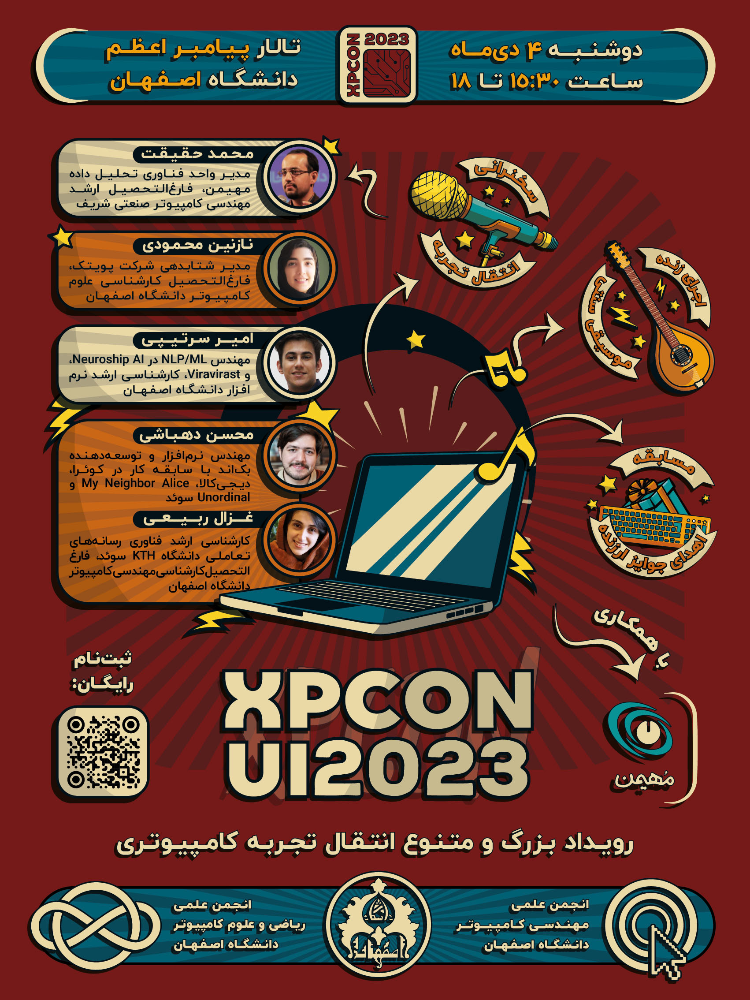
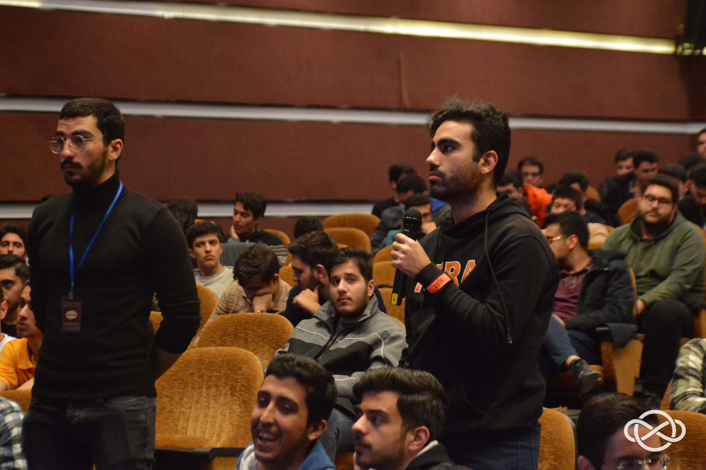
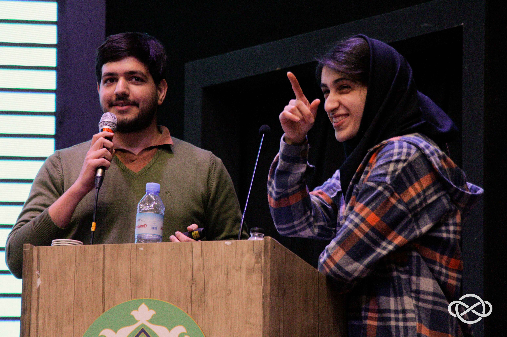
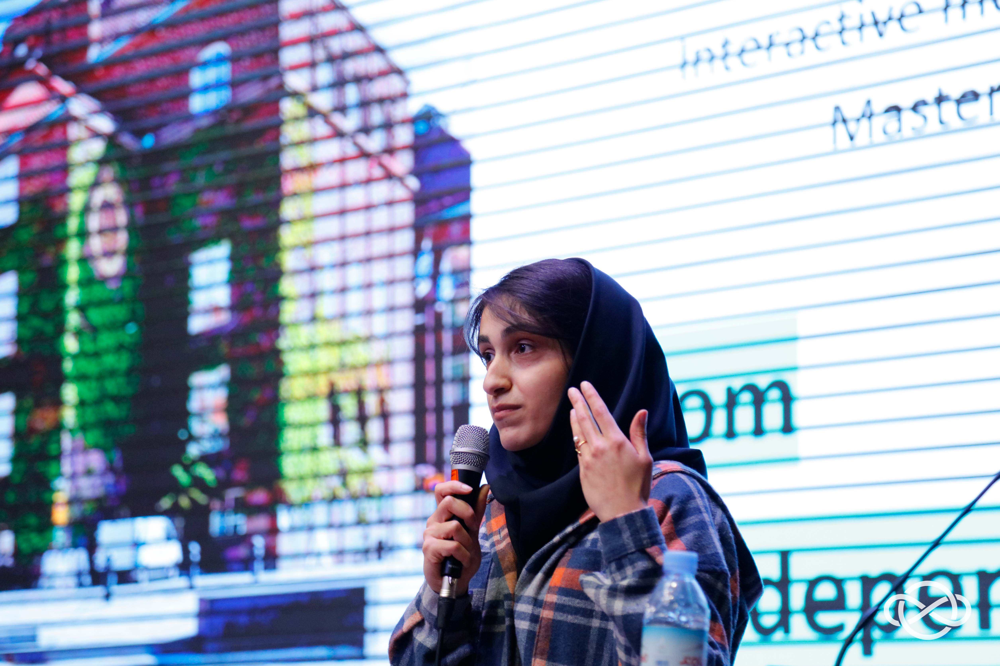
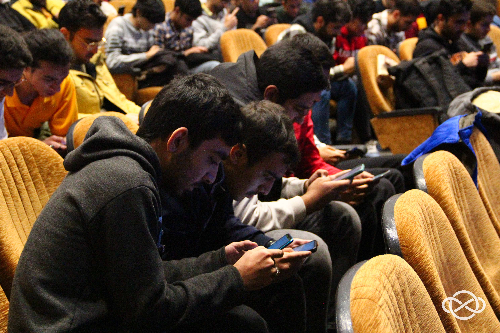
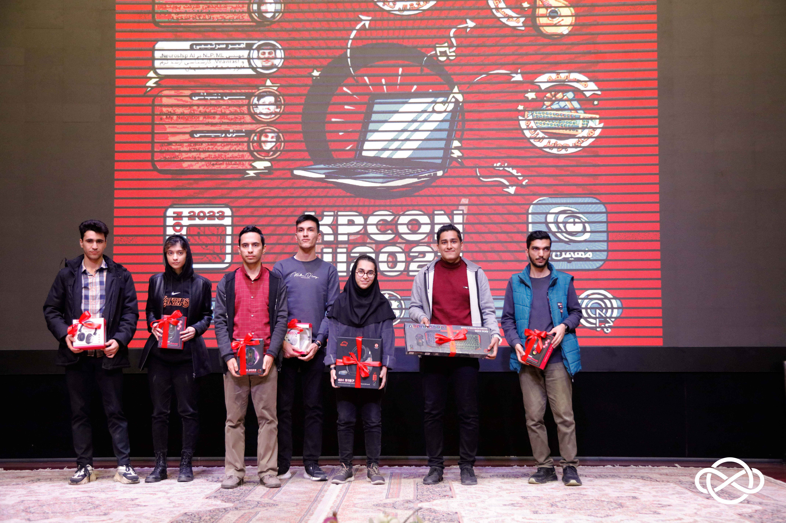
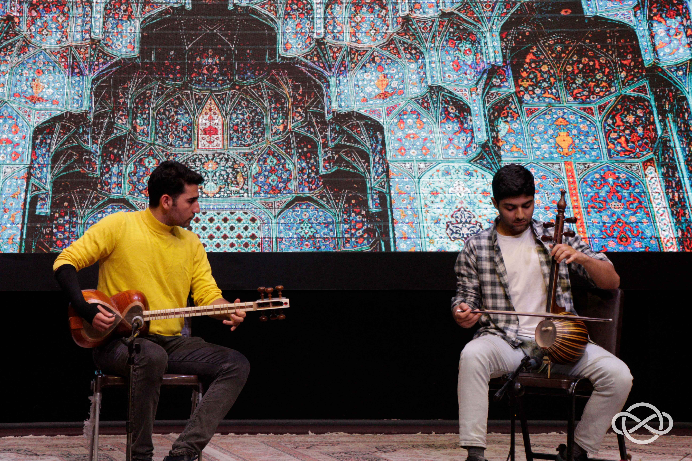
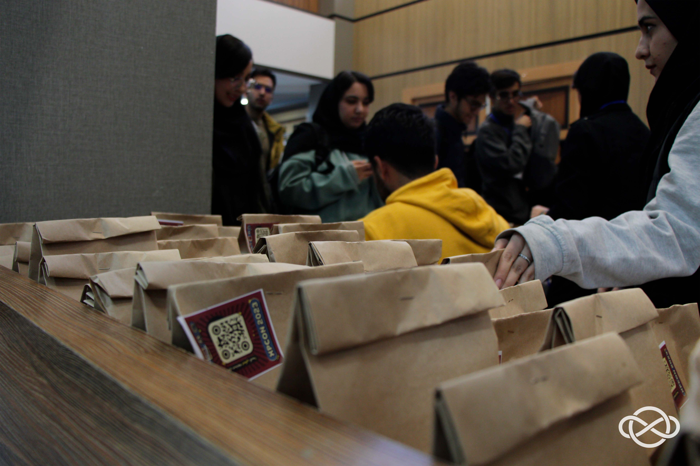
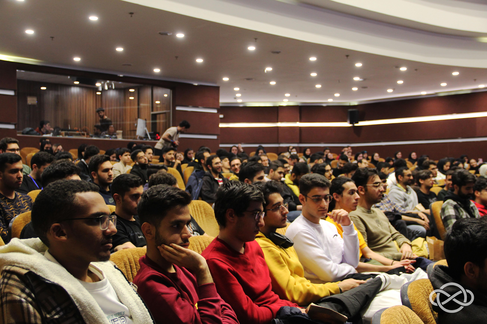
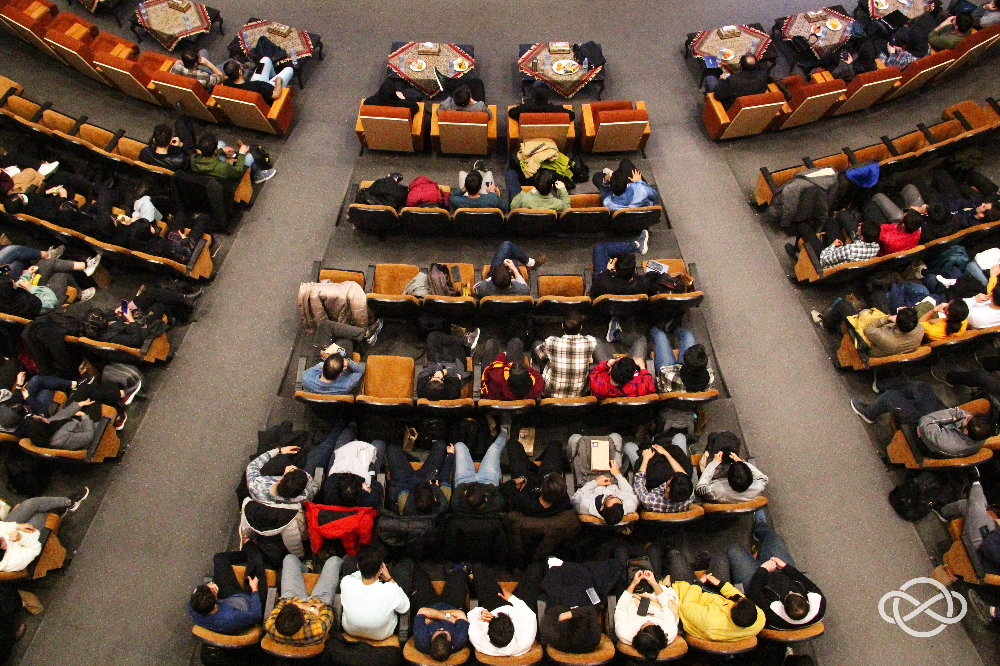

# رویداد انتقال تجربه کامپیوتری XPCon 2023

- **مراکز همکار:**  انجمن علمی مهندسی کامپیوتر دانشگاه اصفهان، شرکت مهیمن، خبرگزاری ایسکانیوز

- **سطح برنامه:** فرادانشگاهی

- **شرکت کنندگان:** ۳۵۰ دانشجوی کارشناسی و کارشناسی ارشد رشته‌های علوم کامپیوتر، مهندسی کامپیوتر، ریاضی، آمار، مهندسی برق و … و همچنین استاد و کارمند دانشگاه اصفهان

- **هزینه ثبت‌‎نام:** رایگان

- **زمان و مکان:** ۴ دی‌ماه ۱۴۰۲ ساعت ۱۵:۳۰ الی ۱۸ در تالار پیامبر اعظم ساختمان مرکزی دانشگاه اصفهان

## اهداف

- پیاده‌سازی کنفرانسی چندبعدی در راستای شبکه‌سازی و دریافت تجربه دانشجویان

- شناخت و دریافت تجربه دانشجویان حول فضاهای کاری و محیط‌های استارتاپی برای درک نیازها و موقعیت‌های شغلی

- آشنایی دانشجویان با مسیرهای پژوهشی تحصیلات تکمیلی برای گسترش دید آنان به آینده

- فرصت ارتباط با صنعت برای تمامین دانشجویان واجد شرایط همراه با امکان ارسال رزومه

- طرح‌ریزی رویدادی خلاقانه برای هم‌قدم‌سازی علم با نشاط متناسب با روحیه نسل جوان

- تقدیر از دانشجویان توانمند و نمونه در حیطه کامپیوتر

## خلاصه برنامه

رویداد XPCon، برگرفته از Experience و Conference، کنفرانسی دانشجویی و پرنشاط با تم Comic برای انتقال تجربه است. پس از ابراز علاقه انجمن علمی مهندسی کامپیوتر به همکاری با انجمن علمی ریکا، همایش XPCon از ایده‌پردازی اعضای انجمن با برندینگ و هویتی ویژه، کامیک و پر نشاط شکل گرفته و با همکاری تنگاتنگ دو انجمن پیاده‌سازی شد.

در این راستا، اولین دوره این رویداد به میزبانی انجمن‌های علمی علوم کامپیوتر و مهندسی کامپیوتر دانشگاه اصفهان، شامل تجربه‌نگاری متخصصان داخلی و خارجی در حوزه‌های کامپیوتری، اجرای موسیقی سنتی و نشاط‌آور و برگزاری مسابقه کامپیوتری با تقدیر از برندگان برگزار شد. در این همایش، انتقال تجربه و گفت‌وگو حول راه موفقیت‌آمیز صاحب‎ نظرانی چون محمد حقیقت، نازنین محمودی، امیر سرتیپی، محسن دهباشی و غزال ربیعی در پژوهش، نوآوری و تکنولوژی و تلاش بر سوق و راهنمایی دانشجویان به مسیر پیشرفت در جامعه، با فرصت استخدام در شرکت مهیمن، حامی رویداد، همراه بود. رویداد در تالار پیامبر اعظم، بزرگترین تالار دانشگاه اصفهان، با همکاری و مشورت مدیران هر دو گروه ریاضیات کاربردی و علوم کامپیوتر و مهندسی کامپیوتر برگزار شد.

## روند برگزاری

به صورت کلی، اولین دوره کنفرانس XPCon 2023 از چهار بخش اصلی تشکیل شده بود.

- **ارتباط با صنعت و غرفه شرکت حامی:** شرکت مهیمن به عنوان اسپانسر و شرکت همکار در برگزاری رویداد، به عنوان حامی مالی این دوره از XPCon نقش پررنگی داشت. این شرکت با برپایی غرفه و ارتباط‌گیری با دانشجویان، رزومه علاقه‌مندان را به منظور همکاری در حوزه‌های مختلف فناوری دریافت می‌کرد.

    
    <em>شرکت کنندگان در حال ارسال رزومه در کنار غرفه شرکت مهیمن</em>

- **سخنرانی‌های انتقال تجربه:** در این بخش از برنامه سعی بر آن بود تا با دعوت از افراد فعال در حوزه صنعت و فناوری که در داخل یا خارج از کشور مشغول به کار هستند، شاکله‌ای از مسیر پیش‌روی دانشجویان در آینده ترسیم شود. سخنرانان مدعو، با انتقال تجربیات ارزنده‌‌ خود در زمینه ارتباط میان دانشگاه و صنعت به دانشجویان در ترسیم مسیر آینده خود یاری رساندند. در انتهای هر سخنرانی، شرکت کنندگان سرتاسر سالن فرصت مطرح نمودن سوالات خود از متخصصین را داشتند.

    
    <em>پرسش و پاسخ شرکت کنندگان</em>

- **سخنرانی اول**

	- **سخنران:** محمد حقیقت

	- **سمت و سابقه کاری و تحصیلی:** مدیر واحد فناوری تحلیل داده مهیمن، فارغ‌التحصیل کارشناسی ارشد مهندسی کامپیوتر دانشگاه صنعتی شریف

	- **خلاصه سخنرانی:‌** مهندس حقیقت به بیان دلایل عدم مهاجرت خویش و ارائه‌ مثال‌های واقعی از بسترهای کلان موجود در کشور پرداختند و ضمن بیان تجربیات خویش در شرکت مهیمن، جوانان را تشویق به یافتن و ساختن فرصت‌ها کردند.
    

    
    <em>سخنرانی مهندس محمد حقیقت</em>

- **سخنرانی دوم**

	- **سخنران:** نازنین محمودی

	- **سمت و سابقه کاری و تحصیلی:** مدیر شتابدهی شرکت پویتک، فارغ‌التحصیل کارشناسی علوم کامپیوتر دانشگاه اصفهان

	- **خلاصه سخنرانی:** مهندس محمودی که خود فارغ‌التحصیل علوم کامپیوتر دانشگاه اصفهان بودند، صحبت خود را با شیوه‌ای جدید و منحصر به فرد آغاز کرده و به بیان دغدغه‌های دوران دانشگاهی خویش پرداختند. ایشان در ادامه از اهمیت شکست در فضای استارتاپی سخن گفتند و آن را بخشی جدایی‌ناپذیر از مسیر پیشرفت خواندند. در نهایت نیز، ضمن آرزوی تجربه شکست برای دانشجویان (به منظور کسب تجربه)، توصیه به آموختن از شکست‌ها نمودند.

    
    <em>سخنرانی مهندس نازنین محمودی</em>

- **سخنرانی سوم**

	- **سخنران:** امیر سرتیپی

	- **سمت و سابقه کاری و تحصیلی:** مهندس NLP/ML در Neuroship AI و Vivavirast، فارغ‌التحصیل کارشناسی ارشد مهندسی نرم‌افزار دانشگاه اصفهان

	- **خلاصه سخنرانی:** ایشان در طول سخنرانی خود از چالش‌های مسیر انتقال از دانشگاه به صنعت صحبت کرده و بینش خود را درباره مسیرهای شغلی و تحقیقاتی در مهندسی و علوم کامپیوتر، با مخاطبان به اشتراک گذاشتند. وی با پرداختن به و Neuroship AI، داستان اپلیکیشن‌هایی که هسته آن‌ها از مدل‌های Viravirast زبانی قدرت گرفته، کاربرد عملی دانش و مهارت را در تکنولوژی نشان دادند.

    
    <em>سخنرانی مهندس امیر سرتیپی</em>

- **سخنرانی چهارم**
	این سخنرانی، تلفیقی از تجربیات مجزا و مشترک زوج فارغ‌التحصیل رشته مهندسی کامپیوتر دانشگاه اصفهان بود.

	- **سخنران‌ اول:** محسن دهباشی

	- **سمت و سابقه کاری و تحصیلی:** مهندسی نرم‌افزار و توسعه‌دهنده بک‌اند با سابقه کار در کوئرا، دیجی‌کالا، My Neighbor Alice و Unordinal سوئد

	- **سخنران دوم:** غزال ربیعی

	- **سمت و سابقه کاری و تحصیلی:** کارشناسی ارشد فناوری رسانه‌های تعاملی دانشگاه KTH سوئد، فارغ‌التحصیل کارشناسی مهندسی کامپیوتر دانشگاه اصفهان

	- **خلاصه سخنرانی:** این زوج در ابتدا برای دانشجویان از تجربیات دانشجویی خود در دوران کارشناسی، فرصت‌های فضای دانشجویی، تجربه شرکت و برگزاری مسابقات ACM و همچنین اشتغال در شرکت‌های بزرگ و مطرح ایران و جهان سخن گفتند. در ادامه نیز به چرایی گسترش مسئله مهاجرت در میان جوانان، به ویژه دانشجویان و فرهیختگان و دلایل و سختی‌های آن پرداختند.

  

    
	
    <em>سخنرانی مهندسین محسن دهباشی و غزال ربیعی</em>

- **برگزاری مسابقات شاد و مفرح:‌** در وقفه میان سخنرانی‌ها، به منظور رفع خستگی و همچنین سنجش پتانسیل‌های علمی دانشجویان، مسابقاتی شاد و مفرح شامل چند مرحله دارای مهلت کوتاه، همراه با اهدای جوایز نفیس برگزار شد که مشتمل بر ۲ قسمت بود.

	1. **اطلاعات عمومی:** در این مسابقه شرکت‌کنندگان با ورود به لینک موجود در وب‌گاه زی‌لینک رویداد، یک دقیقه فرصت داشتند تا به سوالات مربوط به حوزه کامپیوتر پاسخ دهند.
	2. **حدس عدد:** در این بخش هر فرد یک دقیقه زمان داشت تا با بررسی مباحث احتمال، حدس بزند نصف میانگین تمام اعداد ارسالی توسط شرکت‌کنندگان چه عددی خواهد بود. نزدیک‌ترین حدس به عنوان برنده اعلام می‌شد. تقریبا تمام شرکت‌کنندگان در این مسابقه شرکت‌کردند و هنگام اعلام نتایج شور و هیجان بالایی سالن را فرا گرفته بود.

[زی‌لینک رویداد (لینک‌های مسابقه)](https://zil.ink/xpcon)

در پایان رویداد و پس از قسمت آخر مسابقات، به برندگان مسابقه کیبورد، موس و هدست گیمینگ تقدیم شد.

  

	
    <em>شرکت کنندگان در حال انجام مسابقه</em>

	
    <em>اهدای جوایز به دانشجویان برتر مسابقه</em>

- **سایر عناصر جانبی:** در کنار تمرکزهای اصلی همایش، برای افزایش تعامل و جذابیت رویداد، مواردی مانند اجرای موسیقی زنده سنتی توسط خود دانشجویان توانمند رشته کامپیوتر، تقدیم پذیرایی و شبکه‌سازی در نظر گرفته شدند.

	
    <em>اجرای موسیقی زنده توسط دو دانشجو</em>

	
    <em>بسته‌های پذیرایی دوستدار محیط زیست</em>

	
	
    <em>نمایی اجمالی از فضای کنفرانس</em>

	
	
    <em>تصاویر یادگاری شرکت کنندگان و تیم اجرایی</em>

  
## اثربخشی

  
- **پوشش خبری رویداد:** در راستای اهداف برندینگ رویداد، انتقال اخبار و تجربه‌نگاری‌ها، با دعوت از مهرزاد سلیمی، مدیر باشگاه خبرنگاران دانشجویی ایران «ایسکانیوز» در اصفهان و تیم مجرب دانشجویی ایشان در دانشگاه اصفهان که پیش‌تر در کارگاه «مبانی خبرنویسی و مصاحبه» انجمن علمی ریاضی علوم کامپیوتر دانشگاه اصفهان توانمند شده بودند، پوشش خبری کاملی از رویداد صورت گرفت که مشروح آن در وبگاه ایسکانیوز و سایت دانشگاه اصفهان قابل مشاهده است.

[پوشش خبری رویداد توسط خبرگزاری ایسکانیوز](https://www.iscanews.ir/photo/1213181/%D8%A8%D8%B1%DA%AF%D8%B2%D8%A7%D8%B1%DB%8C-%D8%B1%D9%88%DB%8C%D8%AF%D8%A7%D8%AF-XPCON-UI-%D8%A8%D8%A7-%D8%AD%D8%B6%D9%88%D8%B1-%D8%AF%D8%A7%D9%86%D8%B4%D8%AC%D9%88%DB%8C%D8%A7%D9%86-%D9%85%D9%87%D9%86%D8%AF%D8%B3%DB%8C-%D9%88-%D8%B9%D9%84%D9%88%D9%85-%DA%A9%D8%A7%D9%85%D9%BE%DB%8C%D9%88%D8%AA%D8%B1)

پوشش خبری ایسکانیوز با عنوان ["دانشجویان مهندسی، فضای صنعت را با کارآموزی تجربه کنند"](https://iscanews.ir/xdnz3)

[پوشش خبری رویداد توسط روابط عمومی دانشگاه اصفهان](https://www.ui.ac.ir/page-indexmega/fa/0/news/42070-G1618)
  

- **فرم نظرسنجی و بازخورد:** پس از برگزاری رویداد، فرم نظرسنجی به دست شرکت‌کنندگان رسید و نظرات ایشان در رابطه با کیفیت و میزان رضایت آنان از رویداد دریافت شد. مثبت بودن بازخورد و نظرات ارسالی حول میزان کاربردی بودن کنفرانس و ارائه جذاب سخنرانان، همچنین جذابیت بازی در تایم‌های استراحت،‌ انرژی دوباره‌ای به عوامل برگزار کننده رویداد بخشید و نشان از علاقه‌مندی شرکت‌کنندگان برای حضور در دوره‌های بعدی این همایش داشت.

[فرم نظرسنجی رویداد](https://app.epoll.pro/33169250)
