# کارگاه LaTeX


## نصب Tex Live


### دریافت فایل


برای نصب، به فایل `texlive.iso` نیاز داریم. در هنگام نوشتن این متن، (اواخر سال ۲۰۲۴) این فایل تقریبا ۶ گیگابایت هست. برای دریافت این فایل دو راه وجود داره.

  
1. با مراجعه به دفتر انجمن و به همراه داشتن یک فلش، هارد، گوشی یا ... فایل رو دریافت کنید.


2. فایل رو دانلود کنید. [لینک دانلود از طریق سایت دانشگاه یزد](https://ctan.yazd.ac.ir/systems/texlive/Images/texlive.iso)

  
 > توجه: اگر لینک دانلود براتون کار نمیکرد، می‌تونید این مراحل رو طی کنید:


1. بقیه Mirror ها رو [اینجا](https://ctan.org/mirrors) ببینید و کشور و سایت مورد نظرتون رو انتخاب کنید.
2. سپس نوع پروتکل (ترجیحا https) رو انتخاب کنید.
3. پس از اون در لیستی که باز میشه، از قسمت `system`، گزینه `TeX Live` رو انتخاب کنید.
4. سپس فولدر `Images` رو انتخاب و فایل `texlive.iso` رو دانلود کنید.
  

### نصب فایل


1\. پوشه‌ای که فایل در اون قرار داره رو باز کنید.


2\. روی فایل `textlive.iso` راست کلیک کنید و گزینه `Open with` رو انتخاب کنید.


3\. در ابتدا سعی کنید با زدن گزینه `Windows Explorer` فایل `iso` رو اصطلاحا `Mount` کنید.


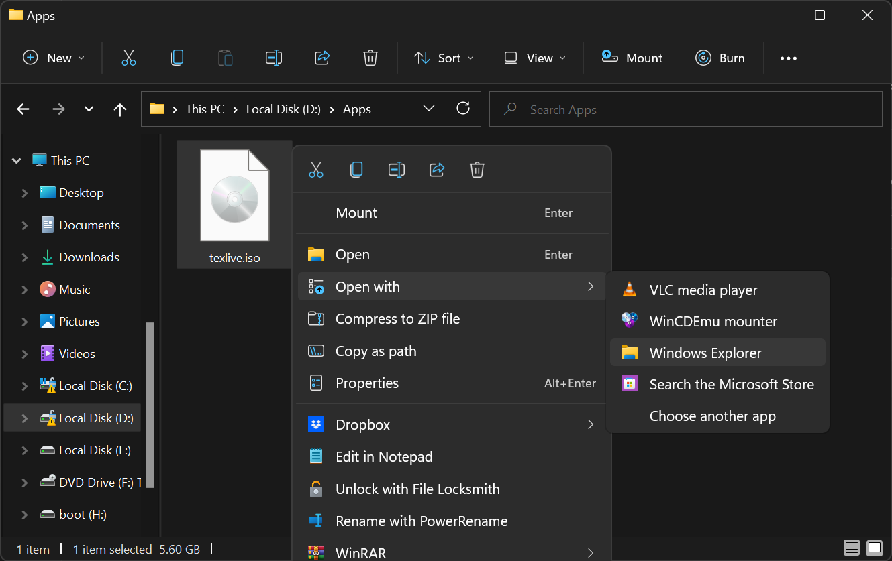


4\. برای اینکه مطمئن بشید وقتی گزینه رو زدید، همه چیز اوکی بوده و کار کرده، به منوی سمت چپی که توی عکس می‌بینید دقت کنید. اگر درایو جدیدی با اسم `F` یا حرف دیگری ایجاد شده بود و با باز کردنش محتویاتی مثل تصویر زیر دیدید، همه چیز آماده نصب هست و میتونید به مرحله ۵ مراجعه کنید. در غیر این صورت، سه مرحله زیر رو دنبال کنید.


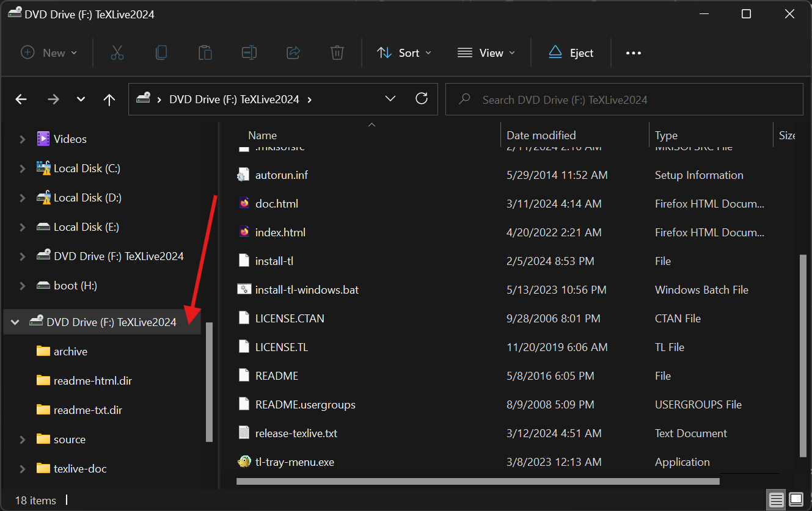


- اگه این درایو رو ندیدید، نرم‌افزار [WinCDEmu](https://github.com/sysprogs/WinCDEmu/releases/download/v4.1/WinCDEmu-4.1.exe) رو نصب کنید.
- حالا مراحل 1 و 2 که در بالا بودند رو دوباره اجرا کنید و در مرحله‌ی 3 به جای `Windows Explorer` روی `WinCDEmu mounter` کلیک کنید.
- حالا باید درایو جدیدی که در عکس بالا می‌بینید قابل مشاهده باشه و می‌تونید به مرحله‌ی بعد برید.


5\. روی فایل `install-tl-windows.bat` کلیک کنید. ممکنه که پسوند `.bat` برای شما نمایش داده نشه، مشکلی نیست و صرفا دقت کنید که اسم فایل دقیقا همین باشه.  


6\. باید پنجره‌ای باز بشه و پس از چند لحظه تصویری مشابه با چیزی که در زیر می‌بینید قابل مشاهده باشه.


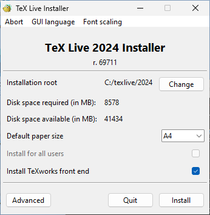


7\. در اینجا نیاز به انجام تغییرات خاصی نیست، ولی پیشنهاد میشه اگر درایو `C` تون پر هست یا حجم کمی داره، روی گزینه `Change` کلیک کنید و درایو رو تغییر بدید.


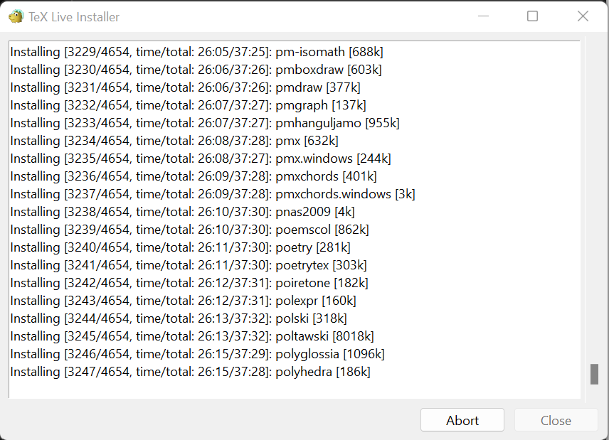


8\. همونطور که در تصویر می‌بینید، فایل نصبی در حال نصب 4564 پکیج هست که تا اینجای کار 3247 عدد از اونها نصب شدند. مدت زمان نصب ممکنه تا ۴۰ دقیقه طول بکشه. منتظر بمونید تا نصب تموم بشه و پیامی مثل عکس زیر دریافت کنید.


`Welcome to Tex Live!`


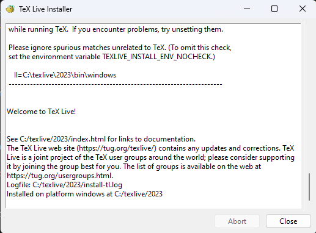


نصب Tex Live در اینجا به پایان رسید.


# نصب VS Code و LaTeX-Workshop


1\. ابتدا از [این لینک](https://code.visualstudio.com/Download) نسخه `VS Code` مطابق با سیستم‌عاملتون رو دانلود و نصب کنید.


2\. اگر آیکون برنامه در صفحه `Desktop` قرار نگرفته بود، عبارت `code` رو در سرچ‌بار ویندوز جست‌وجو کنید و برنامه رو باز کنید.


3\. نصب افزونه `LaTeX-Workshop`:


1. بعد از باز کردن `VS Code`، ابتدا تب `Extension` رو باز کنید. (فلش قرمز)


با اینکه منویی که فلش قرمز به یکی از گزینه‌هاش اشاره کرده به صورت پیش‌فرض در سمت چپ برنامه قرار داره، پیشنهاد میشه که اونو به سمت راست منتقل کنید. برای این کار روی منو کلیک راست کرده و گزینه `Move Primary Side Bar Right` رو انتخاب کنید.


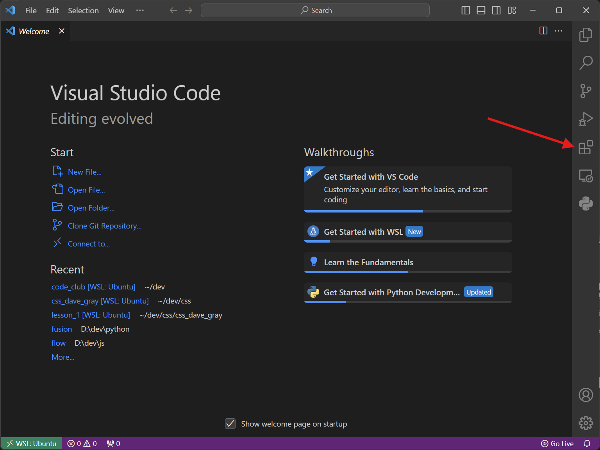


2. حالا در قسمت سرچ، عبارت `Latex Workshop` رو جست‌وجو کنید و موردی که از همه بیشتر دانلود داره (!) رو `Install` کنید. ممکنه برای این کار نیاز به تحریم‌شکن داشته باشید.


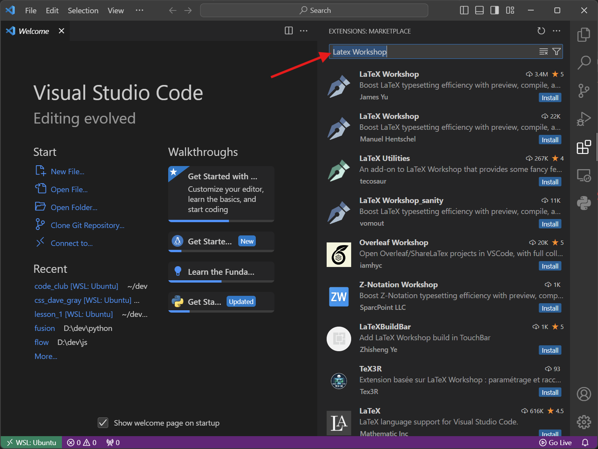


3. در نهایت باید صفحه‌ای مثل این عکس داشته باشید:


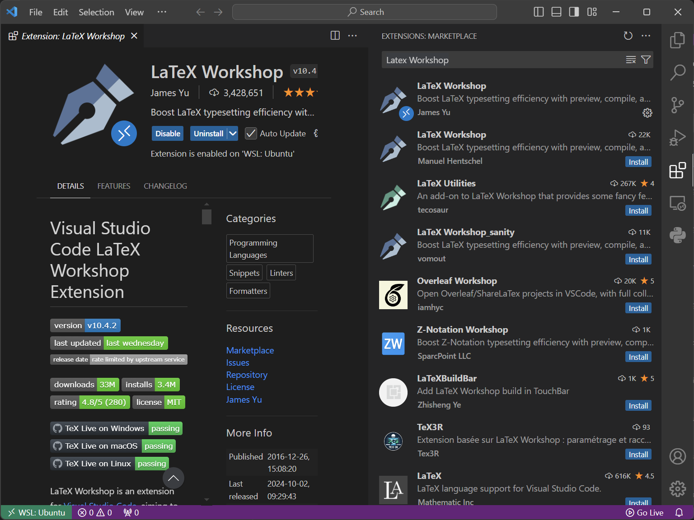


# تنظیم کامپایلر و اجرای اولین دستور


1\. ابتدا باید یک پوشه بسازیم و اونو با `VS Code` باز کنیم. برای این کار روی گزینه `File` کلیک کنید و `Open Folder` را بزنید.


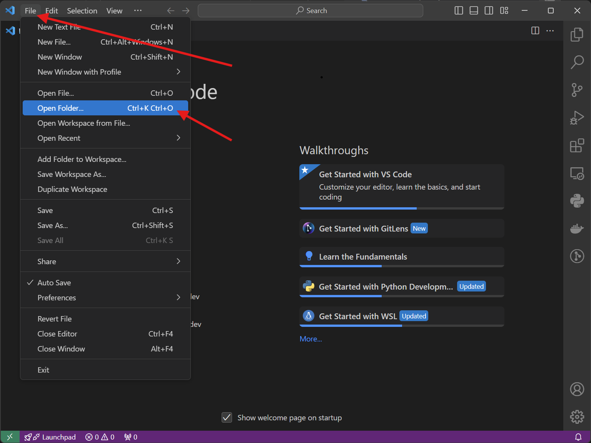


2\. حالا می‌تونید پوشه مورد نظر خودتونو انتخاب کنید. برای مثال اینجا توی درایو `D` پوشه `uni` و سپس `Tex` انتخاب شده. با استفاده از دکمه‌ای که در تصویر مشخص شده می‌توانید در هر مرحله پوشه‌ی مورد نظر خودتونو ایجاد کنید. در پایان روی دکمه `Select Folder` در پایین پنجره کلید کنید. 


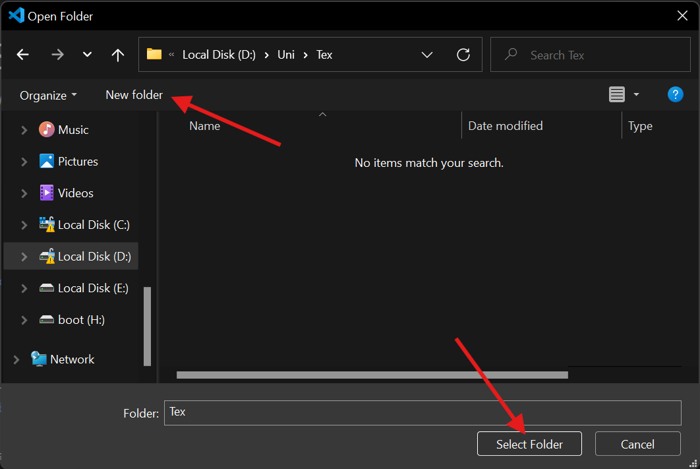


3\. حالا `File Explorer` رو باز کنید.


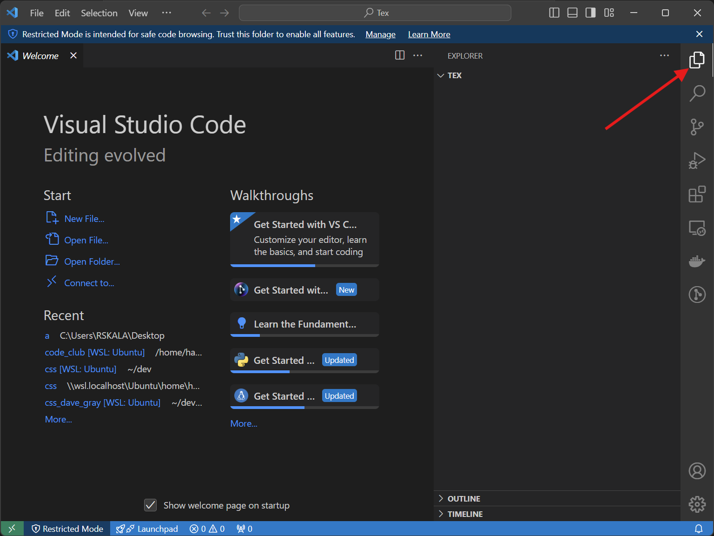


4\. در این مرحله با استفاده از دکمه‌ای که در تصویر مشخص شده یک پوشه با نام `vscode.` بسازید. به نقطه‌ی اول اسم پوشه دقت کنید. قبل از نقطه هم چیزی قرار ندید.


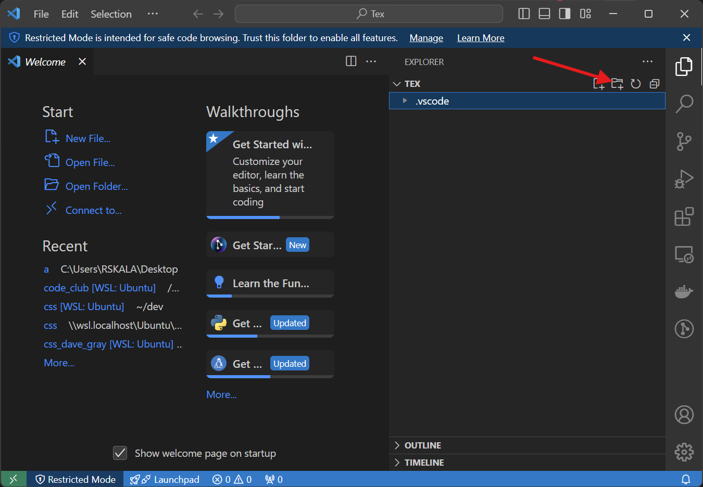


5\. وارد پوشه بشید و یک فایل به اسم `settings.json` ایجاد کنید. حالا بسته به سیستم‌عاملتون `Windows` / `MacOS` , `Linux` مقادیر زیر رو در اون کپی کنید.


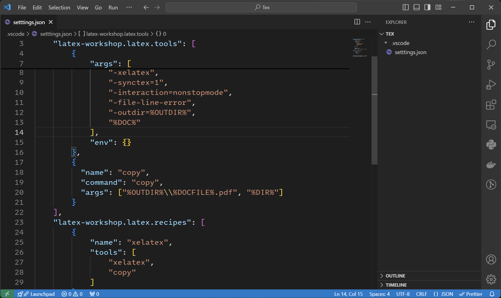


`Windows`:


```json

{

    "latex-workshop.latex.outDir": "%DIR%/out",

    "latex-workshop.latex.tools": [

        {

            "name": "xelatex",

            "command": "latexmk",

            "args": [

                "-xelatex",

                "-synctex=1",

                "-interaction=nonstopmode",

                "-file-line-error",

                "-outdir=%OUTDIR%",

                "%DOC%"

            ],

            "env": {}

        },

        {

          "name": "copy",

          "command": "copy",

          "args": ["%OUTDIR%\\%DOCFILE%.pdf", "%DIR%"]

        }

    ],

    "latex-workshop.latex.recipes": [

        {

            "name": "xelatex",

            "tools": [

                "xelatex",

                "copy"

            ]

        }

    ],

    "latex-workshop.latex.autoBuild.run": "onFileChange",

    "latex-workshop.latex.recipe.default": "xelatex"

  }

```

  
`Linux | MacOS`


```json

    "latex-workshop.latex.outDir": "%DIR%/out",

    "latex-workshop.latex.tools": [

        {

            "name": "xelatex",

            "command": "latexmk",

            "args": [

                "-xelatex",

                "-synctex=1",

                "-interaction=nonstopmode",

                "-file-line-error",

                "-outdir=%OUTDIR%",

                "%DOC%"

            ],

            "env": {}

        },

        {

          "name": "copy",

          "command": "cp",

          "args": ["%OUTDIR%/%DOCFILE%.pdf", "%DIR%"]

        }

    ],

    "latex-workshop.latex.recipes": [

        {

            "name": "xelatex",

            "tools": [

                "xelatex",

                "copy"

            ]

        }

    ],

    "latex-workshop.latex.autoBuild.run": "onFileChange",

    "latex-workshop.latex.recipe.default": "xelatex"

  }

```

  
فرق دو فایل در کامند `copy` و اسلش و بک‌اسلش‌هاست.


6\. حالا بیرون از فولدر `vscode.` یک فایل با نام دلخواه و پسوند `tex.` ایجاد کنید. مثلا `article.tex` و سپس مقادیر زیر را در آن کپی کنید. در پایان روی دکمه `Run` (سبز رنگ) کلیک کنید.


```tex

\documentclass{article}

\begin{document}

\begin{center}

Taylor's series

\end{center}

$$\sum_{n=0}^{\infty} \frac{f^{(n)}(a)}{n!}(x - a)^n$$

\end{document}

```


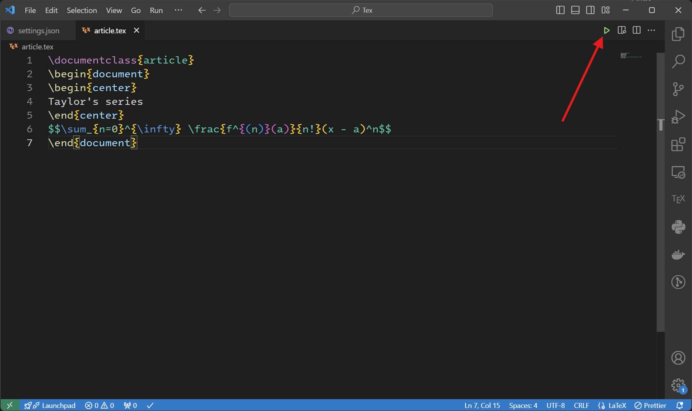


7\. چند لحظه صبر کنید و سپس برای دیدن نتیجه کار خود روی دکمه‌ای که کنار `Run` است کلیک کنید.


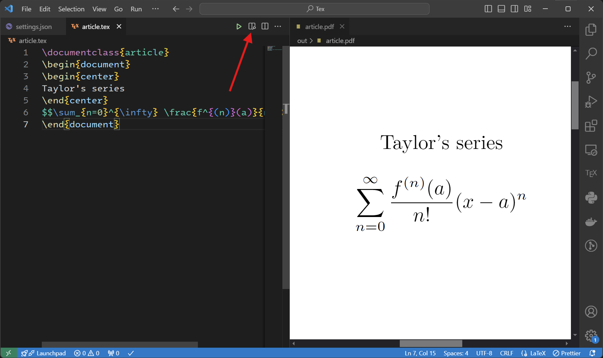
