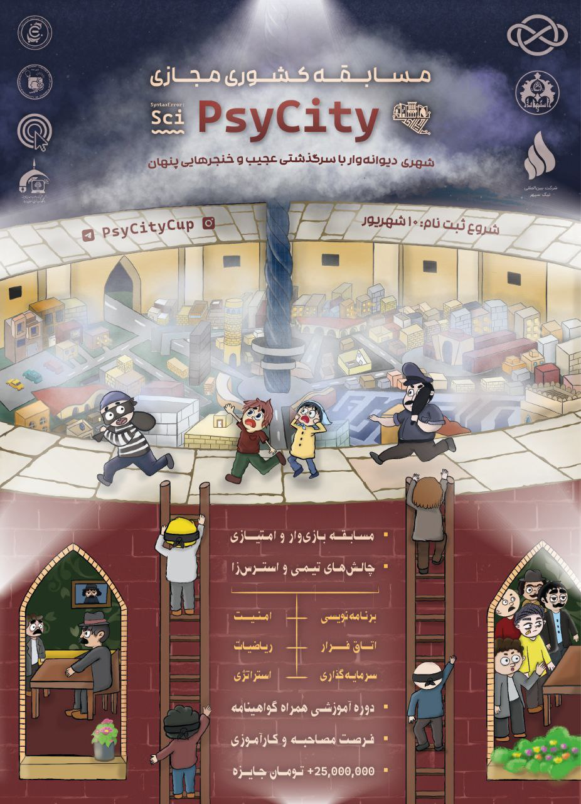

# رویداد کشوری PsyCity

*مسابقه‌ای آموزش‌محور و بازی‌وار شده در شهری دیوانه‌وار*

سای‌سیتی، شهری پر هرج و مرج با چاشنی طنز در دنیایی موازی، که در آن هیجان علوم‌کامپیوتر با قصه‌های جنایی و ذکاوت یک معامله‌ی خوب ترکیب می‌شود!

- **مراکز همکار:** معاونت فرهنگی اجتماعی دانشگاه اصفهان، شرکت بین‌المللی نیک‌سپهر، مرکز آپا دانشگاه اصفهان، اتحادیه انجمن‌های علمی دانشجویی کامپیوتر ایران، انجمن علمی ACM دانشگاه اصفهان، انجمن علمی مهندسی کامپیوتر دانشگاه اصفهان، انجمن علمی کامپیوتر دانشگاه شهید اشرفی اصفهانی و معاونت علمی و فناوری ریاست جمهوری
- **سطح برنامه:** کشوری
- **شرکت کنندگان:** 95 دانشجوی کارشناسی و کارشناسی ارشد انواع رشته‌های علوم کامپیوتر، مهندسی‌کامپیوتر، ریاضیات کاربردی، مهندسی برق و مهندسی پزشکی از دانشگاه‌های اصفهان، صنعتی اصفهان، تهران، صنعتی خواجه نصیر طوسی، علم و صنعت ایران، علامه طباطبایی، شیراز، الزهرا، سمنان، شهرکرد، رازی کرمانشاه، سمنان، کاشان، یزد و ... به صورت 30 تیم، که 40 نفر به صورت حضوری و مابقی به صورت آنلاین در رویداد شرکت کردند.
- **پیش‌نیاز:**  یک زبان برنامه‌نویسی و ریاضیات پایه (دانشی در مورد گراف و ترکیبیات)
- **زمان:** کارگاه‌ها ۱۹ بهمن تا 11 اسفند، مینی‌کانتست 13 اسفند و مسابقه 16 تا 18 اسفند 1402

چند روز و چه زمانی توی سای‌سیتی اقامت داریم؟ 
کارگاه‌ها به مدت دو هفته در بهمن و اسفند برگزار می‌شند و بعد از اون به مدت 3 روز وارد شهر می‌شید و تلاش می‌کنید پول در بیارید!

## سای‌سیتی چیست؟

در این رویداد بازی‌وار شده که اسفندماه ۱۴۰۲ در طی سه روز به صورت مجازی (در کنار تجربه انتخابی و جذاب حضوری در اصفهان با امکانات کامل) در یک شهر مجازی گرافیکی برگزار شد، شرکت‌کنندگان پس از آموزش، با حل سوالات برنامه‌نویسی، رمزنگاری و امنیت در یک شهر مجازی همراه با تیم‌سازی و استفاده از استراتژی‌های زیرکانه و معاملات پر از کلک، پول در آورده و جایزه‌ی بزرگ شهر را از آن خود کردند.

## اهداف

- حرکت در مسیر طرح‌های بازی‌وارسازی آموزش و سنجش برای رفع فاصله افراد از محیط آموزشی
- تقویت نشاط فعالیت علمی در محیط دانشگاهی برای ارتباط بیشتر با نسل جوان و علاقه‌مند برای توسعه فناوری، نوآوری و خلاقیت
- تشویق دانشجویان علاقه‌مند در انجمن در راستای استفاده از مهارت‌های خود برای توسعه طرح فناورانه بازی‌وارسازی آموزش
- آموزش و کسب تجربه دانشجویان علاقه‌مند در برگزاری و پیاده‌سازی یک طرح فناورانه و کسب رزومه به صورت عضویت در تیم برگزاری رویداد 
- گسترش دید کاربردی شرکت‌کنندگان از مطالعه و آزمون به مطالعه و عمل
- توانمندسازی و کسب تجربه دانشجویان در حیطه‌های لازم برای موفقیت در محیط کار مانند توانایی ارائه خود به شرکت‌ها و فعالیت تیمی
- آشنایی افراد با کارکرد و استفاده‌های مباحث رمزنگاری و امنیت
- کشف افراد مستعد و توانمند در زمینه‌های تفکر استراتژیک، مدیریت مالی، مدیریت زمان، مدیریت بحران، حل مسئله، برنامه‌نویسی، ریاضیات، رمزنگاری، ارتباطات، کار تیمی و ...
- فراهم کردن محیطی برای رقابت، همفکری و شبکه‌سازی جوانان
- تشویق و پاداش دانشجویان برتر و ایجاد فرصت کشف استعداد افراد توسط صنایع مربوطه

## آموزش و انتقال تجربه

از اونجا که اهداف رویداد **سای‌سیتی** ترویج علم و افزایش دانش تخصصی در حوزه‌های جدید و نوین تکنولوژیه و همچنین برای اینکه فرصت یادگیری و آماده شدن برای مسابقه رو زیاد و فضای رقابتی عادلانه برای شرکت‌کنندگان ایجاد کنیم، با هماهنگی چند پیشکسوت، ویدئوهای مثال محوری رو برای شرکت‌کنندگان آماده کردیم تا اگر این موضوعات جذاب رو بلد نیستند، با کمک این محتوا، دستیارهای آموزشیمون و جلسات آنلاین رفع اشکال و حل تمرین با اساتید، اون‌ها رو یاد بگیرید. این آموزش‌ها شامل موارد فنی (از جمله مباحثی که برای حل سوالات لازم دارند) و مباحث توانمندی‌های نرم (شامل مواردی که برای پیشرفت در محیط کار لازم است) بودند.

### موضوعات کارگاه‌های آموزشی

- مقدماتی بر لینوکس
- الگوریتم‌های کاربردی
- رمزنگاری متقارن و نامتقارن
- استگانوگرافی و نفوذ به وب 
- مهندسی معکوس اندروید

همونطور که قبل‌تر اشاره کردیم به غیر از این موارد، دیگر مهارت‌های مورد نیاز دانشجویان به منظور پیشرفت در محیط کار و فناوری شامل توانایی تیم‌سازی، کار تیمی، روابط عمومی، تفکر اقتصادی و استراتژیک، خلاقیت و ... در طول مسابقه توسط اعضای کادر اجرایی به نام سیبیل‌سفیدان در قالب سرنخ‌های مسابقه ارائه شدند.

در کنار همه این‌ها، به عنوان بونِس، با هر مهمان یک جلسه‌ی «یک روز کاری در زندگی یک پیشکسوت کامپیوتر» رو هم داشتیم تا بیشتر فضای صنعت و نحوه‌ی پیشرفت درش رو درک کنند و سوالات مهمشون رو بپرسند!

اگه دوست دارید اطلاعات بیشتری در مورد کارگاه‌ها کسب کنید سری به [مدرسه عجایب](/سای%E2%80%8Cسیتی/کارگاه%E2%80%8Cهای%20آموزشی/) این شهر دیوانه‌وار بزنید.

## شیوه بازی

**تیمی یا فردی، مسئله این است.**

ثبت‌نام افراد به صورت فردی بود اما مسابقه با تیم‌های دو الی چهار نفره برگزار شد چرا که کار تیمی و اخراج و استخدام از چالش‌های اصلی مسابقه بود و همچنین تقسیم کار از مهم‌ترین عناصر و جزء اهداف برتر بود. در اصل به علت اهمیت کار تیمی در این مسابقه و فعالیت‌های متنوع ممکن در شهر، شرکت کنندگان در طول بازی نیازمند تعامل و معاملات میان تیم‌ها و همچنین تعیین نقش اعضای تیم برای تقسیم کار در تیم بودند.

### مسئولیت افراد در تیم

- **کد مَستر:** مدیر دارایی تیم
- **مغز متفکر:** مدیر مالی تیم
- **چرب‌زبون:** مدیر روابط‌عمومی تیم

افراد توسط اعضای کادر اجرایی و بر اساس فرم ثبت‌نامی، به صورت اولیه تیم‌بندی شدند، سپس در طول جلسات آنلاین آشنایی، بازی عمومی پیش از سه روز اصلی مسابقه و در طول خود مسابقه فرصت داشتند تا اقدام به تعویض تیم نمایند. البته اقامت افراد در تیم‌ها دائمی نبود و در طول بازی، تیم‌ها می‌توانستند افراد کم‌کار گروه را اخراج کرده (فرد را بی‌خانمان کنند) و یا از میان تیم‌های دیگر یا افراد بی‌خانمان، برای تیم خود عضو جدید بگیرند (فرد جدید شکار کنند). از آنجا که بی‌خانمان‌ها توانایی کسب امتیاز ندارند، بایستی تلاش کنند تا مجدداً توسط تیم‌ها جذب شوند.

### نقش‌های مختلف هر تیم

به هر کدام از تیم‌های اولیه‌ی تشکیل شده یکی از سه نقش **پلیس**، **مافیا** یا **شهروند** داده شده بود تا در طول بازی افراد بسته به نقش خود به فعالیت‌های امتیازآور متفاوتی بپردازند. *هر کدوم به نوبه خودشون خراب کاری کنن 😉*

همچنین هر یک از روزهای شهر به دو بازه صبح و شب تقسیم شده بود که در هر کدام از این  بازه‌ها امکانات و سبک سوالات گوناگون در دسترس افراد بود. به طوری که مسابقه شامل 5 بخش صبح و 4 بخش شب به صورت پیوسته بود که در انتهای صبح روز آخر، نتایج اعلام شد.

### صبح شهر

در بازه‌ی صبح نقش‌های تیم‌ها مخفی بود و همه به عنوان شهروندهای عادی شهر عمل می‌کردند. بدین صورت که پس از باز شدن امکانات کلی طرح شده برای آنان (پول، بانک، دارالخزینه و بازار سیاه)، تیم‌ها می‌توانستند از طریق خرید و فروش سوالات الگوریتمی و برنامه‌نویسی از دارالخزینه (بازار اصلی عرضه سوالات) یا در بازار سیاه برای تبادل و معامله با تیم‌های دیگر، حل سوالات و دریافت سود، وام گرفتن از بانک، سرمایه‌گذاری در بانک و دریافت سود سپرده امتیاز کسب کنند.

### شب شهر

در بازه‌ی شب بانک و بازار اصلی عرضه سوالات گمرکی تعطیل شده و پس از خاموشی، تیم‌ها با امکانات متمایز نقش‌هایشان شروع به فعالیت و کسب امتیاز می‌کردند. به طور دقیق‌تر:

- **مافیا:** 
	- دزدی سوالات از انبار گمرک (هک جعبه‌های سوالات و پول با حل سوالات رمزنگاری و امنیت)
	- دستبرد به بانک امتیازات (حل معماهای ریاضی اتاق فرارهای گرافیکی حول بانک) 
	- قتل شهروندان بی‌خانمان (استفاده از امتیاز تیم)
- **پلیس:** 
	- ردیابی مجرمان دستبرد زده به انبار سوالات (هک سنسور جعبه‌های نگهداری با حل سوالات رمزنگاری وامنیت)
	- ردیابی مجرمان دستبرد زده به بانک امتیازات (حل معماهای ریاضی اتاق فرارهای مسیر دست‌یابی به سرنخ) 
	- محافظت از شهروندان بی‌خانمان (استفاده از میزان امتیاز کسب شده تیم)
- **شهروند:**
	- معامله با مافیا جهت نفوذ به بانک (سمت مافیا بازی کردن؛ مافیا بدون شهروند نمیتوانست به بانک نفوذ پیدا کند)
	- معامله با پلیس و نصب دوربین مدار بسته در بانک به عنوان مأمور مخفی (سمت پلیس بازی کردن؛ با حل معمای ریاضی اتاق فرار های نفوذ به بانک) 
	- امن‌سازی سوالات انبار گمرک برای شهردار (هک جعبه‌های قابل نفوذ با حل سوالات رمزنگاری و امنیت و امن کردن آن‌ها) 

به طور خلاصه شما با خرید، فروش و حل سوالات مختلف، پرسه زدن توی مراکز شهر، باز کردن درها، بستن معامله‌، سرمایه‌گذاری، سوءاستفاده از قوانین و به طور کلی با ایجاد هرج و مرج میتونید زنده بمونید.

### بسترهای برگزاری

سای‌سیتی شهری مجازیه که شما داخل بسترهای متفاوت می‌تونید توی اون فعالیت کنید:

- سرور و ربات دیسکورد  ←  شهر اصلی 
- اپ بازی گرافیکی آنلاین  ←  اتاق فرار و نفوذ به انبار
- دیگر اپ‌ها و سایت‌ها  ←  تست‌های نفوذ

## اطلاعات بیشتر و راه‌های ارتباطی

درسته که اولین سری بلیط‌های این شهر تموم شده اما ما بازم قراره به این شهر سفر کنیم پس منتظر اخبار دوره‌ی دوم رویداد باشید!

تو این فاصله که منتظر قطار بعدی نشستید میتونید برای کشف اسرار بیشتر این شهر دیوانه‌وار و افراد ساکن در اون داستان ما رو در کتابخونه‌های قدیمی دنبال کنید. 😉

- [صفحه اینستاگرام](https://instagram.com/PsyCityCup)
- [کانال تلگرام](https://t.me/PsyCityCup) 
- [زی‌لینک شهر](https://zil.ink/psycitycup)

یادتون نره ما اینجا همیشه مشتاق و آماده شنیدن سوالاتون هستیم.

- [ایمیل رسمی](mailto:psycitycup@gmail.com)
- [اکانت پشتیبانی تلگرام](https://t.me/AMCSSup)
