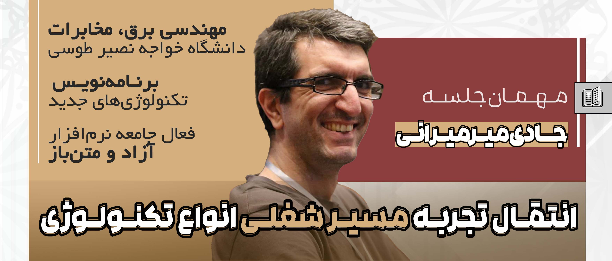
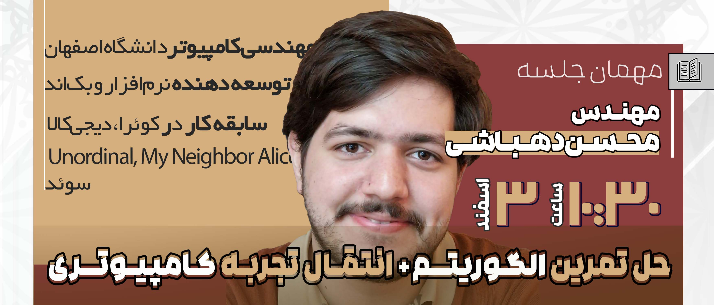
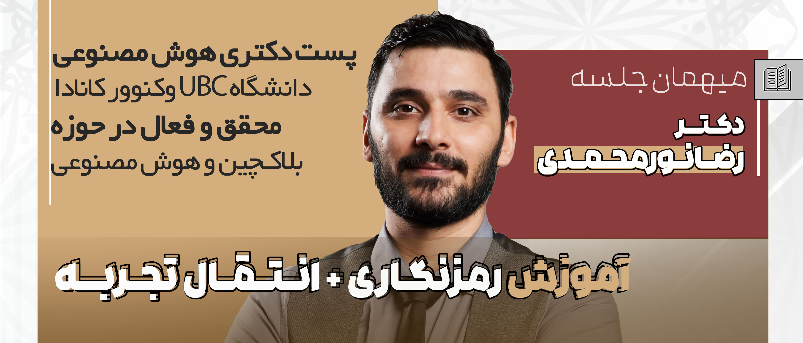
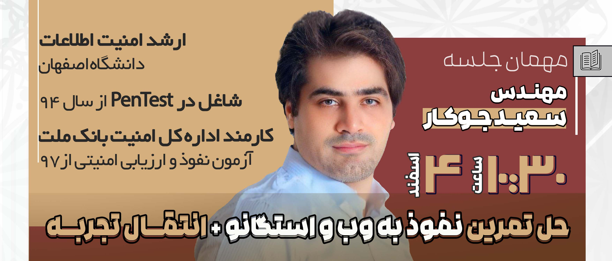
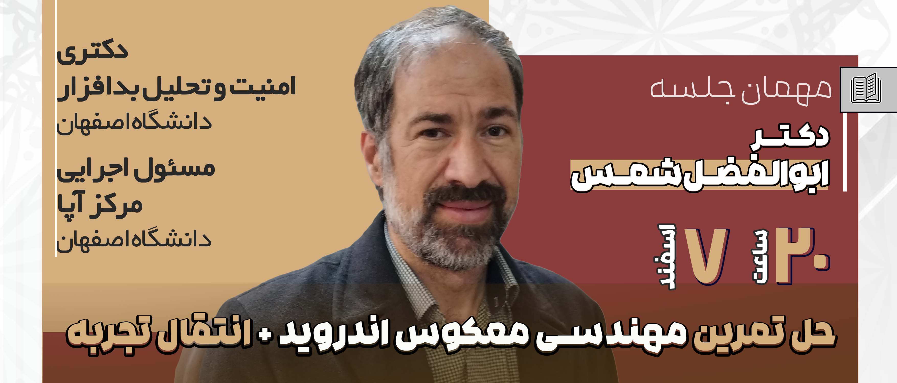

# سلسله کارگاه‌‎های آموزشی سای‌سیتی

## مقدماتی بر لینوکس

- **رزومه مدرس:**

	**مهندس امیرعماد میرمیرانی (ملقب به جادی)**، فارغ‌التحصیل کارشناسی برق گرایش مخابرات از دانشگاه خواجه نصیر و کارشناسی ارشد جامعه‌شناسی از دانشگاه علامه طباطبائی، برنامه‌نویس و مهندس امنیت شبکه با سابقه بیش از ۲۰ سال فعالیت در زمینه‌های امنیت و حقوق دیجیتال، ابزارهای جدید حوزه کامپیوتر و اینترنت و یکی از شاخص‌ترین مدرسان دوره‌های علمی فارسی زبان حوزه تکنولوژی

- **سرفصل‌ها:**

	- Installation
	- Install Apps
	- Shell
	- Strings and Texts
	- Files
	- Streams
	- RegEx and Search
	- Edit Files
	- File Premissions
	- FHS
	- Bash Scripting

[ویدئوهای منتخب آموزش لینوکس](https://www.mediafire.com/folder/s01kvnh9dreff/%D9%85%D9%82%D8%AF%D9%85%D8%A7%D8%AA%DB%8C_%D8%A8%D8%B1_%D9%84%DB%8C%D9%86%D9%88%DA%A9%D8%B3_(%D8%B1%D8%A7%DB%8C%DA%AF%D8%A7%D9%86_%D8%A7%D8%B2_%D8%A7%D9%84%D9%BE%DB%8C%DA%A9_%D8%AC%D8%A7%D8%AF%DB%8C))

[جلسه پرسش و پاسخ و انتقال تجربه](https://www.mediafire.com/file/1op92s86scvxx83/%D9%BE%D8%B1%D8%B3%D8%B4+%D9%BE%D8%A7%D8%B3%D8%AE+%D9%88+%D8%A7%D9%86%D8%AA%D9%82%D8%A7%D9%84+%D8%AA%D8%AC%D8%B1%D8%A8%D9%87+%D8%A8%D8%A7+%D8%AC%D8%A7%D8%AF%DB%8C+%D9%85%DB%8C%D8%B1%D9%85%DB%8C%D8%B1%D8%A7%D9%86%DB%8C.mp4/file)

## الگوریتم‌های کاربردی

-  **رزومه مدرسین:**
	- **مهندس محسن دهباشی**، فارغ‌التحصیل کارشناسی مهندسی کامپیوتر دانشگاه اصفهان، مهندس نرم‎افزار و توسعه دهنده بک‎اند و بلاک‌چین با سابقه کار در کوئرا، دیجی کالا، Unordinal و My Neighbor Alice و دستیاری آموزشی الگوریتم و ساختمان داده در دوران تحصیل
	- **مهندس غزال ربیعی**، کارشناسی ارشد فناوری رسانه‌های تعاملی دانشگاه KTH سوئد، فارغ‌التحصیل کارشناسی مهندسی کامپیوتر دانشگاه اصفهان، با سابقه دستیاری آموزشی الگوریتم و ساختمان داده در دوران تحصیل

-  **سرفصل‌ها:**
	- Working With Arrays: Linked List, Hash Map, etc
	- Sorting
	- Binary Search and Binary Tree
	- Divide and Conquer
	- Graph Modeling
	- BFS and DFS
	- Shortest Path in Graph
	- Dynamic Programming

[ویدئوهای آموزش آفلاین](https://www.mediafire.com/folder/9jbvkwu0k6rpt/%D8%A7%D9%84%DA%AF%D9%88%D8%B1%DB%8C%D8%AA%D9%85+%D9%87%D8%A7%DB%8C+%DA%A9%D8%A7%D8%B1%D8%A8%D8%B1%D8%AF%DB%8C)

[جلسه حل تمرین](https://www.mediafire.com/folder/nkq7rbgnm3y7t/حل+تمرین+الگوریتم‌های+کاربردی)

[جلسه پرسش و پاسخ و انتقال تجربه](https://www.mediafire.com/file/wtwqru0nl7vnrde/%D9%BE%D8%B1%D8%B3%D8%B4+%D9%BE%D8%A7%D8%B3%D8%AE+%D8%A7%D9%84%DA%AF%D9%88%D8%B1%DB%8C%D8%AA%D9%85.mp4/file)

## رمزنگاری متقارن و نامتقارن

- **رزومه مدرس:**

  
	**دکتر رضا نورمحمدی**، پست‌دکترای هوش مصنوعی دانشگاه UBC ونکوور کانادا، محقق، مدرس و فعال در حوزه بلاک‌چین و هوش مصنوعی

- **سرفصل‌ها:**
	- مقدمه‌ای بر مفاهیم و اصطلاحات پایه‌ای و ضروری رمزنگاری
	- چیستی و چرایی رمزنگاری
	- معرفی الگوریتم‌های رمزنگاری متقارن و نامتقارن رایج شامل:
	
	
		- Base64 
		- Morse 
		- Caesar
		- Vigenere
		- Rail Fence
		- RSA
		- DH
	- معرفی ابزارهای مختلف رمزنگاری مانند CyberChef
	- استفاده عملی و نشان دادن کاربرد الگوریتم‌ها

[ویدئوهای آموزش رمزنگاری](https://www.mediafire.com/file/zgjqimbjk9wa858/%D8%A2%D9%85%D9%88%D8%B2%D8%B4%DB%8C+%D8%B1%D9%85%D8%B2%D9%86%DA%AF%D8%A7%D8%B1%DB%8C.mp4/file)

[جلسه پرسش و پاسخ و انتقال تجربه](https://www.mediafire.com/file/v2lc3b1vykojkj4/%D9%BE%D8%B1%D8%B3%D8%B4+%D9%88+%D9%BE%D8%A7%D8%B3%D8%AE+%D8%B1%D9%85%D8%B2%D9%86%DA%AF%D8%A7%D8%B1%DB%8C.mp4/file)

## استگانوگرافی و نفوذ به وب 

- **رزومه مدرس:**

	**مهندس سعید اکبری جوکار**، کارشناسی ارشد امنیت اطلاعات دانشگاه اصفهان، شاغل در زمینه امنیت اطلاعات و پن‎تست از سال ۱۳۹۴، کارمند اداره کل امنیت بانک ملت در حوزه آزمون نفوذ و ارزیابی امنیتی از سال ۱۳۹۷، سابقه تدریس مسابقات فتح پرچم کشوری

- **سرفصل‌ها:**
	- Steganography:
		- Basics and DigitalFforensics
		- Text Steganography
		- Image Steganography
		- Least Significant Bit (LSB) Steganography
		- Audio Steganography
	- Web Penetration:
		- SQL Injection 
		- NoSQL Injection
		- Command Injection 
		- JSON Web Tokens (JWT)
		- Loose Comparisons
		- Server-side Template Injection (SSTI)
		- WSS

[ویدئوهای آموزش نفوذ به وب](https://www.mediafire.com/folder/dh70rziqxjfcm/%D9%86%D9%81%D9%88%D8%B0_%D8%A8%D9%87_%D9%88%D8%A8)

[ویدئوهای آموزش استگانوگرافی](https://www.mediafire.com/file/j3rqt66a8eqrk93/Steganography.mp4)

[جلسه حل تمرین](https://www.mediafire.com/folder/1k1jthaspddbn/حل+تمرین+نفوذ+به+وب+و+استگانوگرافی)

[جلسه انتقال تجربه](https://www.mediafire.com/file/zsmgh98rcn1cn2f/%D9%BE%D8%B1%D8%B3%D8%B4+%D9%BE%D8%A7%D8%B3%D8%AE+%D9%86%D9%81%D9%88%D8%B0+%D8%A8%D9%87+%D9%88%D8%A8.mp4/file)

## مهندسی معکوس اندروید

- **رزومه مدرس:**

	**مهندس ابوالفضل شمس**، دکتری امنیت و تحلیل بدافزار دانشگاه اصفهان، مسئول اجرایی مرکز آپا دانشگاه اصفهان

- **سرفصل‌ها:**
	- مقدمه‎ای بر چیستی مهندسی معکوس    
	- مقدمه‎ای بر کارکرد کلی اندروید و بخش‌های آن
	- ساختار اپ اندروید و محتویات هر بخش: Main و Resources و ...    
	- فایل XML: ساختار، چیستی
	- کار با Genymotion
	- کار با JADX

[ویدئوهای آموزش مهندسی معکوس](https://www.mediafire.com/folder/3t370q6vwlkb9/%D9%85%D9%87%D9%86%D8%AF%D8%B3%DB%8C_%D9%85%D8%B9%DA%A9%D9%88%D8%B3)

[جلسه حل تمرین](https://www.mediafire.com/file/ehmfo4lxx7s7yub/%D8%AD%D9%84+%D8%AA%D9%85%D8%B1%DB%8C%D9%86+%D9%85%D9%87%D9%86%D8%AF%D8%B3%DB%8C+%D9%85%D8%B9%DA%A9%D9%88%D8%B3.mp4/file)

[جلسه انتقال تجربه](https://www.mediafire.com/file/jr4z8nc1y6qis01/%D8%A7%D9%86%D8%AA%D9%82%D8%A7%D9%84+%D8%AA%D8%AC%D8%B1%D8%A8%D9%87+%D9%85%D9%87%D9%86%D8%AF%D8%B3%DB%8C+%D9%85%D8%B9%DA%A9%D9%88%D8%B3.mp4/file)

## اطلاعات بیشتر و راه‌های ارتباطی

برای آشنایی بیشتر با این شهر دیوانه‌وار و افراد ساکن در اون با ما همراه باشید. 😉

- [رویداد سای‌سیتی](/سای%E2%80%8Cسیتی)
- [زی‌لینک شهر](https://zil.ink/psycitycup)
- [کانال تلگرام](https://t.me/PsyCityCup)
- [صفحه اینستاگرام](https://instagram.com/PsyCityCup)

یادتون نره ما اینجا همیشه مشتاق و آماده شنیدن سوالاتون هستیم.

- [ایمیل رسمی](mailto:psycitycup@gmail.com)
- [اکانت پشتیبانی تلگرام](https://t.me/AMCSSup)
