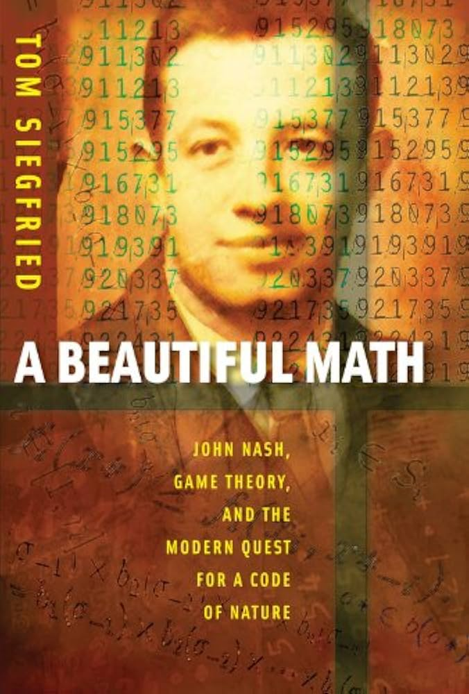

# نقد و بررسی فیلم و کتاب

## نقد کتاب "ریاضیات زیبا"

**کتاب "ریاضیات زیبا"** یکی از آثاری است که به شیوه‌ای جذاب و دقیق به مفاهیم پایه‌ای ریاضیات می‌پردازد. تام سیگفرید، نویسنده این کتاب، با استفاده از مثال‌های زنده و الهام‌بخش، نشان می‌دهد که ریاضیات چگونه می‌تواند زیبا و شگفت‌انگیز باشد.

سیگفرید در این کتاب به موضوعاتی مانند اعداد فیبوناچی، نسبت طلایی، هندسه، ترکیبات و احتمالات، معادلات و دیگر مفاهیم ریاضیاتی پرداخته و آن‌ها را به شیوه‌ای ساده و قابل فهم توضیح می‌دهد. او با رویکردی هنرمندانه نشان می‌دهد که ریاضیات همچون یک اثر هنری زیباست که با تمرین و دیدگاهی نو می‌توان از آن لذت برد.

این کتاب برای عموم مخاطبان قابل فهم است و تلاش می‌کند تا جذابیت‌های نهفته در ریاضیات را به خوانندگان نشان دهد. سیگفرید با استفاده از مثال‌های روزمره از زندگی، هنر، موسیقی و حتی طبیعت، به تشریح اهمیت و زیبایی ریاضیات می‌پردازد. او با تکیه بر مفاهیمی مانند اعداد فیبوناچی و نسبت طلایی، نشان می‌دهد که ریاضیات نه تنها ابزاری برای حل مسائل است، بلکه زبانی زیبا برای بیان الگوها و نظم در جهان می‌باشد.

کتاب "ریاضیات زیبا" با رویکردی الهام‌بخش و انگیزشی، خواننده را به دنیای شگفت‌انگیز ریاضیات دعوت می‌کند و نشان می‌دهد که هر فردی می‌تواند از زیبایی‌های آن لذت ببرد. این کتاب به عنوان یک معرفی جذاب به دنیای ریاضیات، توجه بسیاری از مخاطبان را جلب کرده است. با این حال، برخی خوانندگان ممکن است نکات مثبت و منفی کتاب را متفاوت ارزیابی کنند.

**نقاط قوت کتاب:**

۱. **درون‌مایه جذاب:** کتاب به شیوه‌ای جذاب و دلنشین، مفاهیم پایه‌ای ریاضیات را معرفی می‌کند و نشان می‌دهد که ریاضیات چگونه در زندگی روزمره و دنیای واقعی تأثیرگذار است. این رویکرد حتی برای کسانی که به ریاضیات علاقه ندارند، جذابیت دارد.

۲. **استفاده از مثال‌های متنوع:** نویسنده با بهره‌گیری از مثال‌های گوناگون، مفاهیم ریاضیاتی را به شکلی واضح‌تر و قابل درک‌تر معرفی می‌کند.

۳. **ارتباط با دنیای واقعی:** کتاب نشان می‌دهد که چگونه مفاهیم ریاضیاتی در هنر، موسیقی و طبیعت کاربرد دارند. این امر به خواننده کمک می‌کند تا ریاضیات را به زندگی خود مرتبط کرده و ارزش آن را درک نماید.

۴. **زبان ساده و قابل فهم:** نویسنده از زبانی ساده و روان استفاده می‌کند که حتی برای خوانندگانی که با ریاضیات مشکل دارند، مفاهیم به راحتی قابل درک باشد.

**نقاط ضعف کتاب**:

۱. **سطح ساده:** برخی خوانندگان ممکن است احساس کنند که محتوای کتاب بسیار ساده و پایه‌ای است و بیشتر به مفاهیم ابتدایی ریاضیات می‌پردازد. این موضوع ممکن است برای افرادی که به دنبال یادگیری مفاهیم پیشرفته‌تر هستند، نقطه ضعفی محسوب شود.

۲.**کمبود عمق**: برخی منتقدان معتقدند که کتاب در بررسی برخی از مفاهیم ریاضیاتی، عمق کافی ندارد و به مفاهیم پایه‌ای و سطحی محدود شده است.

۳. **استفاده محدود از ابزارهای تحلیلی:** کتاب بیشتر از رویکرد داستان‌محور برای توضیح مفاهیم استفاده می‌کند و از ابزارهای تحلیلی و ریاضیاتی به‌صورت محدود بهره می‌برد. این موضوع ممکن است موجب نارضایتی برخی از خوانندگان با سابقه در زمینه ریاضیات شود.

با این حال، با در نظر گرفتن نقاط قوت و ضعف، کتاب "ریاضیات زیبا" همچنان به عنوان اثری مهم و الهام‌بخش در حوزه ریاضیات ارزش مطالعه دارد.

 
***نویسنده: فرنوش پورشبان***

🔹 ادامه نقد این کتاب و مقایسه آن با فیلم ذهن زیبا، به همراه مطالب علمی و فرهنگی بیشتر را می‌توانید در شماره اول نشریه رعد مطالعه کنید.

[درباره نشریه](/نشریه)

[اطلاعات بیشتر (زیلینک نشریه)](https://zil.ink/radjournal)

