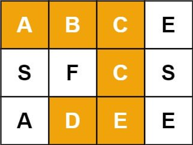
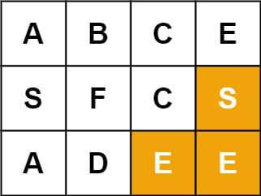
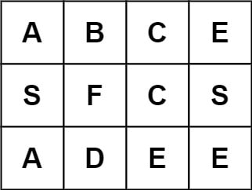

# Word Search


***تاریخ:***  *جلسه ۲ - ۱۸ مرداد ۱۴۰۳*


## صورت سوال


لینک سوال: [79. Word Search](https://leetcode.com/problems/word-search/)
 
 
---


در یک صفحه `m * n` با نام `board` و یک کلمه `word`، مقدار `true` را برگردانید در صورتی که `word` در صفحه وجود داشته باشد.


حروف کلمه می‌تواند از خانه‌های مجاور جدول تشکیل شود. خانه‌ها باید از لحاظ سطری یا ستونی مجاور باشند و خانه‌های مورب مجاور نیستند.


هر خانه جدول تنها یک بار می‌تواند استفاده شود.





**ورودی:**


```

board = [["A","B","C","E"],["S","F","C","S"],["A","D","E","E"]]

word = "ABCCED"

```


**خروجی:** `true`





**ورودی:**


```

board = [["A","B","C","E"],["S","F","C","S"],["A","D","E","E"]]

word = "SEE"

```


**خروجی:** `true`





**ورودی:**


```

board = [["A","B","C","E"],["S","F","C","S"],["A","D","E","E"]]

word = "ABCB"

```


**خروجی:** `false`


**قیدهای مسئله:**


- `m = board.length`


- `n = baord[i].length`


- `1 <= m, n <= 6`


- `1 <= word.length <= 15`


- آرایه `board` و کلمه `word` فقط از حروف lowercase و uppercase انگلیسی تشکیل شده است.

  
## پاسخ سوال


---


```python

 def exist(self, board, word):

        def backtrack(i, j, k):

            if k == len(word):

                return True

            if i < 0 or i >= len(board) or j < 0 or j >= len(board[0]) or board[i][j] != word[k]:

                return False

            temp = board[i][j]

            board[i][j] = ''

            if backtrack(i+1, j, k+1) or backtrack(i-1, j, k+1) or backtrack(i, j+1, k+1) or backtrack(i, j-1, k+1):

                return True

            board[i][j] = temp

            return False

        for i in range(len(board)):

            for j in range(len(board[0])):

                if backtrack(i, j, 0):

                    return True

        return False

```


**توضیح:**


راهبرد ما در این حل سوال روشی مشابه با پیمایش عمیق است.


اندیس های `i`, `j` و `k` را تعریف می‌کنیم:


`i`: عرض صفحه


`j`: طول صفحه


`k`: اندیس حرف در کلمه `word`


ابتدا تابع `backtrack` را تعریف می‌کنیم که این سه اندیس را دریافت می‌کند. سپس بررسی می‌کنیم که `k` ای که دریافت کرده است با طول کلمه برابر است یا نه. چون اگر برابر باشد، بدین معنی است که کلمه پیدا شده است. در غیر این صورت ۵ شرط را بررسی می‌کنیم:


1. اندیس `i` منفی یا بزرگتر از عرض صفحه نباشد. (۲ شرط)


2. اندیس `j` منفی یا بزرگتر از طول صفحه نباشد. (۲ شرط)


3. حرف `k` ام کلمه‌ی `word` برابر با حرفی باشد که در خانه `board[i][j]` قرار دارد.


در صورتی که هر یک از شرایط بالا نقض شوند، مسیری که الگوریتم در پیش گرفته بن‌بست است و باید مسیری جدید یافته شود.

  
 در صورتی که هیچ کدام نقض نشوند، ابتدا مقدار خانه `board[i][j]` را در یک متغیر (`temp`) ذخیره می‌کنیم و سپس مقدار `board[i][j]` را برابر با مقدار خالی در نظر می‌گیریم. این کار برای جلوگیری از استفاده‌ی دوباره از این خانه در ادامه پیمایش جدول است.

  
سپس تابع `backtrack` را برای چهار جهت (چهار همسایه) آن صدا می‌زنیم.


راست:


`backtrack(i + 1, j, k + 1)`


چپ:


`backtrack(i - 1, j, k + 1)`


بالا:


`backtrack(i, j + 1, k + 1)`


پایین:


`backtrack(i, j - 1, k + 1)`

  
در صورتی این صدا زدن ها به ما `true` برگردانند، کلمه پیدا شده است و در غیر این صورت `temp` را به جای اولش برگردانده و `false` را برمی‌گردانیم.


در نهایت این تابع را برای همه خانه‌های `board` صدا می‌زنیم و اگر یکی از آن‌ها `true` برگرداند، مقدار مورد نظر پیدا شده است و در غیر این صورت خیر.
