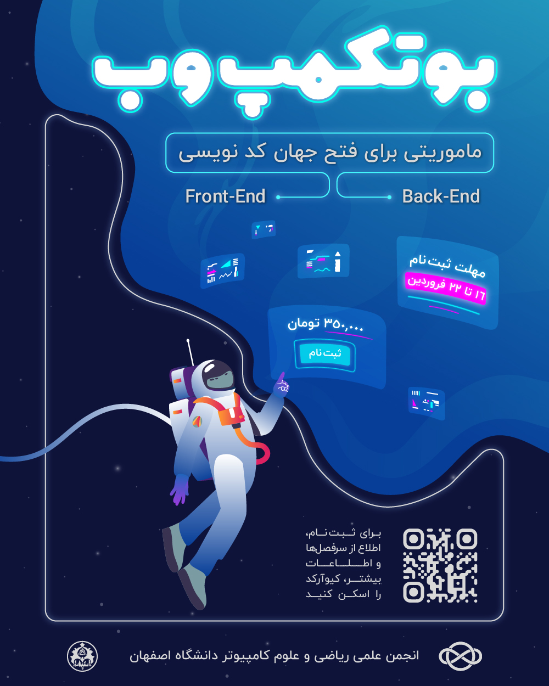

**بوت‌کمپ وِب**

*ماموریتی برای فتح جهان کد نویسی!*

👾  در دنیایی که هر کلیک، مسیری به یک تجربه‌ی جدید باز می‌کنه و هر خط کد مثل ستاره‌ها توی تاریکی می‌درخشه، گروهی از کاوشگران آماده‌‌ شدن تا سفری هیجان‌انگیز رو آغاز کنن ... 

🔹  *این ماموریت حضوری، جستجویی در دنیای فرانت‌اند و بک‌اندِ! جایی که هر کاوشگر با برخورداری از آموزش‌های منحصر به فرد، تمرین و پروژه‌های عملی، مهارت‌های خودش رو برای ساختن جهانی دیجیتالی تقویت می‌کنه.*

**سرفصل‌های فرانت‌اند:**

- آشنایی جامع با HTML
- تسلط  بر CSS مدرن
- طراحی responsive
- کار با Flexbox و Grid
- مقدمه‌ای بر JavaScript
- کار با API و پردازش و استفاده از داده‌ها
- تفسیر و درک طراحی‌ها و layout
- آشنایی اولیه با Git
- استفاده از انیمیشن
- کار با کتابخانه های مختلف
- ورود به دنیای React
- پروژه‌ها و تمرینات کاربردی

**سرفصل‌های بک‌اند:**

- آشنایی با گیت و گیت‌هاب
- آشنایی با معماری client-server و MVT
- مروری بر پایتون
- آشنایی کلی با html/css
- کار با django template engine
- مروری بر دیتابیس
-  آشنایی با orm و کار با django-orm
- تست نویسی و اصول تست نویسی
- احراز هویت در جنگو
- پروژه‌ها و تمرینات کاربردی

**اطلاعات ثبت‌نام:**

- مهلت ثبت‌نام:

  
    ۱۶ تا ۲۲ فروردین ماه

  
- هزینه:

  
    ۳۵۰ هزار تومان (دانشجویان دانشگاه اصفهان)

  
    ۵۰۰ هزار تومان (سایر متقاضیان خارج از دانشگاه)

- شروع بوت‌کمپ:

    از ۲۱ فروردین‌ماه هر هفته پنجشنبه و جمعه‌ها

👾  اگه آماده‌اید تا توی یه محیط دوستانه ولی حرفه‌ای، برنامه‌نویسی وب رو اصولی یاد بگیرید و با چالش‌های واقعی روبه‌رو بشید، همین حالا [ثبت‌نام](https://app.epoll.ir/61996050) کنید! 
