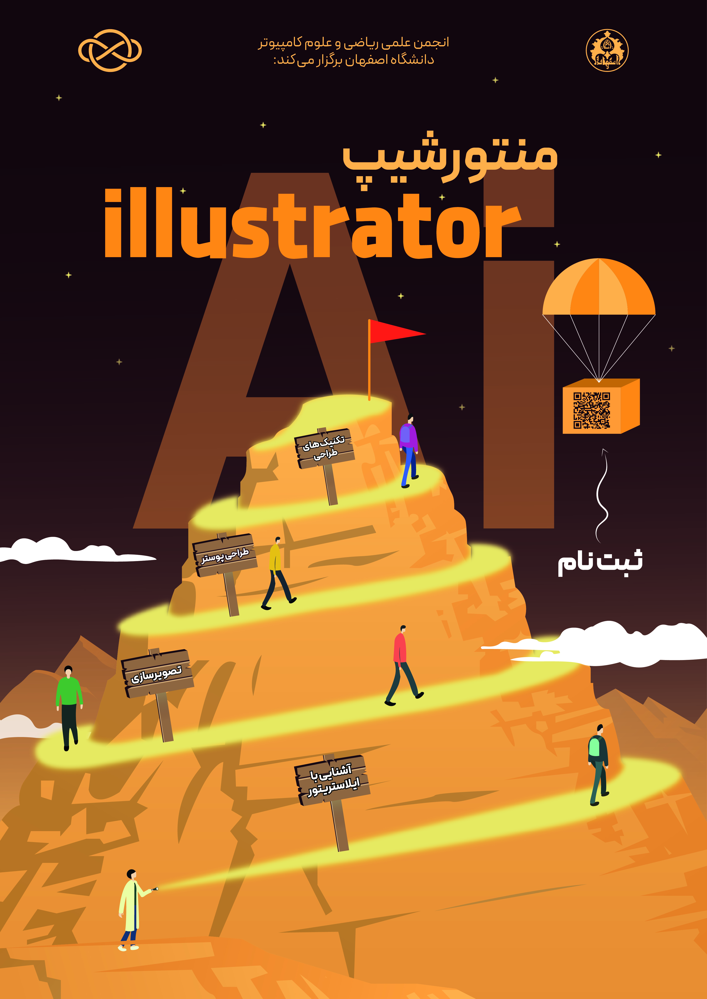

# منتورشیپ طراحی گرافیکی | Adobe Illustrator

**به دنیای ایلاستریتور خوش آمدید!** ✨

جایی که خطوط ساده به طرح‌های شگفت‌انگیز و جزئیات بی‌نظیر تبدیل می‌شوند و رنگ‌های معمولی، در دستان شما به پالت‌های خیره‌کننده و چشم‌نواز تبدیل می‌شوند.

این نرم‌افزار به شما این قدرت را می‌دهد تا هر آنچه در ذهن دارید، با دقت و ظرافت به تصویر بکشید و با هر حرکت قلم، دنیایی از ایده‌های نو و خلاقانه را به زندگی دعوت کنید.

- **سطح برنامه:** دانشگاهی

- **هزینه ثبت‌‎نام:** رایگان

- [لینک ثبت‌نام](https://app.epoll.ir/40716050)

- **زمان و مکان:** از ۳ خرداد ۱۴۰۳ به صورت مجازی

## اهداف

- پاسخ به درخواست‌های چندی از دانشجویان مبنی بر یادگیری از گرافیست‌های حرفه‌ای مشغول به کار در انجمن

- رفع نیاز بالای انجمن به طراحان گرافیک بیشتر برای کاهش حجم کاری افراد محدود و سرمایه‌گذاری برای آینده

- یادگیری 

- توانمندسازی دانشجویان در ابزارهای کاربردی دارای قابلیت کسب درآمد بالا

- ایجاد فرصت استفاده دانشجویان از تجربیات و راهنمایی‌های دانشجویان با سابقه در مسیر یادگیری خودآموز و شناسایی بهتر نقاط ضعف و قوت خود در حلقه یادگیری گروهی و دانشجویی    

## خلاصه برنامه

طبق صحبت‌ها و همفکری‌های صورت گرفته با استاد مشاور انجمن مبنی بر طراحی برنامه‌ای کارآمد برای ساختن یک مسیر یادگیری شخصی‌سازی شده و هدف‌مندتر در تربیت و تعلیم هنرجوها، تصمیم بر آن شد که طرح منتورشیپ به جای کارگاه آموزشی انتخاب شود که بیشتر متمرکز بر شکل‌گیری گروه‌های دانشجویی همفکری با نظارت یک یا چند منتور است.

لذا در تعریف این طرح، سعی بر آن شد تا با توجه به پر اهمیت بودن نقش تعامل افراد با یکدیگر در یادگیری، حلقه‌ای علمی-آموزشی تشکیل شود تا امکان گفت‌وگو و یادگیری از هم را برای شرکت کنندگان فراهم کند. هدف از اجرای این طرح بدین شکل، ایجاد بستری نوین جهت رشد و یادگیری متقابل برای دانشجویان بود، تا مسیر یادگیری را همراه با پشتیبانی افراد مجرب و دریافت بازخورد از یکدیگر طی‌ کنند و در عین تقویت مهارت‌ و دانش خود، گامی روبه‌جلو برای پیشرفت خود در این عرصه بردارند. از دیگر مزایای این برنامه نسبت به کارگاه آموزشی برای هنرجویان می‌توان به گذراندن محتوای متناسب با نیازشان و انجام تمرینات شخصی‌سازی شده اشاره کرد که هر دو باعث جلوگیری از اتلاف وقت آن‌ها و فراگیری هرچه بهتر خواسته‌هایشان می‌شود.

شایان ذکر است که یادگیری صرف ابزارها مد نظر و جزو اهداف برگزاری این رویداد نبود، بلکه قصد انجمن آموزش ابزارها به همراه مبانی تصویرسازی و طراحی بر اساس استانداردهای موجود بود. 

## روند برگزاری

### مسیر آموزش

پس از انتشار فراخوان شروع منتورشیپ، ثبت‌نام کنندگان به عضویت گروه تلگرامی که به عنوان فضایی برای تعامل و پرسش و پاسخ با یکدیگر در نظر گرفته شده بود، در آمدند. بعد از صحبت‌هایی که توسط منتورها با هر هنرجو به منظور تعیین سطح و شناخت بهتر توانمندی‌های او صورت می‌گرفت، [محتوای آموزشی](/منتورشیپ/ایلاستریتور/مسیر%20آموزشی) متناسب در راستای نیازهای هنرجو از منابع مختلف برای وجود امکان انتخاب محتوایی که هر فرد بیشترین اثربخشی و ارتباط را از آن دریافت می‌کند، گردآوری و در اختیار او قرار داده می‌شد. لازم به ذکر است که محتوای ارائه شده صرفاً آموزش ابزارها در ایلاستریتور نبود و علاوه بر آن، به آموزش مفاهیم پایه‌ای کار با وکتور و اصول طراحی نیز پرداخته شد.

در ادامه مسیر، تسک‌ها و تمریناتی چالشی متنوعی که قسمت‌های مورد نیاز کار با نرم‌افزار و طراحی را پوشش می‌دادند، به اعضا واگذار می‌شد. پس از انجام وظایف توسط هنرجوها، فیدبک‌های لازم توسط منتورها و سایر اعضای حلقه جهت بهبود طرح و انجام برخی از مراحل به روش اصولی‌تر و راحت‌تر به آن‌ها منتقل می‌گردید. برای پیشرفت بیشتر، در پایان هر هفته جلساتی برگزار می‌شد که در آن افراد به تحلیل و بررسی گروهی نمونه کارهای شرکت کنندگان می‌پرداختند. در این جلسات، ضمن بیان نکاتی جهت ایجاد طراحی بهتر توسط منتورها در راستای استفاده تمام اعضا، به سوالاتی که در لحظه برای افراد پیش می‌آمد نیز پاسخ داده می‌شد. در تمامی مدت هنرجوها می‌توانستند سوالات و ابهامات پیش آمده در هر قسمت از مسیرشان را در گروه تلگرامی نیز مطرح کنند تا از کمک و راهنمایی منتورها و دیگر اعضا بهره ببرند.

از دیگر اقداماتی که با هم‌اندیشی منتورها و استاد مشاور انجمن به منظور نگه داشتن هنرجوها در مسیر یادگیری صورت گرفت، دریافت بازخورد و گزارش عملکرد به طور پیوسته از شرکت‌کنندگان و واگذاری پروژه‌های گروهی به آن‌ها بود. اعضا طبق صلاحدید منتورها، به گروه‌های چند نفره تقسیم شده و سپس پروژه‌ای برای آن‌ها تعیین می‌گردید؛ دسته‌بندی و انتخاب پروژه همواره متناسب با توانایی‌ها و نیازمندی‌های آنان صورت می‌گرفت.

### منتورها

- مریم رضائی، کارشناسی ارشد علوم کامپیوتر دانشگاه صنعتی شریف، با ۷ سال سابقه طراحی گرافیکی با ایلاستریتور

- امیرحسین کامرانی‌نژاد، کارشناسی علوم کامپیوتر دانشگاه اصفهان، با ۳ سال سابقه طراحی گرافیکی با ایلاستریتور

## اثربخشی و بازخورد

بنا به نظرسنجی‌ها، ثمره این کار علاوه بر تقویت مهارت‌های طراحی و تسلط بر نرم‌افزار، یادگیری تجربه مدیریت پروژه، تقسیم کار و کار تیمی بود. تمامی این رویکردها به قصد آموزش اعضای کارآمد برای انجمن و امکان فراهم کردن کسب درآمد برای دانشجویان از طریق فراگیری یک مهارت بود.

## راه‌های ارتباطی

اگر دوست دارید، می‌توانید از [دنیای آموزشی ما](/منتورشیپ/ایلاستریتور/مسیر%20آموزشی) دیدن کنید و با مسیر یادگیری‌تون آشنا بشید.

یادتون نره که برای پیوستن به جمع دوست‌داران هنر، به [خانه خلاقیت](https://app.epoll.ir/40716050) سر بزنید. همچنین برای دریافت اطلاعات بیشتر، می‌تونید از طریق [جغد نامه‌رسان انجمن](https://t.me/AMCSSup) با ما در ارتباط باشید.
