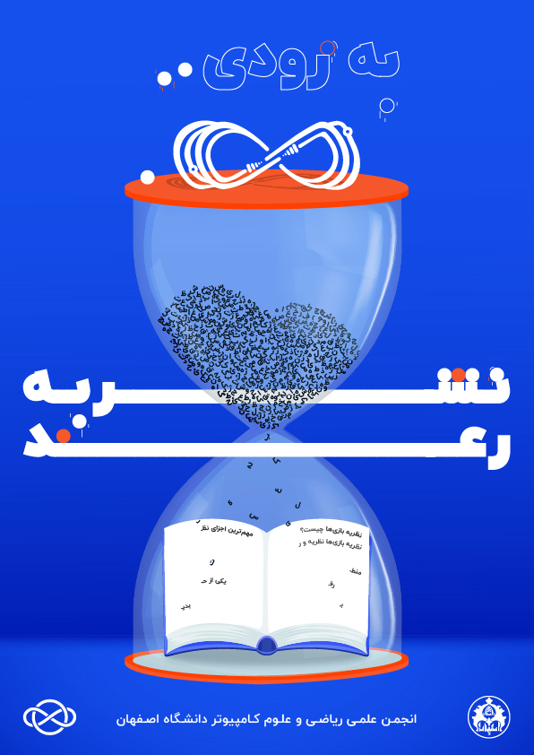
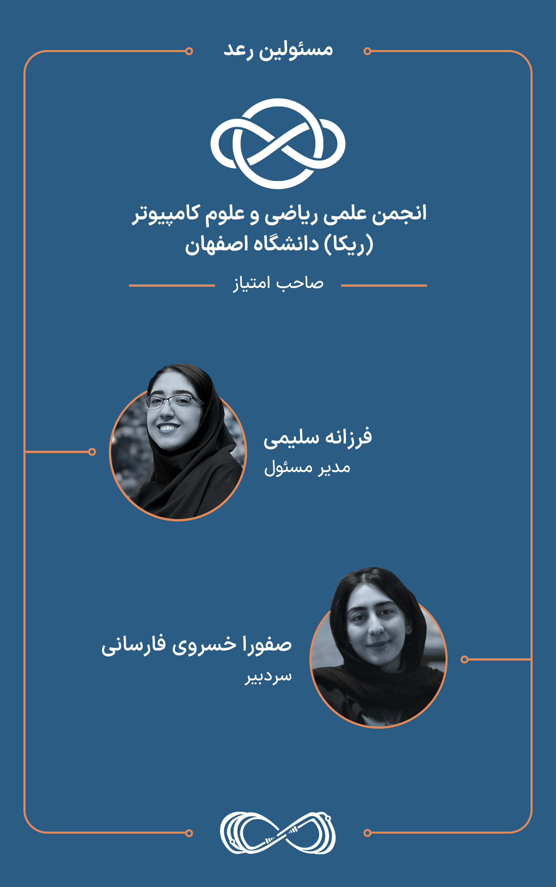
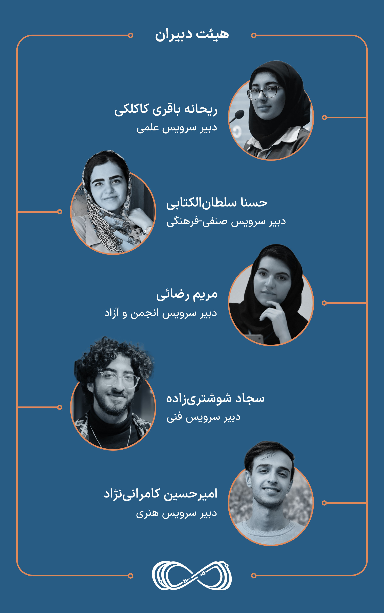

# نشریه دانشجویی علمی-صنفی رعد 

*تحت امتیاز [انجمن علمی ریاضی و علوم‌کامپیوتر](https://zil.ink/amcsui) دانشگاه اصفهان*  

## درباره‌ی ما

 🔹  **نشریه «رعد»، سرواژه‌ و مخففی برای «ریاضی و علوم‌کامپیوتر دانان» است** که همواره در تلاش بودند خود را در گنبد ستارگانِ علم، همچون «رعد» بیابند و با انگیزه‌ای عمیق و آمیخته با شور کلمات از پاییز ۱۴۰۱ آغاز به کار کردند. این نشریه به‌عنوان پنجره‌ای روشن به سوی دانش و خلاقیت، شما را به کاوش در مرزهای تازه‌ای از علم و تکنولوژی دعوت می‌کند.

در رعد ایده‌های ناب در قالب کلمات به طرح‌های فکری عمیق و تأثیرگذار تبدیل می‌شوند و مفاهیم پیچیده، با قلم‌ شما ترکیب شده و محتوایی روشنگر و الهام‌بخش را پدید می‌آورند به طوری که هر نوشته پنجره‌ای روشن به سوی دنیایی از دانش و خلاقیت می‌گشاید که شما را به کاوش در مرزهای تازه‌ای از علم و تکنولوژی دعوت می‌کند. 

در اینجا، هر نوشته همچون چراغی است که مسیر کشف‌های جدید را برای شما روشن می‌سازد و شما را به همراهی در این سفر علمی و فکری دعوت می‌کند. 

این نشریه به شما این امکان را می‌دهد تا در چهارچوب موضوعات خلاقانه‌ی هر شماره، بتوانید آنچه در ذهن دارید را با دقت و هنرمندی به نگارش درآورید و با دیگران به اشتراک بگذارید. در ادامه این مسیر با ما همراه باشید و از این دنیای پُر از اکتشافات و نوآوری‌ها بهره‌مند شوید.

## شورای رعد

👤 [**فرزانه سلیمی**](https://t.me/Farxami)
  
  
  مدیر مسئول | ۴۰۱ علوم‌کامپیوتر

📧 [`farzaneh.s2003@gmail.com`](mailto:farzaneh.s2003@gmail.com)

👤 [**صفورا خسروی**](https://t.me/safoura_khosravi)
  
  
  سردبیر | ۴۰۲ علوم‌کامپیوتر

📧 [`Sa.khosravifarsani@gmail.com`](mailto:Sa.khosravifarsani@gmail.com)
  
  
👤 [**ریحانه باقری**](https://t.me/Reyhane_Bagheri)
  
  
  دبیر سرویس علمی | ۴۰۱ علوم کامپیوتر

📧 [`lreyhaneh.bagheril@gmail.com`](mailto:lreyhaneh.bagheril@gmail.com)
  
  
👤 [**حسنا سلطان الکتابی**](https://t.me/hosna_sltn)
  
  
  دبیر سرویس صنفی-فرهنگی | ۴۰۱ علوم کامپیوتر

📧 [`hosnasoltan@gmail.com`](mailto:hosnasoltan@gmail.com)
 
    
👤 [**مریم رضائی**](https://t.me/msmrexe)
  
  
  دبیر سرویس انجمن و آزاد | ارشد ۴۰۱ علوم‌کامپیوتر

📧 [`ms.maryamrezaee@gmail.com`](mailto:ms.maryamrezaee@gmail.com)

    
👤 [**امیر حسین کامرانی نژاد**](https://t.me/kami_j0n)
  
  
  دبیر سرویس هنری | ۴۰۲ علوم کامپیوتر

📧 [`amir.h.k.n1384@gmail.com`](mailto:amir.h.k.n1384@gmail.com)
  
  
👤 [**سجاد شوشتری‌زاده**](https://t.me/Drssh)
  
  
  دبیر سرویس فنی | ۴۰۲ فیزیک

📧 [`dr.ssh2003@gmail.com`](mailto:dr.ssh2003@gmail.com)

## ارتباط با ما

🔹  با ما در ادامه این مسیر همراه باشید تا دانش و توانایی‌های خود را ارتقاء داده، به اوج برسانیم و با انتشار و انتقال این تجارب در جهت افزایش‌ آگاهی و رشد خود و جامعه گام برداریم.

- [فرم درخواست همکاری](https://app.epoll.pro/28655325)

- [اطلاعات بیشتر (زی‌لینک)](https://zil.ink/raadjournal)
  
  
- [کانال تلگرام](https://t.me/RaadJournal)

- [صفحه اینستاگرام](https://www.instagram.com/raadjournal)

🔹  رعد شنوای انتقادات و پیشنهادات شماست.

- [اکانت پشتیبانی تلگرام](https://t.me/AMCSSup)

- ایمیل رسمی: amcsui.ir@gmail.com 
